# 基础资产与抵押资产的核心数据结构

> Compound V3 核心数据结构详解

## 📋 目录

- [概述](#概述)
- [基础资产 vs 抵押资产](#基础资产-vs-抵押资产)
- [基础资产数据结构](#基础资产数据结构)
- [抵押资产数据结构](#抵押资产数据结构)
- [数据结构关系图](#数据结构关系图)
- [存储优化技巧](#存储优化技巧)
- [实际应用示例](#实际应用示例)

---

## 概述

Compound V3 使用**高度优化的数据结构**来管理基础资产（Base Asset）和抵押资产（Collateral Assets）。所有数据结构都经过精心设计，使用**紧凑打包（Tight Packing）**技术，将多个变量打包到单个 256 位存储槽中，以最小化 Gas 成本。

### 核心设计原则

1. **紧凑存储**: 所有结构体都恰好占用整数个存储槽（256 bits）
2. **本金-现值分离**: 存储固定的本金，动态计算当前价值
3. **位标志优化**: 使用位标志记录用户持有的资产
4. **有符号整数**: 用正负值区分供应和借贷

---

## 基础资产 vs 抵押资产

### 对比概览

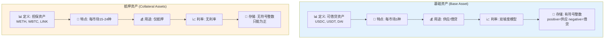

### 功能对比表

```
┌─────────────────────────────────────────────────────────────┐
│              基础资产 (Base Asset)                           │
├─────────────────────────────────────────────────────────────┤
│ • 定义: 用户可以借贷的资产（如 USDC, USDT）                │
│ • 特点: 每个市场只有一种基础资产                            │
│ • 用途: 供应赚取利息，或借出使用                            │
│ • 利率: 双坡度利率模型（基于利用率）                        │
│ • 存储: 使用有符号整数（正=供应，负=借贷）                  │
└─────────────────────────────────────────────────────────────┘

┌─────────────────────────────────────────────────────────────┐
│             抵押资产 (Collateral Assets)                     │
├─────────────────────────────────────────────────────────────┤
│ • 定义: 用于担保借贷的资产（如 WETH, WBTC）                │
│ • 特点: 每个市场可以有多种抵押资产（最多 15-24 种）        │
│ • 用途: 仅作为抵押品，不能借出                              │
│ • 利率: 无利率（不产生利息）                                │
│ • 存储: 使用无符号整数（只能为正）                          │
└─────────────────────────────────────────────────────────────┘
```

### 示例市场

```
USDC 市场:
├─ 基础资产: USDC
│  └─ 用户可以供应 USDC 赚取利息，或借出 USDC
│
└─ 抵押资产:
   ├─ WETH (以太坊)
   ├─ WBTC (比特币)
   ├─ LINK (Chainlink)
   ├─ UNI (Uniswap)
   └─ COMP (Compound)
   
用户操作:
1. 存入 1 WETH 作为抵押
2. 借出 1000 USDC (基于 WETH 的价值和抵押率)
3. WETH 不产生利息
4. USDC 借贷需要支付利息
```

---

## 基础资产数据结构

### 1. 全局基础资产数据: TotalsBasic

```solidity
/**
 * @dev 市场全局基础统计数据
 * @dev 总计 512 bits = 2 个存储槽
 */
struct TotalsBasic {
    // ===== 第一个存储槽 (256 bits) =====
    uint64 baseSupplyIndex;      // 64位: 供应累积指数
    uint64 baseBorrowIndex;      // 64位: 借贷累积指数
    uint64 trackingSupplyIndex;  // 64位: 供应奖励追踪指数
    uint64 trackingBorrowIndex;  // 64位: 借贷奖励追踪指数
    
    // ===== 第二个存储槽 (256 bits) =====
    uint104 totalSupplyBase;     // 104位: 市场总供应量（本金）
    uint104 totalBorrowBase;     // 104位: 市场总借贷量（本金）
    uint40 lastAccrualTime;      // 40位: 上次利息累积时间戳
    uint8 pauseFlags;            // 8位: 暂停标志位
}
// 总计: 64+64+64+64 + 104+104+40+8 = 256+256 = 512 bits = 2 slots ✅
```

#### 字段详解

| 字段 | 类型 | 大小 | 作用 | 初始值 |
|------|------|------|------|--------|
| **baseSupplyIndex** | uint64 | 64位 | 供应利息累积指数 | 1e15 |
| **baseBorrowIndex** | uint64 | 64位 | 借贷利息累积指数 | 1e15 |
| **trackingSupplyIndex** | uint64 | 64位 | 供应奖励追踪指数 | 0 |
| **trackingBorrowIndex** | uint64 | 64位 | 借贷奖励追踪指数 | 0 |
| **totalSupplyBase** | uint104 | 104位 | 市场总供应量（本金） | 0 |
| **totalBorrowBase** | uint104 | 104位 | 市场总借贷量（本金） | 0 |
| **lastAccrualTime** | uint40 | 40位 | 上次累积时间戳 | now |
| **pauseFlags** | uint8 | 8位 | 暂停功能标志 | 0 |

#### 存储布局

```
存储槽 0 (256 bits):
┌──────────┬──────────┬──────────┬──────────┐
│baseSupply│baseBorrow│tracking  │tracking  │
│Index     │Index     │SupplyIdx │BorrowIdx │
│ 64 bits  │ 64 bits  │ 64 bits  │ 64 bits  │
└──────────┴──────────┴──────────┴──────────┘

存储槽 1 (256 bits):
┌───────────┬───────────┬──────────┬────────┐
│totalSupply│totalBorrow│lastAccrual│pause  │
│Base       │Base       │Time      │Flags  │
│ 104 bits  │ 104 bits  │ 40 bits  │ 8 bits│
└───────────┴───────────┴──────────┴────────┘
```

#### 存储槽可视化

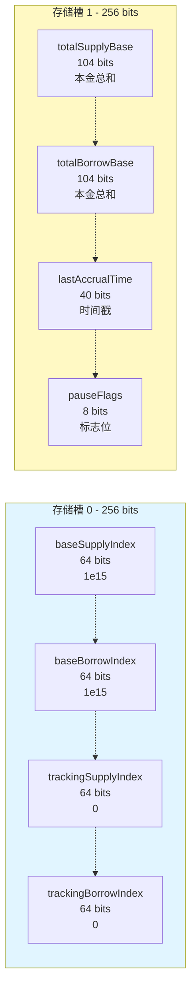

### 2. 用户基础资产数据: UserBasic

```solidity
/**
 * @dev 用户的基础账户数据
 * @dev 256 bits = 1 个存储槽
 */
struct UserBasic {
    int104 principal;            // 104位: 用户本金（正=供应，负=借贷）
    uint64 baseTrackingIndex;    // 64位: 用户奖励追踪索引快照
    uint64 baseTrackingAccrued;  // 64位: 已累积的奖励（未领取）
    uint16 assetsIn;             // 16位: 位标志，记录持有的抵押资产
    uint8 _reserved;             // 8位: 预留字段
}
// 总计: 104+64+64+16+8 = 256 bits = 1 slot ✅
```

#### 字段详解

| 字段 | 类型 | 大小 | 作用 | 特点 |
|------|------|------|------|------|
| **principal** | int104 | 104位 | 本金（有符号） | 正=供应，负=借贷 |
| **baseTrackingIndex** | uint64 | 64位 | 奖励追踪快照 | 用于计算增量奖励 |
| **baseTrackingAccrued** | uint64 | 64位 | 已累积奖励 | 未领取的奖励金额 |
| **assetsIn** | uint16 | 16位 | 抵押资产位标志 | 最多记录 16 种资产 |
| **_reserved** | uint8 | 8位 | 预留字段 | 扩展版用于资产 16-23 |

#### 存储布局

```
用户基础数据 (256 bits):
┌───────────┬──────────┬──────────┬────────┬────────┐
│principal  │tracking  │tracking  │assetsIn│reserved│
│(有符号)   │Index     │Accrued   │(位标志)│        │
│ 104 bits  │ 64 bits  │ 64 bits  │ 16 bits│ 8 bits │
└───────────┴──────────┴──────────┴────────┴────────┘
```

#### 用户数据槽可视化

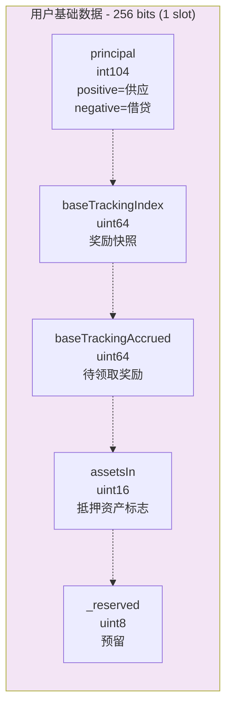

#### Principal 的有符号整数设计

```solidity
// principal 的含义:
// 正值 = 供应者
// 负值 = 借款人
// 零值 = 无头寸

示例:
principal = 1000e6    // 供应了 1000 USDC（本金）
principal = -500e6    // 借贷了 500 USDC（本金）
principal = 0         // 无头寸

// 当前价值计算:
if (principal > 0) {
    // 供应者
    presentValue = principal × baseSupplyIndex / BASE_INDEX_SCALE
} else if (principal < 0) {
    // 借款人
    presentValue = |principal| × baseBorrowIndex / BASE_INDEX_SCALE
}
```

#### Principal 计算流程图

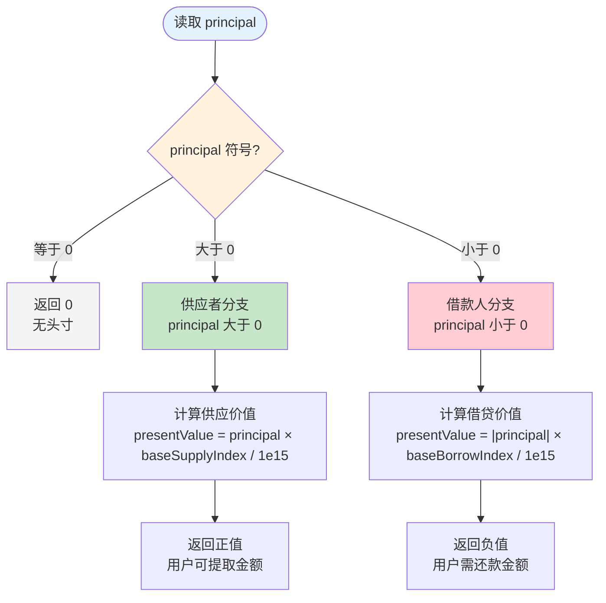

### 3. 全局存储变量

```solidity
contract CometStorage {
    // ===== 基础资产全局状态 =====
    uint64 internal baseSupplyIndex;      // 供应指数
    uint64 internal baseBorrowIndex;      // 借贷指数
    uint64 internal trackingSupplyIndex;  // 供应奖励指数
    uint64 internal trackingBorrowIndex;  // 借贷奖励指数
    uint104 internal totalSupplyBase;     // 总供应量
    uint104 internal totalBorrowBase;     // 总借贷量
    uint40 internal lastAccrualTime;      // 上次累积时间
    uint8 internal pauseFlags;            // 暂停标志
    
    // ===== 用户基础资产映射 =====
    mapping(address => UserBasic) public userBasic;
}
```

---

## 抵押资产数据结构

### 1. 全局抵押资产数据: TotalsCollateral

```solidity
/**
 * @dev 单个抵押资产的全局统计
 * @dev 256 bits = 1 个存储槽
 */
struct TotalsCollateral {
    uint128 totalSupplyAsset;    // 128位: 该抵押资产的总供应量
    uint128 _reserved;           // 128位: 预留字段
}
// 总计: 128+128 = 256 bits = 1 slot ✅
```

#### 字段详解

| 字段 | 类型 | 大小 | 作用 |
|------|------|------|------|
| **totalSupplyAsset** | uint128 | 128位 | 该抵押资产的市场总供应量 |
| **_reserved** | uint128 | 128位 | 预留字段（未来扩展） |

#### 存储布局

```
抵押资产全局数据 (256 bits):
┌──────────────────┬──────────────────┐
│totalSupplyAsset  │_reserved         │
│ 128 bits         │ 128 bits         │
└──────────────────┴──────────────────┘
```

### 2. 用户抵押资产数据: UserCollateral

```solidity
/**
 * @dev 用户的单个抵押资产数据
 * @dev 256 bits = 1 个存储槽
 */
struct UserCollateral {
    uint128 balance;             // 128位: 用户该抵押资产的余额
    uint128 _reserved;           // 128位: 预留字段
}
// 总计: 128+128 = 256 bits = 1 slot ✅
```

#### 字段详解

| 字段 | 类型 | 大小 | 作用 |
|------|------|------|------|
| **balance** | uint128 | 128位 | 用户在该抵押资产上的余额 |
| **_reserved** | uint128 | 128位 | 预留字段（未来扩展） |

#### 存储布局

```
用户抵押资产数据 (256 bits):
┌──────────────────┬──────────────────┐
│balance           │_reserved         │
│ 128 bits         │ 128 bits         │
└──────────────────┴──────────────────┘
```

### 3. 全局存储映射

```solidity
contract CometStorage {
    // ===== 抵押资产全局统计 =====
    // 映射: 抵押资产地址 => 该资产的总供应量
    mapping(address => TotalsCollateral) public totalsCollateral;
    
    // ===== 用户抵押资产余额 =====
    // 二维映射: 用户地址 => 抵押资产地址 => 余额
    mapping(address => mapping(address => UserCollateral)) public userCollateral;
}
```

### 4. 抵押资产配置: AssetInfo

```solidity
/**
 * @dev 单个抵押资产的配置信息
 * @dev 从 immutable 变量中解包得到
 */
struct AssetInfo {
    uint8 offset;                      // 资产索引（0-14 或 0-23）
    address asset;                     // 资产代币地址
    address priceFeed;                 // 价格预言机地址
    uint8 scale;                       // 价格缩放因子
    uint64 borrowCollateralFactor;     // 借贷抵押率（如 80%）
    uint64 liquidateCollateralFactor;  // 清算阈值（如 85%）
    uint64 liquidationFactor;          // 清算惩罚（如 95%）
    uint128 supplyCap;                 // 供应上限
}
```

#### 字段详解

| 字段 | 类型 | 作用 | 示例 |
|------|------|------|------|
| **offset** | uint8 | 资产在列表中的索引 | 0, 1, 2, ... |
| **asset** | address | 抵押资产代币地址 | WETH 地址 |
| **priceFeed** | address | Chainlink 价格预言机 | ETH/USD feed |
| **scale** | uint8 | 价格缩放因子 | 18 (WETH) |
| **borrowCollateralFactor** | uint64 | 借贷时的抵押率 | 0.80e18 (80%) |
| **liquidateCollateralFactor** | uint64 | 清算阈值 | 0.85e18 (85%) |
| **liquidationFactor** | uint64 | 清算后价值 | 0.95e18 (95%) |
| **supplyCap** | uint128 | 该资产的供应上限 | 100000e18 |

---

## 数据结构关系图

### 数据结构类图

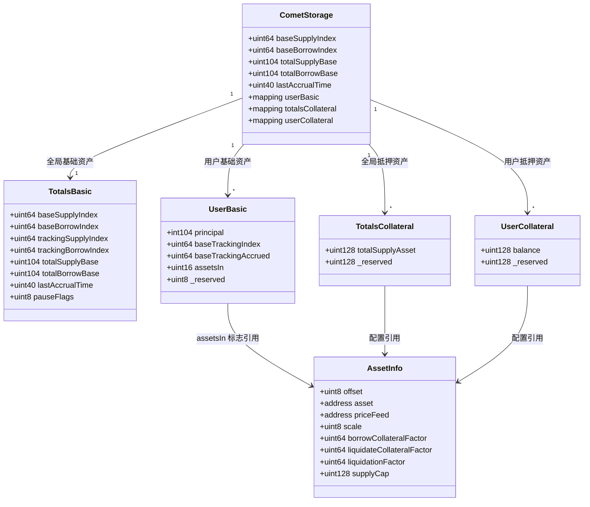

### 完整存储架构

```
┌─────────────────────────────────────────────────────────────┐
│                    Comet 存储架构                            │
└─────────────────────────────────────────────────────────────┘

全局层 (Global Level)
├─ 基础资产全局状态
│  ├─ baseSupplyIndex: uint64         (供应指数)
│  ├─ baseBorrowIndex: uint64         (借贷指数)
│  ├─ totalSupplyBase: uint104        (总供应本金)
│  ├─ totalBorrowBase: uint104        (总借贷本金)
│  └─ lastAccrualTime: uint40         (上次累积时间)
│
└─ 抵押资产全局统计
   └─ mapping(address => TotalsCollateral) totalsCollateral
      └─ TotalsCollateral:
         └─ totalSupplyAsset: uint128  (该资产总供应量)

用户层 (User Level)
├─ 用户基础资产数据
│  └─ mapping(address => UserBasic) userBasic
│     └─ UserBasic:
│        ├─ principal: int104         (本金，有符号)
│        ├─ baseTrackingIndex: uint64 (奖励快照)
│        ├─ baseTrackingAccrued: uint64 (已累积奖励)
│        └─ assetsIn: uint16          (持有的抵押资产位标志)
│
└─ 用户抵押资产余额
   └─ mapping(address => mapping(address => UserCollateral)) userCollateral
      └─ UserCollateral:
         └─ balance: uint128           (该资产余额)

配置层 (Configuration Level)
└─ 抵押资产配置 (Immutable)
   ├─ asset00_a, asset00_b: uint256   (资产 0 配置)
   ├─ asset01_a, asset01_b: uint256   (资产 1 配置)
   └─ ... (asset02 ~ asset14)
   
   解包为 AssetInfo:
   ├─ asset: address                   (代币地址)
   ├─ priceFeed: address               (价格预言机)
   ├─ borrowCollateralFactor: uint64   (抵押率)
   ├─ liquidateCollateralFactor: uint64 (清算阈值)
   └─ supplyCap: uint128               (供应上限)
```

### 数据访问路径

```
查询用户基础资产余额:
userBasic[user].principal → int104 本金
  ↓ (如果 > 0)
presentValue = principal × baseSupplyIndex / 1e15
  ↓
返回当前供应价值

查询用户抵押资产余额:
userCollateral[user][asset].balance → uint128 余额
  ↓
返回抵押品数量（无需转换，没有利息）

查询用户是否持有某资产:
assetsIn = userBasic[user].assetsIn  → uint16 位标志
  ↓
isInAsset = (assetsIn & (1 << assetOffset)) != 0
  ↓
返回 true/false
```

### 数据访问流程图

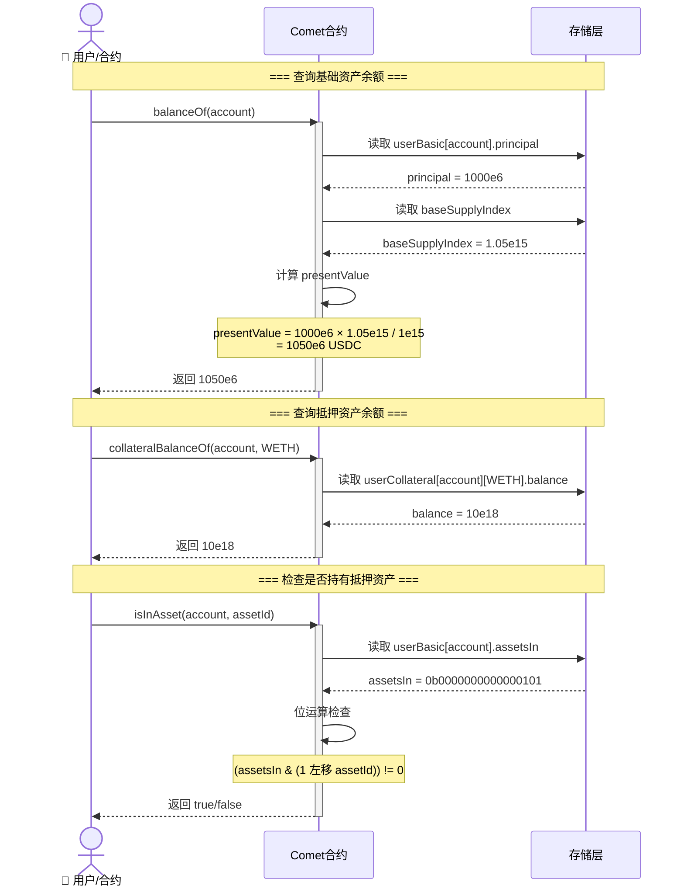

---

## 存储优化技巧

### 1. 紧凑打包（Tight Packing）

```solidity
// ❌ 未优化: 占用 4 个存储槽
struct Bad {
    uint256 a;  // 256 bits → 槽 0
    uint8 b;    // 8 bits   → 槽 1
    uint16 c;   // 16 bits  → 槽 2
    uint32 d;   // 32 bits  → 槽 3
}
// Gas 成本: 4 × SSTORE = 4 × 20,000 = 80,000 gas

// ✅ 优化后: 占用 1 个存储槽
struct Good {
    uint8 b;    // 8 bits   ┐
    uint16 c;   // 16 bits  │
    uint32 d;   // 32 bits  │ → 槽 0 (56 bits)
    uint200 a;  // 200 bits ┘
}
// Gas 成本: 1 × SSTORE = 20,000 gas
// 节省: 60,000 gas (75%)
```

### 2. 有符号整数的巧妙使用

```solidity
// 传统方式: 需要额外的标志位
struct Traditional {
    uint104 amount;
    bool isSupply;  // true=供应, false=借贷
}
// 需要: 104 + 8 = 112 bits

// ✅ Comet 方式: 使用有符号整数
struct Optimized {
    int104 principal;  // 正=供应, 负=借贷
}
// 需要: 104 bits
// 节省: 8 bits
// 优势: 一个变量完成两个用途
```

### 3. 位标志优化

```solidity
// 传统方式: 使用 mapping
mapping(address => mapping(uint8 => bool)) hasAsset;
// 每个资产需要 1 个存储槽
// 15 个资产 = 15 个槽 = 300,000 gas

// ✅ Comet 方式: 使用位标志
uint16 assetsIn;
// 所有 16 个资产 = 1 个槽 = 20,000 gas
// 节省: 280,000 gas (93%)

// 检查是否持有资产 2:
bool hasAsset2 = (assetsIn & (1 << 2)) != 0;
// assetsIn = 0b0000000000000101
// (1 << 2) = 0b0000000000000100
// & 操作   = 0b0000000000000100 != 0 → true

// 设置持有资产 3:
assetsIn |= (1 << 3);
// assetsIn = 0b0000000000001101

// 清除资产 2:
assetsIn &= ~(1 << 2);
// assetsIn = 0b0000000000001001
```

#### 位标志操作流程图

```mermaid
flowchart TD
    Start([assetsIn 位标志操作])
    
    subgraph Check["检查资产 (isInAsset)"]
        C1["读取 assetsIn"]
        C2["计算掩码: mask = 1 左移 offset"]
        C3["位与运算: result = assetsIn & mask"]
        C4{result != 0?}
        C5["返回 true<br/>持有该资产"]
        C6["返回 false<br/>不持有该资产"]
        C1 --> C2 --> C3 --> C4
        C4 -->|是| C5
        C4 -->|否| C6
    end
    
    subgraph Set["设置资产 (setAssetIn)"]
        S1["读取 assetsIn"]
        S2["计算掩码: mask = 1 左移 offset"]
        S3["位或运算: assetsIn |= mask"]
        S4["保存新的 assetsIn"]
        S1 --> S2 --> S3 --> S4
    end
    
    subgraph Clear["清除资产 (clearAssetIn)"]
        L1["读取 assetsIn"]
        L2["计算掩码: mask = 1 左移 offset"]
        L3["取反: invMask = ~mask"]
        L4["位与运算: assetsIn &= invMask"]
        L5["保存新的 assetsIn"]
        L1 --> L2 --> L3 --> L4 --> L5
    end
    
    Start --> Check
    Start --> Set
    Start --> Clear
    
    style Start fill:#e3f2fd
    style Check fill:#c8e6c9
    style Set fill:#fff9c4
    style Clear fill:#ffcdd2
```

#### 位标志示例可视化

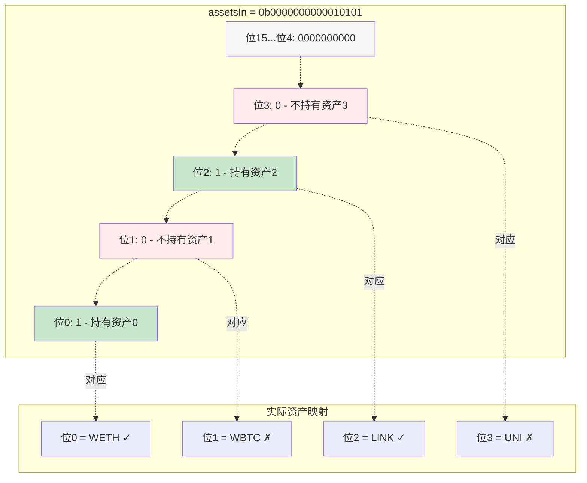

### 4. 本金-现值分离

```solidity
// 传统方式: 存储当前价值
struct Traditional {
    uint256 currentBalance;  // 需要不断更新
}
// 每次利息累积都需要更新所有用户 = 昂贵

// ✅ Comet 方式: 存储本金，动态计算现值
struct Optimized {
    int104 principal;  // 固定不变
}
// 计算时才转换:
presentValue = principal × index / 1e15
// 利息累积只需要更新全局 index = 便宜
```

#### 利息累积机制流程图

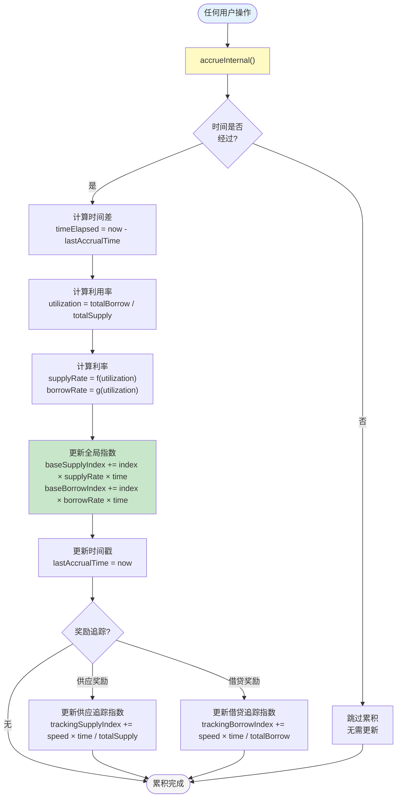

#### 本金到现值转换图

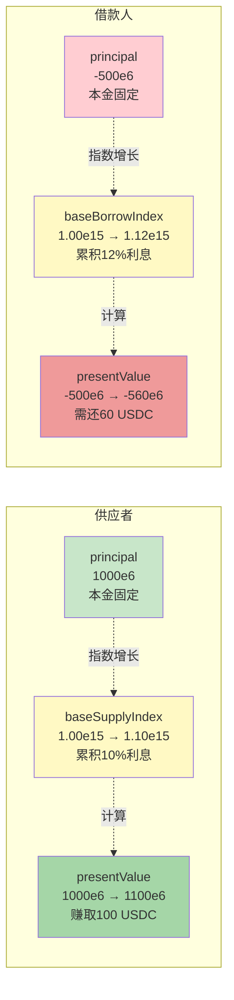

---

## 实际应用示例

### 完整操作流程图

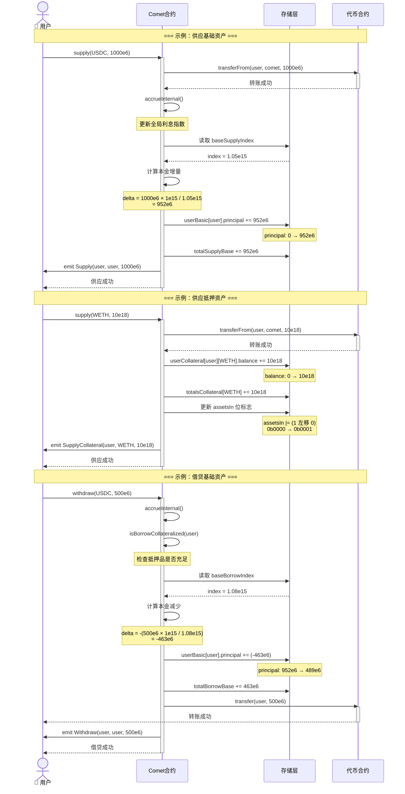

### 示例 1: 用户供应基础资产

```solidity
// 用户 Alice 供应 1000 USDC

// === 更新前 ===
userBasic[alice].principal = 0
totalSupplyBase = 10000e6
baseSupplyIndex = 1.05e15  // 已累积 5% 利息

// === 供应 1000 USDC ===
uint256 amount = 1000e6;  // 1000 USDC

// 计算本金增量
int104 principalDelta = int104(amount × 1e15 / baseSupplyIndex);
principalDelta = int104(1000e6 × 1e15 / 1.05e15);
principalDelta = 952e6;  // 本金约为 952 USDC

// 更新用户数据
userBasic[alice].principal += principalDelta;
userBasic[alice].principal = 952e6;

// 更新全局数据
totalSupplyBase += uint104(principalDelta);
totalSupplyBase = 10952e6;

// === 查询当前价值 ===
// 一段时间后，指数变为 1.10e15
presentValue = 952e6 × 1.10e15 / 1e15;
presentValue = 1047.2e6;  // 约 1047.2 USDC
// 赚取利息: 1047.2 - 1000 = 47.2 USDC
```

### 示例 2: 用户借贷基础资产

```solidity
// 用户 Bob 借贷 500 USDC

// === 更新前 ===
userBasic[bob].principal = 2000e6  // 已供应 2000 USDC
totalBorrowBase = 5000e6
baseBorrowIndex = 1.08e15  // 已累积 8% 利息

// === 借贷 500 USDC ===
uint256 amount = 500e6;  // 500 USDC

// 计算本金增量（负值）
int104 principalDelta = -int104(amount × 1e15 / baseBorrowIndex);
principalDelta = -int104(500e6 × 1e15 / 1.08e15);
principalDelta = -463e6;  // 本金约为 -463 USDC

// 更新用户数据
userBasic[bob].principal += principalDelta;
userBasic[bob].principal = 2000e6 - 463e6 = 1537e6;

// 更新全局数据
totalBorrowBase += uint104(-principalDelta);
totalBorrowBase = 5463e6;

// === 查询当前债务 ===
// 一段时间后，指数变为 1.12e15
借贷部分本金 = -463e6
presentValue = 463e6 × 1.12e15 / 1e15;
presentValue = 518.56e6;  // 约 518.56 USDC 债务
// 应付利息: 518.56 - 500 = 18.56 USDC
```

### 示例 3: 用户供应抵押资产

```solidity
// 用户 Carol 供应 10 WETH 作为抵押

// === 更新前 ===
userCollateral[carol][WETH].balance = 0
totalsCollateral[WETH].totalSupplyAsset = 1000e18
userBasic[carol].assetsIn = 0b0000000000000000  // 无抵押品

// === 供应 10 WETH ===
uint256 amount = 10e18;  // 10 WETH
uint8 assetOffset = 0;   // WETH 是资产 0

// 更新用户抵押资产余额
userCollateral[carol][WETH].balance = 10e18;

// 更新全局抵押资产统计
totalsCollateral[WETH].totalSupplyAsset += uint128(amount);
totalsCollateral[WETH].totalSupplyAsset = 1010e18;

// 更新用户的 assetsIn 位标志
userBasic[carol].assetsIn |= (uint16(1) << assetOffset);
userBasic[carol].assetsIn = 0b0000000000000001;  // 持有资产 0

// === 查询抵押品价值 ===
AssetInfo memory assetInfo = getAssetInfo(0);
uint256 price = getPrice(assetInfo.priceFeed);  // 假设 2000e8 ($2000)
uint256 collateralValue = 10e18 × 2000e8 / 1e18;
collateralValue = 20000e8;  // $20,000

// 计算借贷能力
uint256 borrowCapacity = collateralValue × assetInfo.borrowCollateralFactor / 1e18;
borrowCapacity = 20000e8 × 0.80e18 / 1e18;
borrowCapacity = 16000e8;  // 可借贷 $16,000
```

### 示例 4: 检查用户持有的抵押资产

```solidity
// 用户 Dave 持有多种抵押资产

// === 用户数据 ===
userBasic[dave].assetsIn = 0b0000000000010101;
// 二进制解析:
// 位 0 = 1: 持有资产 0 (WETH)
// 位 1 = 0: 不持有资产 1
// 位 2 = 1: 持有资产 2 (LINK)
// 位 3 = 0: 不持有资产 3
// 位 4 = 1: 持有资产 4 (COMP)

// === 检查是否持有某资产 ===
function isInAsset(uint16 assetsIn, uint8 assetOffset) internal pure returns (bool) {
    return (assetsIn & (uint16(1) << assetOffset)) != 0;
}

// 检查资产 0 (WETH)
isInAsset(0b0000000000010101, 0);
// (0b0000000000010101 & 0b0000000000000001) = 0b0000000000000001 != 0
// 结果: true ✓

// 检查资产 1
isInAsset(0b0000000000010101, 1);
// (0b0000000000010101 & 0b0000000000000010) = 0b0000000000000000 == 0
// 结果: false ✗

// 检查资产 2 (LINK)
isInAsset(0b0000000000010101, 2);
// (0b0000000000010101 & 0b0000000000000100) = 0b0000000000000100 != 0
// 结果: true ✓

// === 遍历所有持有的资产 ===
uint16 assetsIn = userBasic[dave].assetsIn;
for (uint8 i = 0; i < numAssets; i++) {
    if (isInAsset(assetsIn, i)) {
        AssetInfo memory asset = getAssetInfo(i);
        uint128 balance = userCollateral[dave][asset.asset].balance;
        // 处理该抵押资产...
    }
}
```

### 示例 5: 完整的借贷场景

```solidity
// 用户 Eve 的完整借贷操作

// === 初始状态 ===
userBasic[eve].principal = 0
userBasic[eve].assetsIn = 0b0000000000000000
userCollateral[eve][WETH].balance = 0

// === 步骤 1: 供应 5 WETH 作为抵押 ===
supply(WETH, 5e18);

// 结果:
userCollateral[eve][WETH].balance = 5e18
userBasic[eve].assetsIn = 0b0000000000000001  // 持有资产 0
totalsCollateral[WETH].totalSupplyAsset += 5e18

// === 步骤 2: 计算借贷能力 ===
WETH 价格 = $2000
WETH 价值 = 5e18 × 2000e8 / 1e18 = 10000e8 ($10,000)
借贷能力 = 10000e8 × 0.80 = 8000e8 ($8,000)

// === 步骤 3: 借贷 6000 USDC ===
withdraw(USDC, 6000e6);

// 结果:
userBasic[eve].principal = -5714e6  // 负值表示借贷
totalBorrowBase += 5714e6

// === 步骤 4: 时间流逝，累积利息 ===
baseBorrowIndex: 1.05e15 → 1.10e15 (增长 5%)

当前债务 = 5714e6 × 1.10e15 / 1e15 = 6285e6 USDC
应付利息 = 6285e6 - 6000e6 = 285e6 USDC

// === 步骤 5: 检查抵押是否充足 ===
function isBorrowCollateralized(eve) returns (bool) {
    int104 principal = userBasic[eve].principal;  // -5714e6
    int liquidity = presentValue(baseSupplyIndex, principal);
    // liquidity = -5714e6 × 1.10e15 / 1e15 = -6285e8
    
    uint16 assetsIn = userBasic[eve].assetsIn;  // 0b0...0001
    for (uint8 i = 0; i < numAssets; i++) {
        if (isInAsset(assetsIn, i)) {  // i=0, WETH
            AssetInfo memory asset = getAssetInfo(0);
            uint128 balance = userCollateral[eve][WETH].balance;  // 5e18
            uint256 value = balance × 2000e8 / 1e18;  // 10000e8
            liquidity += int(value × asset.borrowCollateralFactor / 1e18);
            // liquidity = -6285e8 + 10000e8 × 0.80 = -6285e8 + 8000e8
            // liquidity = 1715e8 ($1715)
        }
    }
    
    return liquidity >= 0;  // true ✓ (仍有余额，安全)
}
```

---

## 数据结构总结

### Gas 优化对比图

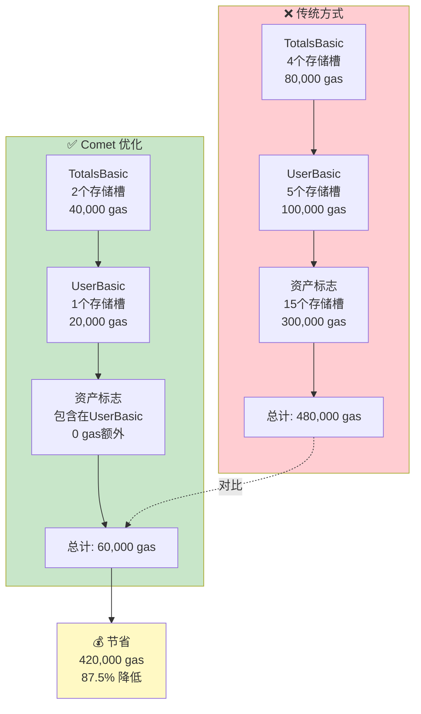

### 完整数据流图

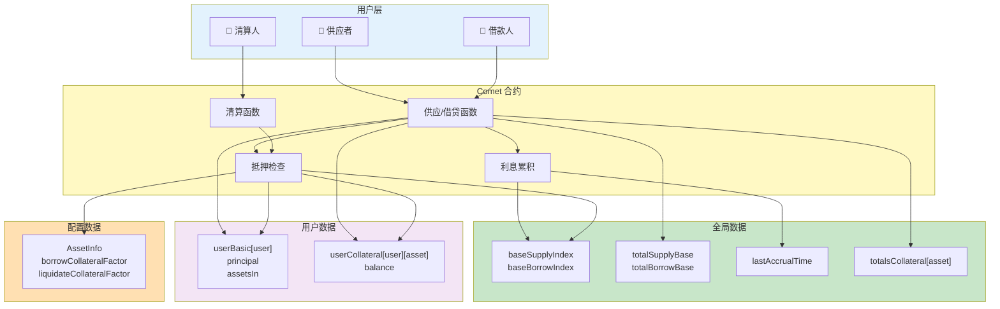

### 关键特性对比

| 特性 | 基础资产 | 抵押资产 |
|------|----------|----------|
| **数据类型** | 有符号整数 (int104) | 无符号整数 (uint128) |
| **存储方式** | 本金（principal） | 余额（balance） |
| **利息** | ✅ 有（动态计算） | ❌ 无 |
| **方向** | 双向（供应/借贷） | 单向（仅供应） |
| **全局索引** | ✅ 有（供应/借贷指数） | ❌ 无 |
| **数量** | 1 种/市场 | 最多 15-24 种/市场 |
| **位标志** | ❌ 不需要 | ✅ 需要（assetsIn） |

### 存储槽总结

| 结构体 | 大小 | 存储槽 | Gas 效率 |
|--------|------|--------|----------|
| **TotalsBasic** | 512 bits | 2 slots | ⭐⭐⭐⭐⭐ |
| **UserBasic** | 256 bits | 1 slot | ⭐⭐⭐⭐⭐ |
| **TotalsCollateral** | 256 bits | 1 slot | ⭐⭐⭐⭐⭐ |
| **UserCollateral** | 256 bits | 1 slot | ⭐⭐⭐⭐⭐ |

### 存储效率可视化

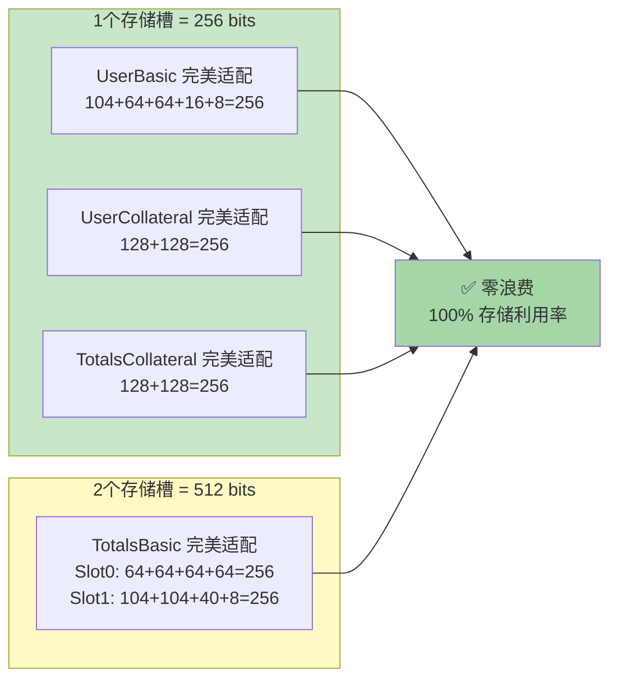

---

## 相关文档

- [core_class_diagram.md](core_class_diagram.md) - 核心类图详解
- [comet_variants_comparison.md](comet_variants_comparison.md) - Comet 变体对比
- [QUICK_REFERENCE.md](QUICK_REFERENCE.md) - 快速参考手册

---

## 📊 文档图表总览

本文档包含以下 Mermaid 可视化图表：

### 架构与关系图
1. **基础资产 vs 抵押资产对比图** - 展示两种资产类型的特点
2. **数据结构类图** - 展示所有结构体之间的关系
3. **完整数据流图** - 展示用户操作到数据存储的完整流程

### 存储布局图
4. **TotalsBasic 存储槽可视化** - 展示全局基础资产的2个存储槽
5. **UserBasic 存储槽可视化** - 展示用户基础资产的1个存储槽
6. **存储效率可视化** - 展示完美的存储槽利用率

### 流程与算法图
7. **Principal 计算流程图** - 展示本金到现值的转换逻辑
8. **位标志操作流程图** - 展示 assetsIn 的三种操作（检查/设置/清除）
9. **位标志示例可视化** - 展示具体的位标志到资产的映射
10. **利息累积机制流程图** - 展示 accrueInternal 的完整流程
11. **本金到现值转换图** - 展示供应者和借款人的价值计算

### 操作序列图
12. **数据访问流程图** - 展示查询余额和检查资产的完整序列
13. **完整操作流程图** - 展示供应、借贷的完整交互序列

### 优化对比图
14. **Gas 优化对比图** - 展示传统方式与 Comet 方式的 Gas 成本对比

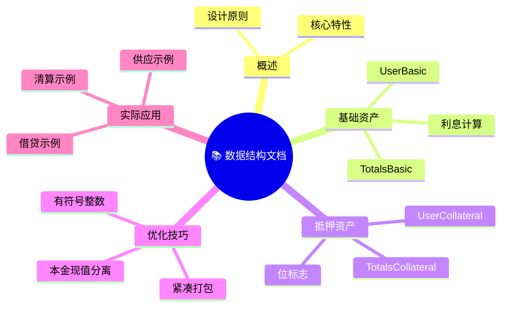

---

**文档版本**: 2.0.0  
**最后更新**: 2026-01-16  
**作者**: Compound 社区  
**更新内容**: 添加 14 个 Mermaid 可视化图表
