# Compound Comet 核心流程分析

> 深度解析 Compound V3 的核心操作流程

## 目录

### 第一部分：基础操作流程

1. [用户存款与取款流程](#一用户存款与取款流程)
   - 1.1 [存款流程详解](#11-存款流程详解)
   - 1.2 [取款流程详解](#12-取款流程详解)
2. [用户贷款与还款流程](#二用户贷款与还款流程)
   - 2.1 [贷款机制](#21-贷款机制)
   - 2.2 [还款机制](#22-还款机制)
3. [计息计算机制](#三计息计算机制)
   - 3.1 [利率模型](#31-利率模型)
   - 3.2 [利息累积机制](#32-利息累积机制)
   - 3.3 [本金与当前价值转换](#33-本金与当前价值转换)
   - 3.4 [计息示例计算](#34-计息示例计算)
4. [清算流程](#四清算流程)
   - 4.1 [清算触发条件](#41-清算触发条件)
   - 4.2 [清算执行流程](#42-清算执行流程)
   - 4.3 [购买抵押品](#43-购买抵押品)
   - 4.4 [清算示例场景](#44-清算示例场景)
   - 4.5 [清算完整时序图](#45-清算完整时序图)

### 第二部分：高级操作流程

1. [转账流程](#五转账流程)
   - 5.1 [核心概念](#51-核心概念)
   - 5.2 [转账核心代码](#52-转账核心代码)
   - 5.3 [转账场景示例](#53-转账场景示例)
   - 5.4 [转账时序图](#54-转账时序图)
2. [授权机制](#六授权机制)
   - 6.1 [授权类型](#61-授权类型)
   - 6.2 [授权核心代码](#62-授权核心代码)
   - 6.3 [EIP-712 签名流程](#63-eip-712-签名流程)
   - 6.4 [授权时序图](#64-授权时序图)
3. [奖励领取流程](#七奖励领取流程)
   - 7.1 [奖励机制概述](#71-奖励机制概述)
   - 7.2 [奖励配置](#72-奖励配置)
   - 7.3 [奖励计算](#73-奖励计算)
   - 7.4 [奖励领取](#74-奖励领取)
   - 7.5 [奖励领取时序图](#75-奖励领取时序图)
4. [储备金提取流程](#八储备金提取流程)
   - 8.1 [储备金机制](#81-储备金机制)
   - 8.2 [提取储备金](#82-提取储备金)
   - 8.3 [储备金示例](#83-储备金示例)
   - 8.4 [储备金提取时序图](#84-储备金提取时序图)

### 第三部分：治理与管理

1. [暂停与恢复机制](#九暂停与恢复机制)
   - 9.1 [暂停机制设计](#91-暂停机制设计)
   - 9.2 [暂停/恢复操作](#92-暂停恢复操作)
   - 9.3 [暂停场景](#93-暂停场景)
   - 9.4 [暂停时序图](#94-暂停时序图)
2. [初始化流程](#十初始化流程)
    - 10.1 [初始化设计](#101-初始化设计)
    - 10.2 [构造函数](#102-构造函数)
    - 10.3 [存储初始化](#103-存储初始化)
    - 10.4 [初始化时序图](#104-初始化时序图)
3. [批量操作（Bulker）](#十一批量操作bulker)
    - 11.1 [Bulker 概述](#111-bulker-概述)
    - 11.2 [Bulker 核心代码](#112-bulker-核心代码)
    - 11.3 [使用示例](#113-使用示例)
    - 11.4 [Bulker 时序图](#114-bulker-时序图)

### 第四部分：总结

1. [核心流程总结](#十二核心流程总结)
    - 12.1 [所有核心流程概览](#121-所有核心流程概览)
    - 12.2 [流程间关系](#122-流程间关系)
    - 12.3 [关键设计模式](#123-关键设计模式)
    - 12.4 [安全机制汇总](#124-安全机制汇总)
2. [关键点总结](#十三关键点总结)
    - 13.1 [核心流程关键点](#131-核心流程关键点)
    - 13.2 [Gas 优化技巧](#132-gas-优化技巧)
    - 13.3 [安全机制](#133-安全机制)
    - 13.4 [数学精度](#134-数学精度)
3. [实际应用建议](#十四实际应用建议)
    - 14.1 [用户操作建议](#141-用户操作建议)
    - 14.2 [清算机器人建议](#142-清算机器人建议)

---

## 一、用户存款与取款流程

### 1.1 存款流程详解

#### 核心概念

Comet 协议中的"存款"分为两种类型：

- **基础资产存款**：存入基础借贷资产（如 USDC），获得利息收益
- **抵押品存款**：存入抵押品资产（如 ETH、WBTC），不获得利息，但可用于借贷

#### 存款核心代码

**入口函数** ([📄 Comet.sol:835-876](https://github.com/compound-finance/comet/blob/main/contracts/Comet.sol#L835-L876)):

```solidity
function supply(address asset, uint amount) override external {
    return supplyInternal(msg.sender, msg.sender, msg.sender, asset, amount);
}

function supplyInternal(address operator, address from, address dst, address asset, uint amount) 
    internal nonReentrant {
    if (isSupplyPaused()) revert Paused();
    if (!hasPermission(from, operator)) revert Unauthorized();

    if (asset == baseToken) {
        // 存入基础资产
        if (amount == type(uint256).max) {
            amount = borrowBalanceOf(dst);  // 还清全部债务
        }
        return supplyBase(from, dst, amount);
    } else {
        // 存入抵押品
        return supplyCollateral(from, dst, asset, safe128(amount));
    }
}
```

**基础资产存款** ([📄 Comet.sol:881-903](https://github.com/compound-finance/comet/blob/main/contracts/Comet.sol#L881-L903)):

```solidity
function supplyBase(address from, address dst, uint256 amount) internal {
    // 1. 转入代币（处理手续费代币）
    amount = doTransferIn(baseToken, from, amount);

    // 2. 累积利息和奖励
    accrueInternal();

    // 3. 读取用户数据
    UserBasic memory dstUser = userBasic[dst];
    int104 dstPrincipal = dstUser.principal;
    
    // 4. 计算新的余额和本金
    int256 dstBalance = presentValue(dstPrincipal) + signed256(amount);
    int104 dstPrincipalNew = principalValue(dstBalance);

    // 5. 区分还款和供应
    (uint104 repayAmount, uint104 supplyAmount) = repayAndSupplyAmount(dstPrincipal, dstPrincipalNew);

    // 6. 更新全局状态
    totalSupplyBase += supplyAmount;
    totalBorrowBase -= repayAmount;

    // 7. 更新用户状态和奖励
    updateBasePrincipal(dst, dstUser, dstPrincipalNew);

    // 8. 发出事件
    emit Supply(from, dst, amount);
}
```

**抵押品存款** ([📄 Comet.sol:908-928](https://github.com/compound-finance/comet/blob/main/contracts/Comet.sol#L908-L928)):

```solidity
function supplyCollateral(address from, address dst, address asset, uint128 amount) internal {
    // 1. 转入代币
    amount = safe128(doTransferIn(asset, from, amount));

    // 2. 获取资产信息
    AssetInfo memory assetInfo = getAssetInfoByAddress(asset);
    
    // 3. 读取用户抵押品余额
    TotalsCollateral memory totals = totalsCollateral[asset];
    uint128 totalSupplyAsset = totals.totalSupplyAsset;
    uint128 currBalance = userCollateral[dst][asset].balance;
    uint128 newBalance = currBalance + amount;

    // 4. 检查供应上限
    if (totalSupplyAsset + amount > assetInfo.supplyCap) revert SupplyCapExceeded();

    // 5. 更新状态
    totalsCollateral[asset].totalSupplyAsset = totalSupplyAsset + amount;
    userCollateral[dst][asset].balance = newBalance;

    // 6. 更新用户持有的资产标志位
    updateAssetsIn(dst, assetInfo, currBalance, newBalance);

    emit SupplyCollateral(from, dst, asset, amount);
}
```

#### 存款时序图

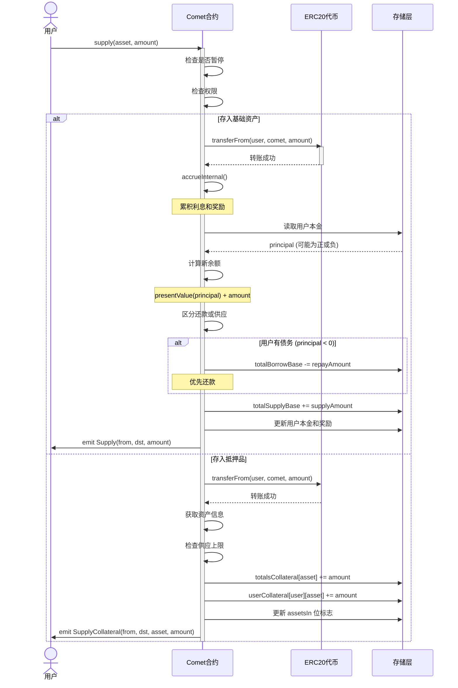

### 1.2 取款流程详解

#### 核心概念

- **取款**：提取存入的基础资产或抵押品
- **借贷**：当取款超过供应量时，自动进入借贷模式
- **抵押检查**：取款和借贷都需要检查抵押率

#### 取款核心代码

**入口函数** ([📄 Comet.sol:1057-1098](https://github.com/compound-finance/comet/blob/main/contracts/Comet.sol#L1057-L1098)):

```solidity
function withdraw(address asset, uint amount) override external {
    return withdrawInternal(msg.sender, msg.sender, msg.sender, asset, amount);
}

function withdrawInternal(address operator, address src, address to, address asset, uint amount) 
    internal nonReentrant {
    if (isWithdrawPaused()) revert Paused();
    if (!hasPermission(src, operator)) revert Unauthorized();

    if (asset == baseToken) {
        if (amount == type(uint256).max) {
            amount = balanceOf(src);  // 提取全部余额
        }
        return withdrawBase(src, to, amount);
    } else {
        return withdrawCollateral(src, to, asset, safe128(amount));
    }
}
```

**基础资产取款/借贷** ([📄 Comet.sol:1103-1130](https://github.com/compound-finance/comet/blob/main/contracts/Comet.sol#L1103-L1130)):

```solidity
function withdrawBase(address src, address to, uint256 amount) internal {
    accrueInternal();  // 先累积利息

    // 1. 读取用户数据
    UserBasic memory srcUser = userBasic[src];
    int104 srcPrincipal = srcUser.principal;
    
    // 2. 计算新余额（减去取款量）
    int256 srcBalance = presentValue(srcPrincipal) - signed256(amount);
    int104 srcPrincipalNew = principalValue(srcBalance);

    // 3. 区分取款和借贷
    (uint104 withdrawAmount, uint104 borrowAmount) = withdrawAndBorrowAmount(srcPrincipal, srcPrincipalNew);

    // 4. 更新全局状态
    totalSupplyBase -= withdrawAmount;
    totalBorrowBase += borrowAmount;

    // 5. 更新用户状态
    updateBasePrincipal(src, srcUser, srcPrincipalNew);

    // 6. 借贷检查
    if (srcBalance < 0) {
        // 检查最小借贷量
        if (uint256(-srcBalance) < baseBorrowMin) revert BorrowTooSmall();
        // 检查抵押率
        if (!isBorrowCollateralized(src)) revert NotCollateralized();
    }

    // 7. 转出代币
    doTransferOut(baseToken, to, amount);

    emit Withdraw(src, to, amount);
}
```

**抵押率检查** ([📄 Comet.sol:524-559](https://github.com/compound-finance/comet/blob/main/contracts/Comet.sol#L524-L559)):

```solidity
function isBorrowCollateralized(address account) override public view returns (bool) {
    int104 principal = userBasic[account].principal;
    
    // 如果没有借贷，总是通过
    if (principal >= 0) {
        return true;
    }

    uint16 assetsIn = userBasic[account].assetsIn;
    
    // 计算债务价值（负值）
    int liquidity = signedMulPrice(
        presentValue(principal),
        getPrice(baseTokenPriceFeed),
        uint64(baseScale)
    );

    // 遍历所有抵押品
    for (uint8 i = 0; i < numAssets; ) {
        if (isInAsset(assetsIn, i)) {
            if (liquidity >= 0) {
                return true;  // 已经足够抵押
            }

            AssetInfo memory asset = getAssetInfo(i);
            
            // 计算抵押品价值
            uint newAmount = mulPrice(
                userCollateral[account][asset.asset].balance,
                getPrice(asset.priceFeed),
                asset.scale
            );
            
            // 应用借贷抵押因子
            liquidity += signed256(mulFactor(
                newAmount,
                asset.borrowCollateralFactor
            ));
        }
        unchecked { i++; }
    }

    return liquidity >= 0;
}
```

**区分取款和借贷** ([📄 Comet.sol:622-633](https://github.com/compound-finance/comet/blob/main/contracts/Comet.sol#L622-L633)):

```solidity
function withdrawAndBorrowAmount(int104 oldPrincipal, int104 newPrincipal) 
    internal pure returns (uint104, uint104) {
    // 如果新本金更大，说明没有取款或借贷
    if (newPrincipal > oldPrincipal) return (0, 0);

    if (newPrincipal >= 0) {
        // 只是取款（从正到正）
        return (uint104(oldPrincipal - newPrincipal), 0);
    } else if (oldPrincipal <= 0) {
        // 只是借贷（从负到负）
        return (0, uint104(oldPrincipal - newPrincipal));
    } else {
        // 先取款再借贷（从正到负）
        return (uint104(oldPrincipal), uint104(-newPrincipal));
    }
}
```

#### 取款/借贷时序图

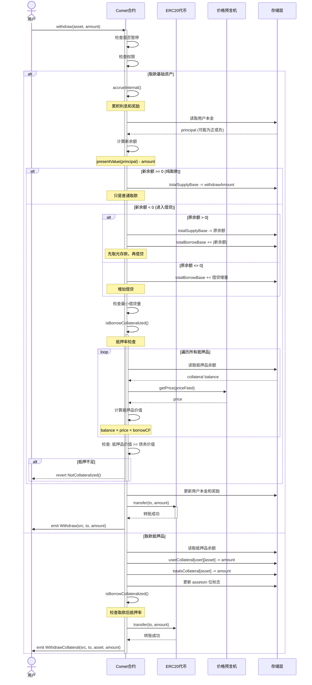

---

## 二、用户贷款与还款流程

### 2.1 贷款机制

#### 核心概念

Comet 的贷款**不是独立的操作**，而是通过**取款超过供应量**自动触发：

- 用户 principal > 0：有供应余额
- 用户 principal = 0：既无供应也无借贷
- 用户 principal < 0：有借贷（负的 principal 表示债务）

#### 贷款示例场景

```
场景1：用户首次借贷
- 初始状态：principal = 0，抵押品 = 10 ETH
- 操作：withdraw(USDC, 5000)
- 结果：principal = -5000（转为债务），取得 5000 USDC

场景2：用户已有存款后借贷
- 初始状态：principal = +3000 USDC，抵押品 = 10 ETH
- 操作：withdraw(USDC, 8000)
- 结果：
  - 先取出 3000 供应
  - 再借入 5000
  - 最终 principal = -5000

场景3：借贷限制
- 最小借贷量：baseBorrowMin (如 100 USDC)
- 不能借太小的金额，避免灰尘攻击
```

#### 借贷能力计算

**公式**：

```
借贷能力 = Σ (抵押品价值 × borrowCollateralFactor)

其中：
- 抵押品价值 = 抵押品余额 × 价格
- borrowCollateralFactor: 通常 0.70 ~ 0.85 (70% ~ 85%)
```

**代码实现** (见上文 `isBorrowCollateralized`)

### 2.2 还款机制

#### 核心概念

还款也**不是独立的操作**，而是通过**存入基础资产**自动还款：

- 如果用户有债务（principal < 0），存入会优先偿还债务
- 债务还清后，剩余部分成为供应

#### 还款示例场景

```
场景1：部分还款
- 初始状态：principal = -5000 USDC（债务）
- 操作：supply(USDC, 2000)
- 结果：principal = -3000 USDC（还剩 3000 债务）

场景2：完全还款
- 初始状态：principal = -5000 USDC
- 操作：supply(USDC, 5000)
- 结果：principal = 0（债务还清）

场景3：还款并转为供应
- 初始状态：principal = -3000 USDC
- 操作：supply(USDC, 8000)
- 结果：
  - 先还 3000 债务
  - 剩余 5000 成为供应
  - 最终 principal = +5000

场景4：一键还清
- 操作：supply(baseToken, type(uint256).max)
- 会自动计算债务并还清全部
```

#### 还款区分逻辑

**代码** ([📄 Comet.sol:606-617](https://github.com/compound-finance/comet/blob/main/contracts/Comet.sol#L606-L617)):

```solidity
function repayAndSupplyAmount(int104 oldPrincipal, int104 newPrincipal) 
    internal pure returns (uint104, uint104) {
    // 如果新本金更小，说明没有还款或供应
    if (newPrincipal < oldPrincipal) return (0, 0);

    if (newPrincipal <= 0) {
        // 只是还款（从负到负，或到0）
        return (uint104(newPrincipal - oldPrincipal), 0);
    } else if (oldPrincipal >= 0) {
        // 只是供应（从正到正）
        return (0, uint104(newPrincipal - oldPrincipal));
    } else {
        // 先还款再供应（从负到正）
        return (uint104(-oldPrincipal), uint104(newPrincipal));
    }
}
```

#### 贷款/还款时序图

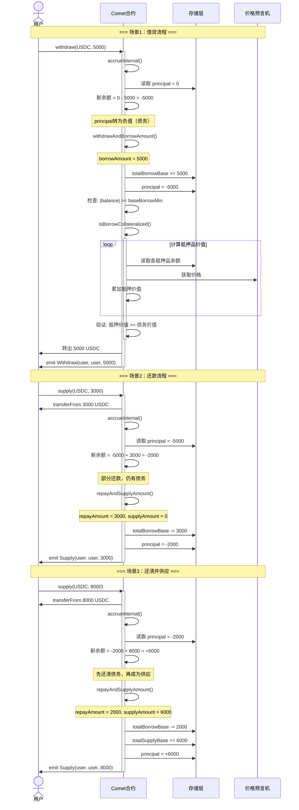

---

## 三、计息计算机制

### 3.1 利率模型

Comet 使用**双斜率（Kink）利率模型**：

#### 利率公式

**供应利率**：

```
if utilization <= supplyKink:
    supplyRate = supplyRateBase + supplyRateSlopeLow × utilization
else:
    supplyRate = supplyRateBase 
                + supplyRateSlopeLow × supplyKink
                + supplyRateSlopeHigh × (utilization - supplyKink)
```

**借贷利率**：

```
if utilization <= borrowKink:
    borrowRate = borrowRateBase + borrowRateSlopeLow × utilization
else:
    borrowRate = borrowRateBase 
                + borrowRateSlopeLow × borrowKink
                + borrowRateSlopeHigh × (utilization - borrowKink)
```

**资金利用率**：

```
utilization = totalBorrow / totalSupply
```

#### 利率计算代码

**利用率** ([📄 Comet.sol:478-486](https://github.com/compound-finance/comet/blob/main/contracts/Comet.sol#L478-L486)):

```solidity
function getUtilization() override public view returns (uint) {
    uint totalSupply_ = presentValueSupply(baseSupplyIndex, totalSupplyBase);
    uint totalBorrow_ = presentValueBorrow(baseBorrowIndex, totalBorrowBase);
    if (totalSupply_ == 0) {
        return 0;
    } else {
        return totalBorrow_ * FACTOR_SCALE / totalSupply_;
    }
}
```

**供应利率** ([📄 Comet.sol:449-457](https://github.com/compound-finance/comet/blob/main/contracts/Comet.sol#L449-L457)):

```solidity
function getSupplyRate(uint utilization) override public view returns (uint64) {
    if (utilization <= supplyKink) {
        // 低于拐点
        return safe64(supplyPerSecondInterestRateBase + 
                     mulFactor(supplyPerSecondInterestRateSlopeLow, utilization));
    } else {
        // 高于拐点
        return safe64(supplyPerSecondInterestRateBase + 
                     mulFactor(supplyPerSecondInterestRateSlopeLow, supplyKink) + 
                     mulFactor(supplyPerSecondInterestRateSlopeHigh, (utilization - supplyKink)));
    }
}
```

**借贷利率** ([📄 Comet.sol:464-472](https://github.com/compound-finance/comet/blob/main/contracts/Comet.sol#L464-L472)):

```solidity
function getBorrowRate(uint utilization) override public view returns (uint64) {
    if (utilization <= borrowKink) {
        return safe64(borrowPerSecondInterestRateBase + 
                     mulFactor(borrowPerSecondInterestRateSlopeLow, utilization));
    } else {
        return safe64(borrowPerSecondInterestRateBase + 
                     mulFactor(borrowPerSecondInterestRateSlopeLow, borrowKink) + 
                     mulFactor(borrowPerSecondInterestRateSlopeHigh, (utilization - borrowKink)));
    }
}
```

### 3.2 利息累积机制

#### 指数累积原理

Comet 使用**指数累积**方式计算利息，而不是简单的线性累加：

**核心公式**：

```
新指数 = 旧指数 × (1 + 利率 × 时间间隔)

用户当前价值 = 用户本金 × 当前指数 / 基础指数
```

**优势**：

- 复利计算自动完成
- 不需要遍历所有用户
- Gas 成本固定，不随用户数增加

#### 利息累积代码

**指数计算** ([📄 Comet.sol:403-414](https://github.com/compound-finance/comet/blob/main/contracts/Comet.sol#L403-L414)):

```solidity
function accruedInterestIndices(uint timeElapsed) internal view returns (uint64, uint64) {
    uint64 baseSupplyIndex_ = baseSupplyIndex;
    uint64 baseBorrowIndex_ = baseBorrowIndex;
    
    if (timeElapsed > 0) {
        // 1. 获取当前利用率
        uint utilization = getUtilization();
        
        // 2. 计算供应和借贷利率
        uint supplyRate = getSupplyRate(utilization);
        uint borrowRate = getBorrowRate(utilization);
        
        // 3. 更新指数
        baseSupplyIndex_ += safe64(mulFactor(baseSupplyIndex_, supplyRate * timeElapsed));
        baseBorrowIndex_ += safe64(mulFactor(baseBorrowIndex_, borrowRate * timeElapsed));
    }
    
    return (baseSupplyIndex_, baseBorrowIndex_);
}
```

**全局累积** ([📄 Comet.sol:419-432](https://github.com/compound-finance/comet/blob/main/contracts/Comet.sol#L419-L432)):

```solidity
function accrueInternal() internal {
    uint40 now_ = getNowInternal();
    uint timeElapsed = uint256(now_ - lastAccrualTime);
    
    if (timeElapsed > 0) {
        // 1. 更新利息指数
        (baseSupplyIndex, baseBorrowIndex) = accruedInterestIndices(timeElapsed);
        
        // 2. 更新奖励追踪指数（如果达到最小要求）
        if (totalSupplyBase >= baseMinForRewards) {
            trackingSupplyIndex += safe64(divBaseWei(
                baseTrackingSupplySpeed * timeElapsed, 
                totalSupplyBase
            ));
        }
        if (totalBorrowBase >= baseMinForRewards) {
            trackingBorrowIndex += safe64(divBaseWei(
                baseTrackingBorrowSpeed * timeElapsed, 
                totalBorrowBase
            ));
        }
        
        // 3. 更新时间戳
        lastAccrualTime = now_;
    }
}
```

**用户奖励更新** ([📄 Comet.sol:761-780](https://github.com/compound-finance/comet/blob/main/contracts/Comet.sol#L761-L780)):

```solidity
function updateBasePrincipal(address account, UserBasic memory basic, int104 principalNew) internal {
    int104 principal = basic.principal;
    basic.principal = principalNew;

    // 计算奖励增量
    if (principal >= 0) {
        // 供应奖励
        uint indexDelta = uint256(trackingSupplyIndex - basic.baseTrackingIndex);
        basic.baseTrackingAccrued += safe64(
            uint104(principal) * indexDelta / trackingIndexScale / accrualDescaleFactor
        );
    } else {
        // 借贷奖励
        uint indexDelta = uint256(trackingBorrowIndex - basic.baseTrackingIndex);
        basic.baseTrackingAccrued += safe64(
            uint104(-principal) * indexDelta / trackingIndexScale / accrualDescaleFactor
        );
    }

    // 更新用户的追踪索引
    if (principalNew >= 0) {
        basic.baseTrackingIndex = trackingSupplyIndex;
    } else {
        basic.baseTrackingIndex = trackingBorrowIndex;
    }

    userBasic[account] = basic;
}
```

### 3.3 本金与当前价值转换

#### 转换原理

```
当前价值 = 本金 × 指数 / BASE_INDEX_SCALE

本金 = 当前价值 × BASE_INDEX_SCALE / 指数
```

**重要细节**：

- 供应：向下舍入（对协议有利）
- 借贷：向上舍入（对协议有利）

#### 转换代码

**本金 → 当前价值** ([📄 CometCore.sol:79-99](https://github.com/compound-finance/comet/blob/main/contracts/CometCore.sol#L79-L99)):

```solidity
function presentValue(int104 principalValue_) internal view returns (int256) {
    if (principalValue_ >= 0) {
        // 供应余额
        return signed256(presentValueSupply(baseSupplyIndex, uint104(principalValue_)));
    } else {
        // 借贷余额
        return -signed256(presentValueBorrow(baseBorrowIndex, uint104(-principalValue_)));
    }
}

function presentValueSupply(uint64 baseSupplyIndex_, uint104 principalValue_) 
    internal pure returns (uint256) {
    return uint256(principalValue_) * baseSupplyIndex_ / BASE_INDEX_SCALE;
}

function presentValueBorrow(uint64 baseBorrowIndex_, uint104 principalValue_) 
    internal pure returns (uint256) {
    return uint256(principalValue_) * baseBorrowIndex_ / BASE_INDEX_SCALE;
}
```

**当前价值 → 本金** ([📄 CometCore.sol:104-126](https://github.com/compound-finance/comet/blob/main/contracts/CometCore.sol#L104-L126)):

```solidity
function principalValue(int256 presentValue_) internal view returns (int104) {
    if (presentValue_ >= 0) {
        return signed104(principalValueSupply(baseSupplyIndex, uint256(presentValue_)));
    } else {
        return -signed104(principalValueBorrow(baseBorrowIndex, uint256(-presentValue_)));
    }
}

function principalValueSupply(uint64 baseSupplyIndex_, uint256 presentValue_) 
    internal pure returns (uint104) {
    // 向下舍入
    return safe104((presentValue_ * BASE_INDEX_SCALE) / baseSupplyIndex_);
}

function principalValueBorrow(uint64 baseBorrowIndex_, uint256 presentValue_) 
    internal pure returns (uint104) {
    // 向上舍入（+baseBorrowIndex_ - 1）
    return safe104((presentValue_ * BASE_INDEX_SCALE + baseBorrowIndex_ - 1) / baseBorrowIndex_);
}
```

### 3.4 计息示例计算

#### 示例参数

```
初始状态：
- baseSupplyIndex = 1e15 (BASE_INDEX_SCALE)
- baseBorrowIndex = 1e15
- supplyRate = 0.02 / year = 6.34e-10 / second (2% APY)
- borrowRate = 0.05 / year = 1.59e-9 / second (5% APY)
- 用户供应本金 = 1000 USDC
- 时间经过 = 30 天
```

#### 计算过程

**步骤1：计算新指数**

```
时间经过 = 30 × 24 × 3600 = 2,592,000 秒

新供应指数 = 旧指数 × (1 + 利率 × 时间)
          = 1e15 × (1 + 6.34e-10 × 2,592,000)
          = 1e15 × (1 + 0.001643)
          = 1e15 × 1.001643
          = 1.001643e15

实际计算（整数运算）：
增量 = 1e15 × 6.34e-10 × 2,592,000 / 1e18
    ≈ 1.643e12
新指数 = 1e15 + 1.643e12 = 1.001643e15
```

**步骤2：计算用户当前价值**

```
用户本金 = 1000e6 (1000 USDC, 6位小数)

当前价值 = principal × newIndex / BASE_INDEX_SCALE
        = 1000e6 × 1.001643e15 / 1e15
        = 1000e6 × 1.001643
        = 1001.643e6
        = 1001.643 USDC

赚取利息 = 1001.643 - 1000 = 1.643 USDC
```

#### 计息时序图

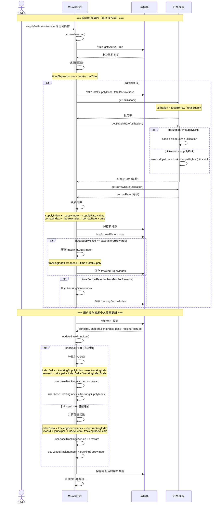

---

## 四、清算流程

### 4.1 清算触发条件

#### 清算判断

用户可被清算当且仅当：

```
抵押品价值 × liquidateCollateralFactor < 债务价值
```

其中：

- `borrowCollateralFactor < liquidateCollateralFactor`
- 通常：`borrowCF = 0.80`, `liquidateCF = 0.85`
- 这 5% 的差距是安全缓冲区

#### 清算检查流程图

```
isLiquidatable(account) 完整判断流程
════════════════════════════════════════════════════════════════

步骤 1: 读取用户本金
├─ int104 principal = userBasic[account].principal;
│
▼
步骤 2: 前置检查（关键！）
├─ if (principal >= 0)
│   │
│   ├─ principal > 0 (供应者，有存款)
│   │   └─→ return false ❌ 不能清算
│   │
│   ├─ principal = 0 (零余额账户)
│   │   └─→ return false ❌ 不能清算
│   │
│   └─ principal < 0 (借款人，有债务)
│       └─→ 继续检查 ✅
│
▼
步骤 3: 计算债务价值
├─ liquidity = signedMulPrice(presentValue(principal), basePrice, baseScale)
├─ 由于 principal < 0，所以 liquidity < 0（负值表示债务）
│
▼
步骤 4: 遍历抵押品，累加价值
├─ for (i = 0; i < numAssets; i++)
│   │
│   ├─ if (liquidity >= 0)
│   │   └─→ return false ❌ 抵押充足，提前退出
│   │
│   └─ liquidity += collateralValue × liquidateCollateralFactor
│
▼
步骤 5: 最终判断
└─ return (liquidity < 0)
    │
    ├─ liquidity < 0 → return true ✅ 可清算
    │   抵押不足，抵押价值 < 债务价值
    │
    └─ liquidity >= 0 → return false ❌ 不能清算
        抵押充足，抵押价值 >= 债务价值
```

**关键要点**：

1. ⚠️ **步骤 2 是第一道防线**：只有借款人才能被清算
2. 📊 **步骤 4 是第二道防线**：抵押品价值必须低于债务价值
3. 🔍 **liquidateCollateralFactor > borrowCollateralFactor**：5% 安全缓冲

#### 清算检查代码

**清算判断** ([📄 Comet.sol:566-601](https://github.com/compound-finance/comet/blob/main/contracts/Comet.sol#L566-L601)):

```solidity
/**
    * @notice 检查账户是否可被清算
    * @dev 使用 liquidateCollateralFactor（较高阈值）检查
    * @dev liquidateCollateralFactor > borrowCollateralFactor，提供安全缓冲
    * 
    * 清算判断公式：
    * ===============================================
    * 
    * 0. **前置检查（关键！）**：
    *    if (principal >= 0) return false;
    *    
    *    只有借款人（principal < 0）才可能被清算
    *    - principal > 0：供应者（有存款）→ 不能清算
    *    - principal = 0：零余额账户 → 不能清算
    *    - principal < 0：借款人（有债务）→ 继续检查
    * 
    * 1. 债务价值计算：
    *    debtValue = |presentValue(principal)| × basePrice / baseScale
    *    其中：
    *    - presentValue(principal) < 0 （本金为负数表示债务）
    *    - basePrice：基础资产价格（例如 USDC = 1.0）
    *    - baseScale：基础资产精度缩放（10^baseDecimals）
    * 
    * 2. 抵押品价值计算（应用清算因子）：
    *    collateralValue = Σ (collateralBalance_i × collateralPrice_i / collateralScale_i × liquidateCollateralFactor_i)
    *    对所有抵押品 i：
    *    - collateralBalance_i：用户抵押的第 i 种资产数量
    *    - collateralPrice_i：第 i 种资产的价格（如 ETH = $3000）
    *    - collateralScale_i：第 i 种资产的精度缩放（10^decimals）
    *    - liquidateCollateralFactor_i：清算抵押率（如 0.85 = 85%）
    * 
    * 3. 流动性计算（Liquidity）：
    *    liquidity = -debtValue + collateralValue
    *              = -|principal| × basePrice / baseScale 
    *                + Σ (balance_i × price_i / scale_i × liquidateFactor_i)
    * 
    * 4. 清算条件：
    *    可清算 ⟺ liquidity < 0
    *    即：collateralValue < debtValue
    *    即：实际抵押价值 < 债务价值
    * 
    * 清算阈值示例：
    * ===============================================
    * 假设：
    * - 借款：$1000 USDC（债务）
    * - 抵押：1 ETH，价格 $3000
    * - liquidateCollateralFactor = 0.85（85%）
    * 
    * 计算：
    * - debtValue = $1000
    * - collateralValue = 1 ETH × $3000 × 0.85 = $2550
    * - liquidity = -$1000 + $2550 = $1550 > 0
    * - 结果：不可清算（抵押充足）
    * 
    * 如果 ETH 价格跌至 $1200：
    * - collateralValue = 1 ETH × $1200 × 0.85 = $1020
    * - liquidity = -$1000 + $1020 = $20 > 0
    * - 结果：仍不可清算（刚好安全）
    * 
    * 如果 ETH 价格跌至 $1100：
    * - collateralValue = 1 ETH × $1100 × 0.85 = $935
    * - liquidity = -$1000 + $935 = -$65 < 0
    * - 结果：可清算（抵押不足）
    * 
    * 清算阈值价格：
    * - liquidationPrice = debtValue / (collateralAmount × liquidateFactor)
    *                    = $1000 / (1 ETH × 0.85)
    *                    = $1176.47
    * 
    * 与借贷能力的关系：
    * ===============================================
    * - borrowCollateralFactor = 0.80 (80%) → 借贷能力
    * - liquidateCollateralFactor = 0.85 (85%) → 清算阈值
    * - 差距 = 5% → 安全缓冲区
    * 
    * 这意味着：
    * 1. 用户最多可借：$3000 × 0.80 = $2400
    * 2. 清算触发于：$3000 × 0.85 = $2550 债务水平
    * 3. 价格下跌到 $2550/$0.85 = $3000 时触发清算
    * 
    * @param account 要检查的账户地址
    * @return 如果可被清算返回 true，否则返回 false
    */
function isLiquidatable(address account) override public view returns (bool) {
    // 步骤 1: 读取用户本金
    int104 principal = userBasic[account].principal;

    // 步骤 2: 如果本金 ≥ 0（没有借贷），则不能被清算
    if (principal >= 0) {
        return false;
    }

    // 步骤 3: 初始化流动性（负值，表示债务的美元价值）
    // 公式：liquidity = presentValue(principal) × basePrice / baseScale
    // 由于 principal < 0，所以 liquidity < 0
    uint16 assetsIn = userBasic[account].assetsIn;
    int liquidity = signedMulPrice(
        presentValue(principal),  // 负值，当前债务金额（已考虑利息累积）
        getPrice(baseTokenPriceFeed),  // 基础资产价格（如 USDC = 1.0）
        uint64(baseScale)  // 缩放因子（如 10^6 for USDC）
    );  // liquidity < 0，表示需要抵押品来覆盖的债务价值（美元）

    // 步骤 4: 遍历用户的所有抵押资产，累加抵押价值
    // 公式：liquidity += Σ (balance_i × price_i / scale_i × liquidateFactor_i)
    for (uint8 i = 0; i < numAssets; ) {
        if (isInAsset(assetsIn, i)) {
            // 提前退出：如果流动性已经 ≥ 0，说明抵押充足，不能清算
            if (liquidity >= 0) {
                return false;
            }

            // 4.1: 获取该抵押资产的配置
            AssetInfo memory asset = getAssetInfo(i);
            
            // 4.2: 计算抵押品的美元价值
            // 公式：collateralValue = balance × price / scale
            uint newAmount = mulPrice(
                userCollateral[account][asset.asset].balance,  // 抵押品数量（原始单位）
                getPrice(asset.priceFeed),  // 抵押品价格（美元，如 ETH = $3000）
                asset.scale  // 缩放因子（10^decimals）
            );  // 结果：抵押品的美元价值（无因子调整）
            
            // 4.3: 应用清算抵押率，累加到流动性
            // 公式：adjustedValue = collateralValue × liquidateCollateralFactor
            // liquidateCollateralFactor 通常为 0.85-0.95（85%-95%）
            // 比 borrowCollateralFactor 高 5-10%，提供安全缓冲区
            // 例如：
            //   - $100 的 ETH × 0.85 = $85 的清算阈值
            //   - 当债务达到 $85 时触发清算
            //   - 而借贷能力只有 $80（borrowCollateralFactor = 0.80）
            liquidity += signed256(mulFactor(
                newAmount,
                asset.liquidateCollateralFactor
            ));
        }
        unchecked { i++; }
    }

    // 步骤 5: 返回流动性是否 < 0
    // liquidity < 0 表示 adjustedCollateralValue < debtValue，可以清算
    // 注意：这里与 isBorrowCollateralized 的返回值相反
    //   - isBorrowCollateralized: liquidity >= 0 → true (可借贷)
    //   - isLiquidatable: liquidity < 0 → true (可清算)
    return liquidity < 0;
}
```

### 4.2 清算执行流程

#### Absorb 机制

Comet 使用**协议吸收**模式，而不是传统的清算人偿还模式：

1. 清算人调用 `absorb()`
2. 协议吸收账户的所有抵押品和债务
3. 抵押品进入协议储备
4. 清算人稍后可以折价购买这些抵押品

#### 清算核心代码

**清算入口** ([📄 Comet.sol:1158-1178](https://github.com/compound-finance/comet/blob/main/contracts/Comet.sol#L1158-L1178)):

```solidity
function absorb(address absorber, address[] calldata accounts) override external {
    if (isAbsorbPaused()) revert Paused();

    uint startGas = gasleft();
    
    // 先累积利息
    accrueInternal();
    
    // 批量清算多个账户
    for (uint i = 0; i < accounts.length; ) {
        absorbInternal(absorber, accounts[i]);
        unchecked { i++; }
    }
    
    uint gasUsed = startGas - gasleft();

    // 记录清算人积分（用于激励）
    LiquidatorPoints memory points = liquidatorPoints[absorber];
    points.numAbsorbs++;
    points.numAbsorbed += safe64(accounts.length);
    points.approxSpend += safe128(gasUsed * block.basefee);
    liquidatorPoints[absorber] = points;
}
```

**清算单个账户** ([📄 Comet.sol:1183-1238](https://github.com/compound-finance/comet/blob/main/contracts/Comet.sol#L1183-L1238)):

```solidity
function absorbInternal(address absorber, address account) internal {
    if (!isLiquidatable(account)) revert NotLiquidatable();

    UserBasic memory accountUser = userBasic[account];
    int104 oldPrincipal = accountUser.principal;
    int256 oldBalance = presentValue(oldPrincipal);
    uint16 assetsIn = accountUser.assetsIn;

    uint256 basePrice = getPrice(baseTokenPriceFeed);
    uint256 deltaValue = 0;

    // 1. 吸收所有抵押品
    for (uint8 i = 0; i < numAssets; ) {
        if (isInAsset(assetsIn, i)) {
            AssetInfo memory assetInfo = getAssetInfo(i);
            address asset = assetInfo.asset;
            
            // 清空用户抵押品
            uint128 seizeAmount = userCollateral[account][asset].balance;
            userCollateral[account][asset].balance = 0;
            totalsCollateral[asset].totalSupplyAsset -= seizeAmount;

            // 计算抵押品价值（应用清算因子）
            uint256 value = mulPrice(seizeAmount, getPrice(assetInfo.priceFeed), assetInfo.scale);
            deltaValue += mulFactor(value, assetInfo.liquidationFactor);

            emit AbsorbCollateral(absorber, account, asset, seizeAmount, value);
        }
        unchecked { i++; }
    }

    // 2. 将抵押品价值转换为基础资产数量
    uint256 deltaBalance = divPrice(deltaValue, basePrice, uint64(baseScale));
    int256 newBalance = oldBalance + signed256(deltaBalance);
    
    // 如果抵押品不足以覆盖债务，剩余由协议储备吸收
    if (newBalance < 0) {
        newBalance = 0;
    }

    // 3. 更新用户状态
    int104 newPrincipal = principalValue(newBalance);
    updateBasePrincipal(account, accountUser, newPrincipal);

    // 清空用户的资产标志
    userBasic[account].assetsIn = 0;

    // 4. 更新全局状态
    (uint104 repayAmount, uint104 supplyAmount) = repayAndSupplyAmount(oldPrincipal, newPrincipal);
    
    // 协议储备减少（因为用抵押品偿还了债务）
    totalSupplyBase += supplyAmount;
    totalBorrowBase -= repayAmount;

    emit AbsorbDebt(absorber, account, basePaidOut, deltaValue);
}
```

### 4.3 购买抵押品

#### 购买机制

清算后，抵押品进入协议储备，任何人可以折价购买：

- 购买价格 = 预言机价格 × `storeFrontPriceFactor`
- `storeFrontPriceFactor` 通常为 0.93 (7% 折扣)
- 只能用基础资产（USDC）购买
- 必须满足 `储备金 > targetReserves` 才能购买

#### 购买代码

**购买入口** ([📄 Comet.sol:1260-1261](https://github.com/compound-finance/comet/blob/main/contracts/Comet.sol#L1260-L1261)):

```solidity
function buyCollateral(address asset, uint minAmount, uint baseAmount, address recipient) 
    override external {
    if (isBuyPaused()) revert Paused();

    // 计算可购买的抵押品数量
    uint collateralAmount = quoteCollateral(asset, baseAmount);
    
    // 滑点保护
    if (collateralAmount < minAmount) {
        revert TooMuchSlippage();
    }
    
    // 检查抵押品储备
    if (collateralAmount > getCollateralReserves(asset)) {
        revert NotForSale();
    }

    // 转入基础资产
    doTransferIn(baseToken, msg.sender, baseAmount);

    // 转出抵押品
    doTransferOut(asset, recipient, collateralAmount);

    emit BuyCollateral(msg.sender, asset, baseAmount, collateralAmount);
}
```

**价格计算** ([📄 Comet.sol:1240-1258](https://github.com/compound-finance/comet/blob/main/contracts/Comet.sol#L1240-L1258)):

```solidity
function quoteCollateral(address asset, uint baseAmount) override public view returns (uint) {
    AssetInfo memory assetInfo = getAssetInfoByAddress(asset);
    
    // 获取价格
    uint256 assetPrice = getPrice(assetInfo.priceFeed);
    uint256 basePrice = getPrice(baseTokenPriceFeed);

    // 检查储备
    uint256 reserves = getReserves();
    if (reserves < 0 || uint(reserves) < targetReserves) {
        revert NotForSale();
    }

    // 计算抵押品数量（应用折扣）
    return divPrice(
        mulFactor(mulPrice(baseAmount, basePrice, uint64(baseScale)), storeFrontPriceFactor),
        assetPrice,
        assetInfo.scale
    );
}
```

### 4.4 清算示例场景

#### 批量清算机制说明

⚠️ **重要**：`absorb` 函数支持批量清算，具有**双层循环结构**：

```solidity
function absorb(address absorber, address[] calldata accounts) {
    // 外层循环：遍历要清算的账户列表
    for (uint i = 0; i < accounts.length; ) {
        absorbInternal(absorber, accounts[i]);
        
        // 内层循环（在 absorbInternal 中）：遍历每个账户的抵押品
        for (uint8 j = 0; j < numAssets; ) {
            // 没收该账户的每个抵押品
            ...
        }
    }
    // 记录清算积分（批量操作的总 Gas 消耗）
}
```

**批量清算优势**：

- ✅ Gas 效率更高（单次交易清算多个账户）
- ✅ 减少区块空间占用
- ✅ 提高清算响应速度
- ✅ 降低清算者的交易成本

**示例**：

- 单账户清算：`absorb(liquidator, [alice])`
- 批量清算：`absorb(liquidator, [alice, bob, carol])` ← 一次清算 3 个账户

以下示例展示**单个账户**的清算过程：

#### 场景参数

```
用户账户：
- 债务：10,000 USDC
- 抵押品：5 ETH @ $2,100 = $10,500

价格变动：
- ETH 价格跌至 $2,000
- 新抵押品价值 = 5 × $2,000 = $10,000

抵押率配置：
- borrowCollateralFactor = 0.80 (80%)
- liquidateCollateralFactor = 0.85 (85%)
- liquidationFactor = 0.95 (95%, 5%惩罚)
- storeFrontPriceFactor = 0.93 (7% 折扣)
```

#### 清算判断

**步骤 1: 检查是否有借贷**

```
principal = -10,000 USDC (负值表示债务)

检查: principal >= 0?
❌ 否（principal = -10,000 < 0）
→ 继续清算判断流程

注意：
- 如果 principal >= 0（供应者或零余额），直接返回 false（不能清算）
- 只有借款人（principal < 0）才可能被清算
```

**步骤 2-5: 计算抵押率和流动性**

```
借贷能力 = $10,000 × 0.80 = $8,000
清算阈值 = $10,000 × 0.85 = $8,500
当前债务 = $10,000

检查: 清算阈值 < 债务?
✅ 是（$8,500 < $10,000）
→ 可被清算 ✅
```

#### 清算执行

```
步骤 1-4: 吸收抵押品
   - 没收用户的 5 ETH（全部余额清零）
   - 抵押品原始价值 = 5 ETH × $2,000 = $10,000
   - 应用 liquidationFactor(0.95)：deltaValue = $10,000 × 0.95 = $9,500
   - totalsCollateral[ETH].totalSupplyAsset -= 5 ETH

步骤 5-6: 计算新余额
   - oldBalance = presentValue(-10,000) = -10,000 USDC
   - deltaBalance = $9,500 / $1.00 = 9,500 USDC
   - newBalance = -10,000 + 9,500 = -500 USDC
   - 由于 newBalance < 0，协议吸收坏账，设为 0

步骤 7-8: 更新用户状态
   - newPrincipal = principalValue(0) = 0
   - updateBasePrincipal(user, 0) - 更新用户本金
   - userBasic[user].assetsIn = 0 - 清空所有抵押品标志

步骤 9-10: 更新全局总量
   - (repayAmount, supplyAmount) = repayAndSupplyAmount(-10,000, 0)
   - repayAmount = 10,000, supplyAmount = 0
   - totalBorrowBase -= 10,000（债务清零）
   - totalSupplyBase += 0（无新增供应）

步骤 11: 触发事件
   - basePaidOut = 0 - (-10,000) = 10,000 USDC
   - valueOfBasePaidOut = 10,000 × $1.00 = $10,000
   - emit AbsorbDebt(absorber, user, 10,000, $10,000)

协议最终状态：
   - 获得：5 ETH（协议储备）
   - 支付：10,000 USDC（抵押品价值 $9,500 + 坏账 $500）
   - 实际坏账：$500（由协议储备金承担）
```

#### 购买抵押品

```
清算人购买：
- 支付：9,500 USDC（想买全部）
- 折扣价格：$2,000 × 0.93 = $1,860 / ETH
- 获得：9,500 / 1,860 ≈ 5.11 ETH（但只有 5 ETH）
- 实际：支付 5 × 1,860 = 9,300 USDC，获得 5 ETH

清算人利润：
- 市场价值：5 × $2,000 = $10,000
- 购买成本：$9,300
- 即时利润：$10,000 - $9,300 = $700
```

### 4.5 清算完整时序图

```mermaid
sequenceDiagram
    actor Liquidator as 清算人
    actor User as 被清算用户
    participant Contract as Comet合约
    participant PriceFeed as 价格预言机
    participant Storage as 存储层
    participant Token as 代币合约

    Note over Liquidator,Token: === 阶段1：监控和触发 ===
    
    Liquidator->>Contract: isLiquidatable(user)
    activate Contract
    
    Contract->>Storage: 步骤 1: 读取 principal = userBasic[account].principal
    Storage-->>Contract: principal = -10,000 USDC (债务)
    
    Contract->>Contract: 步骤 2: 检查是否有借贷
    Note over Contract: if (principal >= 0)
    
    alt principal >= 0 (无债务或有存款)
        Contract-->>Liquidator: 步骤 2a: return false (不能清算)
        Note over Contract: 只有借款人才能被清算<br/>供应者和零余额账户不能被清算
        deactivate Contract
    else principal < 0 (有债务)
        Note over Contract: 步骤 2b: 继续清算判断流程
        
        Note over Contract: === 步骤 3: 初始化流动性（负值）===
        
        Contract->>Storage: 读取 assetsIn = userBasic[account].assetsIn
        Storage-->>Contract: assetsIn = 0b0001 (持有资产0)
        
        Contract->>PriceFeed: getPrice(baseTokenPriceFeed)
        PriceFeed-->>Contract: USDC price = $1.00
        
        Contract->>Contract: 计算初始流动性（负值）
        Note over Contract: liquidity = signedMulPrice(<br/>presentValue(principal),<br/>basePrice, baseScale)<br/>= -10,000 × $1.00 = -$10,000
        
        Note over Contract: === 步骤 4: 遍历抵押品，累加价值 ===
        
        loop 遍历用户的所有抵押资产 (i = 0 to numAssets)
            
            Contract->>Contract: 检查: isInAsset(assetsIn, i)?
            Note over Contract: 检查该资产是否在用户的抵押列表中
            
            Contract->>Contract: 提前退出检查
            Note over Contract: if (liquidity >= 0)<br/>return false
            
            Note over Contract: 如果 liquidity >= 0，提前返回 false<br/>（本例中继续处理）
            
            Contract->>Contract: 步骤 4.1: 获取资产配置
            Note over Contract: AssetInfo asset = getAssetInfo(i)
            
            Contract->>Storage: 步骤 4.2: 读取抵押品余额
            Storage-->>Contract: userCollateral[account][ETH].balance = 5 ETH
            
            Contract->>PriceFeed: 步骤 4.2: 获取抵押品价格
            PriceFeed-->>Contract: getPrice(asset.priceFeed) = $2,000
            
            Contract->>Contract: 步骤 4.2: 计算抵押品原始价值
            Note over Contract: newAmount = mulPrice(<br/>balance, price, scale)<br/>= 5 ETH × $2,000 = $10,000
            
            Contract->>Contract: 步骤 4.3: 应用清算因子并累加
            Note over Contract: liquidity += signed256(<br/>mulFactor(newAmount,<br/>liquidateCollateralFactor))<br/><br/>liquidity = -$10,000 + ($10,000 × 0.85)<br/>= -$10,000 + $8,500<br/>= -$1,500
            
        end
        
        Note over Contract: === 步骤 5: 最终判断 ===
        
        Contract->>Contract: 返回 liquidity < 0
        Note over Contract: liquidity = -$1,500 less than 0?<br/>✅ 是
        
        Contract-->>Liquidator: return true (可清算)
        Note over Contract: 抵押不足，可以被清算
        deactivate Contract
    end
    
    Note over Liquidator,Token: === 阶段2：执行清算 ===
    
    Liquidator->>Contract: absorb(liquidator, [user])
    activate Contract
    
    Contract->>Contract: 检查是否暂停: isAbsorbPaused()
    
    Contract->>Contract: startGas = gasleft()
    Note over Contract: 记录起始 Gas
    
    Contract->>Contract: accrueInternal()
    Note over Contract: 更新利息指数
    
    Note over Contract: === 批量清算循环 ===
    
    loop 遍历每个要清算的账户 (accounts数组)
        
        Contract->>Contract: absorbInternal(liquidator, accounts[i])
        activate Contract
        
        Note over Contract: === 步骤 1: 验证可清算 ===
        
        Contract->>Contract: isLiquidatable(accounts[i])
        Note over Contract: 再次验证该账户是否可清算
        
        Note over Contract: === 步骤 2-3: 读取账户状态和价格 ===
        
        Contract->>Storage: 读取用户基础数据
        Storage-->>Contract: oldPrincipal=-10,000, assetsIn=0b0001
        
        Contract->>Contract: oldBalance = presentValue(oldPrincipal)
        Note over Contract: oldBalance = -10,000 USDC
        
        Contract->>PriceFeed: getPrice(baseTokenPriceFeed)
        PriceFeed-->>Contract: basePrice = $1.00
        
        Contract->>Contract: deltaValue = 0
        Note over Contract: 初始化累积价值
        
        Note over Contract: === 步骤 4: 吸收抵押品 ===
        
        loop 遍历该账户的每个抵押品
            
            Contract->>Contract: 检查: isInAsset(assetsIn, i)?
            
            Contract->>Storage: seizeAmount = userCollateral[user][ETH].balance
            Storage-->>Contract: 5 ETH
            
            Contract->>Storage: userCollateral[user][ETH].balance = 0
            Note over Contract: 清空用户抵押品余额
            
            Contract->>Storage: totalsCollateral[ETH].totalSupplyAsset -= 5
            Note over Contract: 从总供应中扣除
            
            Contract->>PriceFeed: getPrice(assetInfo.priceFeed)
            PriceFeed-->>Contract: ETH price = $2,000
            
            Contract->>Contract: 计算抵押品价值
            Note over Contract: value = 5 × $2,000 = $10,000<br/>deltaValue += $10,000 × liquidationFactor(0.95)<br/>deltaValue = $9,500
            
            Contract->>Liquidator: emit AbsorbCollateral(liquidator, user, ETH, 5, $10,000)
            
        end
        
        Note over Contract: === 步骤 5-6: 计算新余额 ===
        
        Contract->>Contract: 转换为基础资产金额
        Note over Contract: deltaBalance = $9,500 / $1.00 = 9,500 USDC
        
        Contract->>Contract: 计算新余额
        Note over Contract: newBalance = oldBalance + deltaBalance<br/>= -10,000 + 9,500 = -500 USDC
        
        Contract->>Contract: 处理坏账
        Note over Contract: if (newBalance less than 0) newBalance = 0<br/>协议吸收 $500 坏账
        
        Note over Contract: === 步骤 7-8: 更新用户状态 ===
        
        Contract->>Contract: 计算新本金
        Note over Contract: newPrincipal = principalValue(0) = 0
        
        Contract->>Storage: updateBasePrincipal(user, newPrincipal)
        Note over Contract: 更新用户本金和奖励追踪
        
        Contract->>Storage: userBasic[user].assetsIn = 0
        Note over Contract: 清空所有抵押品标志<br/>（用户不再持有任何资产）
        
        Note over Contract: === 步骤 9-10: 更新全局总量 ===
        
        Contract->>Contract: 分解还款和供应
        Note over Contract: (repayAmount, supplyAmount)<br/>= repayAndSupplyAmount(-10,000, 0)<br/>repayAmount = 10,000, supplyAmount = 0
        
        Contract->>Storage: totalSupplyBase += 0
        Contract->>Storage: totalBorrowBase -= 10,000
        Note over Contract: 债务减少 10,000 USDC<br/>协议储备金承担 $500 坏账
        
        Note over Contract: === 步骤 11: 触发债务事件 ===
        
        Contract->>Contract: 计算协议支付金额
        Note over Contract: basePaidOut = 0 - (-10,000) = 10,000<br/>valueOfBasePaidOut = 10,000 × $1.00 = $10,000
        
        Contract->>Liquidator: emit AbsorbDebt(liquidator, user, 10,000, $10,000)
        
        Note over Contract: === 步骤 12: 检查剩余余额 ===
        
        Contract->>Contract: if (newPrincipal > 0)?
        Note over Contract: newPrincipal = 0<br/>不触发 Transfer 事件
        
        deactivate Contract
        Note over Contract: absorbInternal 完成
        
    end
    
    Note over Contract: === 批量清算循环结束 ===
    
    Note over Contract: === 记录清算积分（所有账户清算完成后）===
    
    Contract->>Contract: 计算总 Gas 消耗
    Note over Contract: gasUsed = startGas - gasleft()<br/>（包含所有账户的 Gas）
    
    Contract->>Storage: 读取 liquidatorPoints[absorber]
    Storage-->>Contract: 当前积分记录
    
    Contract->>Contract: 更新积分数据
    Note over Contract: points.numAbsorbs++<br/>（清算操作次数 +1）<br/><br/>points.numAbsorbed += accounts.length<br/>（清算账户总数 +N）<br/><br/>points.approxSpend += gasUsed × block.basefee<br/>（累积 Gas 花费）
    
    Contract->>Storage: liquidatorPoints[absorber] = points
    Note over Contract: 保存更新后的积分<br/>用于治理评估清算者贡献
    
    Contract-->>Liquidator: 清算完成
    deactivate Contract
    
    Note over Liquidator,Token: === 阶段3：购买抵押品 ===
    
    Liquidator->>Contract: quoteCollateral(ETH, 9,300 USDC)
    activate Contract
    
    Contract->>Contract: 检查储备金
    Note over Contract: reserves greater than targetReserves?
    
    Contract->>PriceFeed: 获取价格
    PriceFeed-->>Contract: ETH=$2,000, USDC=$1.00
    
    Contract->>Contract: 计算可买数量
    Note over Contract: amount = 9,300 × $1.00 × 0.93 / $2,000<br/>= 9,300 × 0.93 / 2,000<br/>≈ 4.32 ETH
    
    Contract-->>Liquidator: 4.32 ETH
    deactivate Contract
    
    Liquidator->>Contract: buyCollateral(ETH, 4.3, 9300, liquidator)
    activate Contract
    
    Contract->>Contract: 再次计算并验证
    Contract->>Contract: 检查滑点: 4.32 >= 4.3? ✅
    Contract->>Contract: 检查储备: 4.32 <= 5? ✅
    
    Contract->>Token: transferFrom(liquidator, comet, 9300 USDC)
    activate Token
    Token-->>Contract: 转账成功
    deactivate Token
    
    Contract->>Token: transfer(liquidator, 4.32 ETH)
    activate Token
    Token-->>Contract: 转账成功
    deactivate Token
    
    Contract->>Liquidator: emit BuyCollateral(liquidator, ETH, 9300, 4.32)
    deactivate Contract
    
    Note over Liquidator: 清算人利润分析：<br/>购买成本：$9,300<br/>市场价值：4.32 × $2,000 = $8,640<br/>实际利润：$8,640 - $9,300 = -$660<br/>（此例中由于折扣不够，清算人可能亏损）
```

---

---

## 五、转账流程

### 5.1 核心概念

Comet 实现了 **ERC20 兼容的转账功能**，但有独特的特性：

- 转账基础资产时，可能触发借贷
- 转账抵押品时，需要检查抵押率
- 支持 `uint256.max` 一键转移全部余额

**关键特性**：

- 发送方余额不足时，自动进入借贷模式
- 接收方有债务时，转账自动还款
- 不允许自己转给自己

### 5.2 转账核心代码

#### ERC20 标准转账

**入口函数** ([📄 Comet.sol:933-948](https://github.com/compound-finance/comet/blob/main/contracts/Comet.sol#L933-L948)):

```solidity
// ERC20 标准转账（只能转基础资产）
function transfer(address dst, uint amount) override external returns (bool) {
    transferInternal(msg.sender, msg.sender, dst, baseToken, amount);
    return true;
}

// ERC20 标准授权转账
function transferFrom(address src, address dst, uint amount) override external returns (bool) {
    transferInternal(msg.sender, src, dst, baseToken, amount);
    return true;
}
```

#### 通用转账接口

**转账任意资产** ([📄 Comet.sol:956-988](https://github.com/compound-finance/comet/blob/main/contracts/Comet.sol#L956-L988)):

```solidity
// 转账任意资产（基础资产或抵押品）
function transferAsset(address dst, address asset, uint amount) override external {
    return transferInternal(msg.sender, msg.sender, dst, asset, amount);
}

// 代理转账
function transferAssetFrom(address src, address dst, address asset, uint amount) override external {
    return transferInternal(msg.sender, src, dst, asset, amount);
}

// 内部转账逻辑
function transferInternal(address operator, address src, address dst, address asset, uint amount) 
    internal nonReentrant {
    // 1. 检查暂停状态
    if (isTransferPaused()) revert Paused();
    
    // 2. 检查权限
    if (!hasPermission(src, operator)) revert Unauthorized();
    
    // 3. 不允许自转
    if (src == dst) revert NoSelfTransfer();

    // 4. 根据资产类型分发
    if (asset == baseToken) {
        if (amount == type(uint256).max) {
            amount = balanceOf(src);  // 转移全部余额
        }
        return transferBase(src, dst, amount);
    } else {
        return transferCollateral(src, dst, asset, safe128(amount));
    }
}
```

#### 基础资产转账（可能触发借贷）

**核心逻辑** ([📄 Comet.sol:993-1028](https://github.com/compound-finance/comet/blob/main/contracts/Comet.sol#L993-L1028)):

```solidity
function transferBase(address src, address dst, uint256 amount) internal {
    // 1. 累积利息
    accrueInternal();

    // 2. 读取双方账户数据
    UserBasic memory srcUser = userBasic[src];
    UserBasic memory dstUser = userBasic[dst];
    
    int104 srcPrincipal = srcUser.principal;
    int104 dstPrincipal = dstUser.principal;

    // 3. 计算转账后的新余额
    int256 srcBalance = presentValue(srcPrincipal) - signed256(amount);  // 发送方减少
    int256 dstBalance = presentValue(dstPrincipal) + signed256(amount);  // 接收方增加
    
    int104 srcPrincipalNew = principalValue(srcBalance);
    int104 dstPrincipalNew = principalValue(dstBalance);

    // 4. 分析发送方：取款还是借贷？
    (uint104 withdrawAmount, uint104 borrowAmount) = withdrawAndBorrowAmount(srcPrincipal, srcPrincipalNew);
    
    // 5. 分析接收方：还款还是供应？
    (uint104 repayAmount, uint104 supplyAmount) = repayAndSupplyAmount(dstPrincipal, dstPrincipalNew);

    // 6. 更新全局状态（避免下溢）
    totalSupplyBase = totalSupplyBase + supplyAmount - withdrawAmount;
    totalBorrowBase = totalBorrowBase + borrowAmount - repayAmount;

    // 7. 更新双方账户状态
    updateBasePrincipal(src, srcUser, srcPrincipalNew);
    updateBasePrincipal(dst, dstUser, dstPrincipalNew);

    // 8. 如果发送方进入借贷，检查抵押率
    if (srcBalance < 0) {
        if (uint256(-srcBalance) < baseBorrowMin) revert BorrowTooSmall();
        if (!isBorrowCollateralized(src)) revert NotCollateralized();
    }

    // 9. 发出 ERC20 标准事件
    if (withdrawAmount > 0) {
        emit Transfer(src, address(0), presentValueSupply(baseSupplyIndex, withdrawAmount));
    }
    if (supplyAmount > 0) {
        emit Transfer(address(0), dst, presentValueSupply(baseSupplyIndex, supplyAmount));
    }
}
```

#### 抵押品转账

**核心逻辑** ([📄 Comet.sol:1033-1050](https://github.com/compound-finance/comet/blob/main/contracts/Comet.sol#L1033-L1050)):

```solidity
function transferCollateral(address src, address dst, address asset, uint128 amount) internal {
    // 1. 读取双方抵押品余额
    uint128 srcCollateral = userCollateral[src][asset].balance;
    uint128 dstCollateral = userCollateral[dst][asset].balance;
    
    // 2. 计算新余额
    uint128 srcCollateralNew = srcCollateral - amount;
    uint128 dstCollateralNew = dstCollateral + amount;

    // 3. 更新抵押品余额
    userCollateral[src][asset].balance = srcCollateralNew;
    userCollateral[dst][asset].balance = dstCollateralNew;

    // 4. 获取资产信息并更新资产标志位
    AssetInfo memory assetInfo = getAssetInfoByAddress(asset);
    updateAssetsIn(src, assetInfo, srcCollateral, srcCollateralNew);
    updateAssetsIn(dst, assetInfo, dstCollateral, dstCollateralNew);

    // 5. 检查发送方抵押率（不累积利息，BorrowCF < LiquidationCF 提供缓冲）
    if (!isBorrowCollateralized(src)) revert NotCollateralized();

    emit TransferCollateral(src, dst, asset, amount);
}
```

### 5.3 转账场景示例

#### 场景1：普通转账（双方都有供应）

```
发送方：principal = +10,000 USDC
接收方：principal = +5,000 USDC
转账：3,000 USDC

结果：
发送方：principal = +7,000 USDC（减少供应）
接收方：principal = +8,000 USDC（增加供应）
```

#### 场景2：转账触发借贷

```
发送方：principal = +2,000 USDC，抵押品 = 5 ETH
接收方：principal = +5,000 USDC
转账：5,000 USDC

过程：
1. 发送方先取出 2,000 USDC 供应
2. 再借入 3,000 USDC
3. 转给接收方 5,000 USDC
4. 接收方增加 5,000 供应

结果：
发送方：principal = -3,000 USDC（进入借贷）
接收方：principal = +10,000 USDC
```

#### 场景3：转账自动还款

```
发送方：principal = +10,000 USDC
接收方：principal = -5,000 USDC（有债务）
转账：8,000 USDC

过程：
1. 发送方减少 8,000 供应
2. 接收方先还 5,000 债务
3. 剩余 3,000 成为供应

结果：
发送方：principal = +2,000 USDC
接收方：principal = +3,000 USDC
```

### 5.4 转账时序图

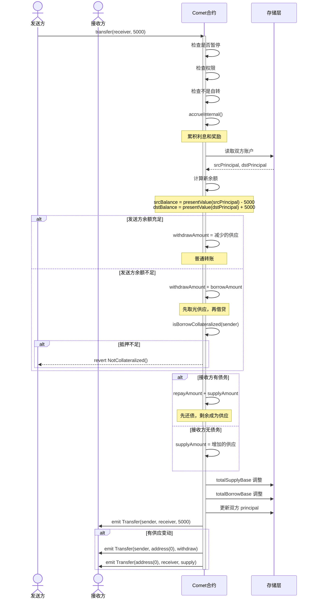

---

## 六、授权机制

### 6.1 授权类型

Comet 提供两种授权方式：

#### 1. **链上授权（approve/allow）**

- 需要发送交易
- 消耗 gas
- 立即生效

#### 2. **签名授权（allowBySig）**

- 链下签名，第三方提交
- 用户无需支付 gas
- 支持批量和自动化
- 使用 EIP-712 标准

### 6.2 授权核心代码

#### ERC20 兼容的 approve

**二元授权** ([📄 CometExt.sol:186-198](https://github.com/compound-finance/comet/blob/main/contracts/CometExt.sol#L186-L198)):

```solidity
function approve(address spender, uint256 amount) override external returns (bool) {
    // 注意：Comet 使用二元授权，不同于传统 ERC20
    if (amount == type(uint256).max) {
        // 授权：spender 可以管理所有资产
        allowInternal(msg.sender, spender, true);
    } else if (amount == 0) {
        // 取消授权
        allowInternal(msg.sender, spender, false);
    } else {
        // 不接受其他金额
        revert BadAmount();
    }
    return true;
}

function allowance(address owner, address spender) override external view returns (uint256) {
    // 返回 uint256.max 或 0
    return hasPermission(owner, spender) ? type(uint256).max : 0;
}
```

#### Comet 特有的 allow

**简单授权** ([📄 CometExt.sol:219-235](https://github.com/compound-finance/comet/blob/main/contracts/CometExt.sol#L219-L235)):

```solidity
function allow(address manager, bool isAllowed_) override external {
    allowInternal(msg.sender, manager, isAllowed_);
}

function allowInternal(address owner, address manager, bool isAllowed_) internal {
    // 更新授权状态
    isAllowed[owner][manager] = isAllowed_;
    
    // 发出 ERC20 兼容事件
    emit Approval(owner, manager, isAllowed_ ? type(uint256).max : 0);
}
```

#### EIP-712 签名授权

**无 gas 授权** ([📄 CometExt.sol:257-311](https://github.com/compound-finance/comet/blob/main/contracts/CometExt.sol#L257-L311)):

```solidity
function allowBySig(
    address owner,
    address manager,
    bool isAllowed_,
    uint256 nonce,
    uint256 expiry,
    uint8 v,
    bytes32 r,
    bytes32 s
) override external {
    // 1. 验证签名的 s 值（防止签名延展性攻击）
    if (uint256(s) > MAX_VALID_ECDSA_S) revert InvalidValueS();
    
    // 2. 验证签名的 v 值
    if (v != 27 && v != 28) revert InvalidValueV();
    
    // 3. 构造 EIP-712 域分隔符
    bytes32 domainSeparator = keccak256(abi.encode(
        DOMAIN_TYPEHASH, 
        keccak256(bytes(name())),
        keccak256(bytes(version)),
        block.chainid,
        address(this)
    ));
    
    // 4. 构造结构化数据哈希
    bytes32 structHash = keccak256(abi.encode(
        AUTHORIZATION_TYPEHASH,
        owner,
        manager,
        isAllowed_,
        nonce,
        expiry
    ));
    
    // 5. 计算最终消息摘要
    bytes32 digest = keccak256(abi.encodePacked("\x19\x01", domainSeparator, structHash));
    
    // 6. 恢复签名者地址
    address signatory = ecrecover(digest, v, r, s);
    
    // 7. 验证签名
    if (signatory == address(0)) revert BadSignatory();
    if (owner != signatory) revert BadSignatory();
    if (nonce != userNonce[signatory]++) revert BadNonce();
    if (block.timestamp >= expiry) revert SignatureExpired();
    
    // 8. 执行授权
    allowInternal(signatory, manager, isAllowed_);
}
```

### 6.3 EIP-712 签名流程

#### 签名消息结构

```typescript
// EIP-712 Domain
const domain = {
    name: "Compound Comet",
    version: "0",
    chainId: 1,  // Mainnet
    verifyingContract: "0x..."  // Comet 地址
};

// Authorization 结构
const types = {
    Authorization: [
        { name: "owner", type: "address" },
        { name: "manager", type: "address" },
        { name: "isAllowed", type: "bool" },
        { name: "nonce", type: "uint256" },
        { name: "expiry", type: "uint256" }
    ]
};

// 待签名的值
const value = {
    owner: "0xUser...",
    manager: "0xManager...",
    isAllowed: true,
    nonce: 0,
    expiry: 1234567890
};

// 用户签名
const signature = await signer._signTypedData(domain, types, value);
const { v, r, s } = ethers.utils.splitSignature(signature);

// 第三方提交
await comet.allowBySig(owner, manager, isAllowed, nonce, expiry, v, r, s);
```

### 6.4 授权时序图

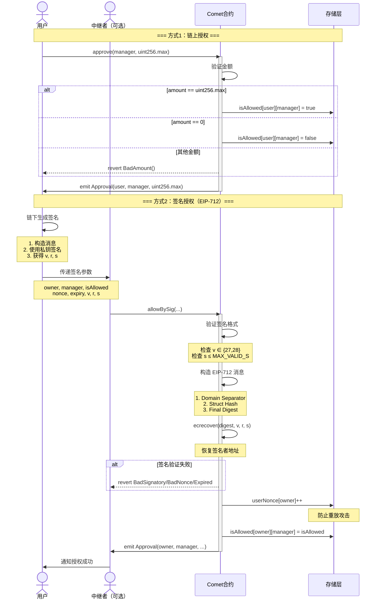

---

---

## 七、奖励领取流程

### 7.1 奖励机制概述

Comet 的奖励系统：

- **独立合约**：CometRewards.sol
- **奖励代币**：通常是 COMP
- **奖励来源**：供应和借贷都可获得奖励
- **累积方式**：自动累积，手动领取

### 7.2 奖励配置

**设置奖励** ([📄 CometRewards.sol:67-89](https://github.com/compound-finance/comet/blob/main/contracts/CometRewards.sol#L67-L89)):

```solidity
function setRewardConfigWithMultiplier(address comet, address token, uint256 multiplier) public {
    if (msg.sender != governor) revert NotPermitted(msg.sender);
    if (rewardConfig[comet].token != address(0)) revert AlreadyConfigured(comet);

    // 获取 Comet 的累积缩放因子
    uint64 accrualScale = CometInterface(comet).baseAccrualScale();
    // 获取奖励代币的小数位数
    uint8 tokenDecimals = ERC20(token).decimals();
    uint64 tokenScale = safe64(10 ** tokenDecimals);
    
    // 计算缩放因子
    if (accrualScale > tokenScale) {
        // 需要缩小
        rewardConfig[comet] = RewardConfig({
            token: token,
            rescaleFactor: accrualScale / tokenScale,
            shouldUpscale: false,
            multiplier: multiplier
        });
    } else {
        // 需要放大
        rewardConfig[comet] = RewardConfig({
            token: token,
            rescaleFactor: tokenScale / accrualScale,
            shouldUpscale: true,
            multiplier: multiplier
        });
    }
}
```

### 7.3 奖励计算

**奖励公式** ([📄 CometRewards.sol:326-343](https://github.com/compound-finance/comet/blob/main/contracts/CometRewards.sol#L326-L343)):

```solidity
function getRewardAccrued(address comet, address account, RewardConfig memory config) 
    internal view returns (uint) {
    // 1. 从 Comet 获取原始累积值
    uint accrued = CometInterface(comet).baseTrackingAccrued(account);

    // 2. 精度转换
    if (config.shouldUpscale) {
        // 累积精度 < 代币精度，需要放大
        accrued *= config.rescaleFactor;
    } else {
        // 累积精度 > 代币精度，需要缩小
        accrued /= config.rescaleFactor;
    }
    
    // 3. 应用奖励倍数
    // multiplier = 1e18 表示 100% (1.0)
    return accrued * config.multiplier / FACTOR_SCALE;
}
```

### 7.4 奖励领取

**领取函数** ([📄 CometRewards.sol:277-301](https://github.com/compound-finance/comet/blob/main/contracts/CometRewards.sol#L277-L301)):

```solidity
function claimInternal(address comet, address src, address to, bool shouldAccrue) internal {
    RewardConfig memory config = rewardConfig[comet];
    if (config.token == address(0)) revert NotSupported(comet);

    // 1. 可选地触发累积
    if (shouldAccrue) {
        CometInterface(comet).accrueAccount(src);
    }

    // 2. 计算应得奖励
    uint claimed = rewardsClaimed[comet][src];
    uint accrued = getRewardAccrued(comet, src, config);

    // 3. 如果有未领取的奖励
    if (accrued > claimed) {
        uint owed = accrued - claimed;
        
        // 更新已领取记录
        rewardsClaimed[comet][src] = accrued;
        
        // 转账奖励代币
        doTransferOut(config.token, to, owed);

        emit RewardClaimed(src, to, config.token, owed);
    }
}
```

### 7.5 奖励领取时序图

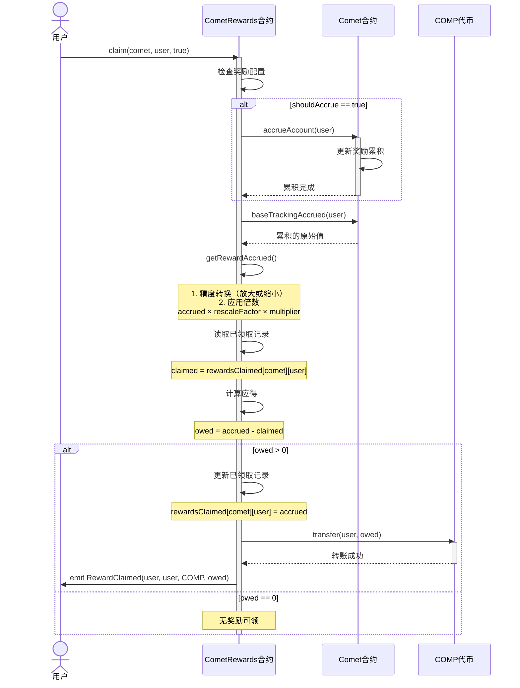

---

---

## 八、储备金提取流程

### 8.1 储备金机制

**储备金来源**：

- 借贷利息收入 > 供应利息支出的差额
- 清算惩罚
- 协议运营收益

**储备金公式** ([📄 Comet.sol:511-517](https://github.com/compound-finance/comet/blob/main/contracts/Comet.sol#L511-L517)):

```solidity
function getReserves() override public view returns (int) {
    (uint64 baseSupplyIndex_, uint64 baseBorrowIndex_) = accruedInterestIndices(getNowInternal() - lastAccrualTime);
    
    uint balance = IERC20NonStandard(baseToken).balanceOf(address(this));  // 合约持有的基础资产
    uint totalSupply_ = presentValueSupply(baseSupplyIndex_, totalSupplyBase);  // 应付给供应者
    uint totalBorrow_ = presentValueBorrow(baseBorrowIndex_, totalBorrowBase);  // 借款者应还
    
    // 储备金 = 实际余额 - 应付供应者 + 应收借款者
    return signed256(balance) - signed256(totalSupply_) + signed256(totalBorrow_);
}
```

### 8.2 提取储备金

**只有治理可调用** ([📄 Comet.sol:1293-1302](https://github.com/compound-finance/comet/blob/main/contracts/Comet.sol#L1293-L1302)):

```solidity
function withdrawReserves(address to, uint amount) override external {
    // 1. 权限检查
    if (msg.sender != governor) revert Unauthorized();

    // 2. 计算当前储备金
    int reserves = getReserves();
    
    // 3. 检查储备金充足
    if (reserves < 0 || amount > unsigned256(reserves)) {
        revert InsufficientReserves();
    }

    // 4. 转出储备金
    doTransferOut(baseToken, to, amount);

    emit WithdrawReserves(to, amount);
}
```

### 8.3 储备金示例

```
假设：
- 合约持有：1,000,000 USDC
- 总供应（应付）：900,000 USDC
- 总借贷（应收）：850,000 USDC

储备金 = 1,000,000 - 900,000 + 850,000 = 950,000 USDC

这不对！让我重新计算...

储备金 = 实际余额 - 应付 + 应收

如果借款人欠 850,000，供应者要取 900,000：
- 收回借款：+850,000
- 支付供应者：-900,000
- 需要从储备拿：50,000

所以储备金 = 1,000,000 - 900,000 + 850,000 = 950,000?

不对，应该是：
储备金 = balance - (totalSupply - totalBorrow)
       = 1,000,000 - (900,000 - 850,000)
       = 1,000,000 - 50,000
       = 950,000 USDC

治理可以提取最多 950,000 USDC
```

### 8.4 储备金提取时序图

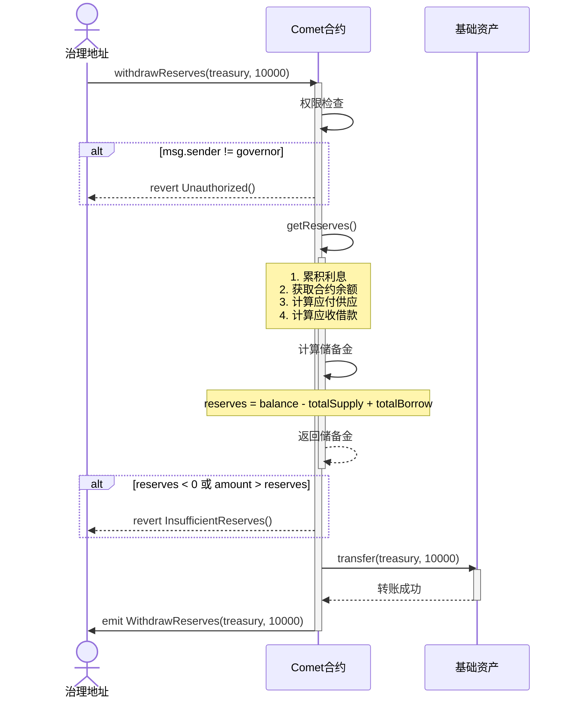

---

---

## 九、暂停与恢复机制

### 9.1 暂停机制设计

Comet 使用**位标志**（bit flags）高效存储 5 种暂停状态：

```solidity
// 暂停标志位
uint8 internal constant PAUSE_SUPPLY_OFFSET = 0;      // 供应
uint8 internal constant PAUSE_TRANSFER_OFFSET = 1;    // 转账
uint8 internal constant PAUSE_WITHDRAW_OFFSET = 2;    // 取款
uint8 internal constant PAUSE_ABSORB_OFFSET = 3;      // 清算
uint8 internal constant PAUSE_BUY_OFFSET = 4;         // 购买抵押品

// 单个 uint8 存储所有暂停状态
// 示例：0b00010110 表示转账、取款、购买被暂停
```

### 9.2 暂停/恢复操作

**设置暂停** ([📄 Comet.sol:643-661](https://github.com/compound-finance/comet/blob/main/contracts/Comet.sol#L643-L661)):

```solidity
function pause(
    bool supplyPaused,
    bool transferPaused,
    bool withdrawPaused,
    bool absorbPaused,
    bool buyPaused
) override external {
    // 1. 权限检查：governor 或 pauseGuardian
    if (msg.sender != governor && msg.sender != pauseGuardian) {
        revert Unauthorized();
    }

    // 2. 构造暂停标志位
    pauseFlags =
        uint8(0) |
        (toUInt8(supplyPaused) << PAUSE_SUPPLY_OFFSET) |
        (toUInt8(transferPaused) << PAUSE_TRANSFER_OFFSET) |
        (toUInt8(withdrawPaused) << PAUSE_WITHDRAW_OFFSET) |
        (toUInt8(absorbPaused) << PAUSE_ABSORB_OFFSET) |
        (toUInt8(buyPaused) << PAUSE_BUY_OFFSET);

    emit PauseAction(supplyPaused, transferPaused, withdrawPaused, absorbPaused, buyPaused);
}
```

**检查暂停状态** ([📄 Comet.sol:666-696](https://github.com/compound-finance/comet/blob/main/contracts/Comet.sol#L666-L696)):

```solidity
function isSupplyPaused() override public view returns (bool) {
    return toBool(pauseFlags & (uint8(1) << PAUSE_SUPPLY_OFFSET));
}

function isTransferPaused() override public view returns (bool) {
    return toBool(pauseFlags & (uint8(1) << PAUSE_TRANSFER_OFFSET));
}

// ... 其他检查函数类似
```

### 9.3 暂停场景

#### 应急暂停场景

1. **发现安全漏洞**：暂停所有操作
2. **价格预言机异常**：暂停供应和借贷
3. **清算异常**：暂停清算功能
4. **市场极端波动**：暂停取款

#### 权限设计

- **pauseGuardian**：
  - 只能暂停，不能恢复
  - 快速响应紧急情况
  - 防止守护者滥用权力

- **governor**：
  - 可以暂停和恢复
  - 需要治理投票
  - 响应时间较慢但更安全

### 9.4 暂停时序图

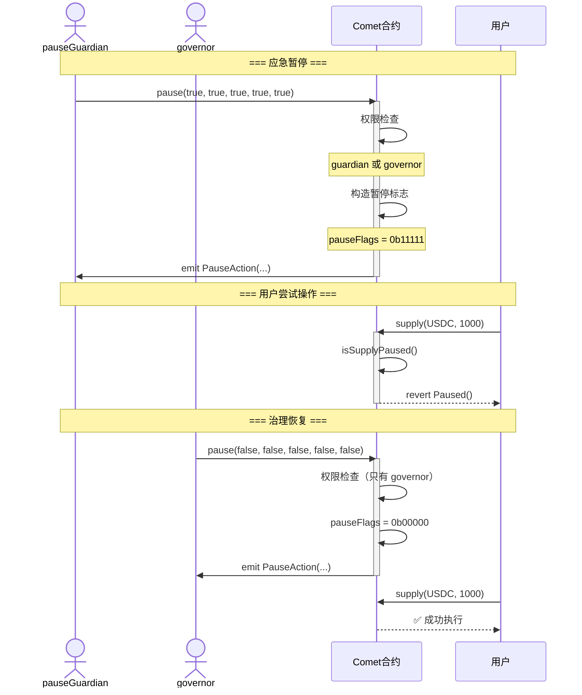

---

---

## 十、初始化流程

### 10.1 初始化设计

Comet 支持两种部署方式：

1. **直接部署**：构造函数 + initializeStorage
2. **代理部署**：Proxy + 实现合约

### 10.2 构造函数

**设置不可变参数** ([📄 Comet.sol:134-193](https://github.com/compound-finance/comet/blob/main/contracts/Comet.sol#L134-L193)):

```solidity
constructor(Configuration memory config) {
    // 1. 参数校验
    uint8 decimals_ = IERC20NonStandard(config.baseToken).decimals();
    if (decimals_ > MAX_BASE_DECIMALS) revert BadDecimals();
    if (config.storeFrontPriceFactor > FACTOR_SCALE) revert BadDiscount();
    if (config.assetConfigs.length > MAX_ASSETS) revert TooManyAssets();
    if (config.baseMinForRewards == 0) revert BadMinimum();
    if (IPriceFeed(config.baseTokenPriceFeed).decimals() != PRICE_FEED_DECIMALS) revert BadDecimals();

    // 2. 复制基本配置（不可变变量）
    governor = config.governor;
    pauseGuardian = config.pauseGuardian;
    baseToken = config.baseToken;
    baseTokenPriceFeed = config.baseTokenPriceFeed;
    extensionDelegate = config.extensionDelegate;
    storeFrontPriceFactor = config.storeFrontPriceFactor;

    decimals = decimals_;
    baseScale = uint64(10 ** decimals_);
    trackingIndexScale = config.trackingIndexScale;
    accrualDescaleFactor = baseScale / BASE_ACCRUAL_SCALE;

    baseMinForRewards = config.baseMinForRewards;
    baseTrackingSupplySpeed = config.baseTrackingSupplySpeed;
    baseTrackingBorrowSpeed = config.baseTrackingBorrowSpeed;
    baseBorrowMin = config.baseBorrowMin;
    targetReserves = config.targetReserves;

    // 3. 设置利率模型参数
    supplyKink = config.supplyKink;
    supplyPerSecondInterestRateBase = config.supplyPerYearInterestRateBase / SECONDS_PER_YEAR;
    supplyPerSecondInterestRateSlopeLow = config.supplyPerYearInterestRateSlopeLow / SECONDS_PER_YEAR;
    supplyPerSecondInterestRateSlopeHigh = config.supplyPerYearInterestRateSlopeHigh / SECONDS_PER_YEAR;
    
    borrowKink = config.borrowKink;
    borrowPerSecondInterestRateBase = config.borrowPerYearInterestRateBase / SECONDS_PER_YEAR;
    borrowPerSecondInterestRateSlopeLow = config.borrowPerYearInterestRateSlopeLow / SECONDS_PER_YEAR;
    borrowPerSecondInterestRateSlopeHigh = config.borrowPerYearInterestRateSlopeHigh / SECONDS_PER_YEAR;

    // 4. 设置资产配置（紧凑存储）
    numAssets = safe8(config.assetConfigs.length);
    (asset00_a, asset00_b) = getPackedAssetInternal(config.assetConfigs, 0);
    (asset01_a, asset01_b) = getPackedAssetInternal(config.assetConfigs, 1);
    // ... 最多 15 个资产
}
```

### 10.3 存储初始化

**初始化可变状态** ([📄 Comet.sol:237-248](https://github.com/compound-finance/comet/blob/main/contracts/Comet.sol#L237-L248)):

```solidity
function initializeStorage() override external {
    // 1. 防止重复初始化
    if (lastAccrualTime != 0) revert AlreadyInitialized();

    // 2. 初始化累积时间
    lastAccrualTime = getNowInternal();
    
    // 3. 初始化指数为基准值
    baseSupplyIndex = BASE_INDEX_SCALE;  // 1e15
    baseBorrowIndex = BASE_INDEX_SCALE;  // 1e15

    // 4. 隐式初始化（不增加合约大小）
    // trackingSupplyIndex = 0;
    // trackingBorrowIndex = 0;
}
```

### 10.4 初始化时序图

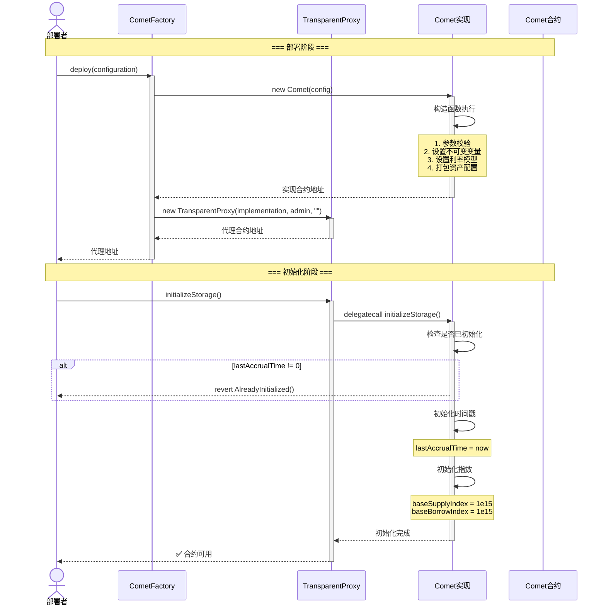

---

---

## 十一、批量操作（Bulker）

### 11.1 Bulker 概述

**BaseBulker** 合约允许用户在单笔交易中执行多个 Comet 操作：

- 供应多种资产
- 提取多种资产
- 领取奖励
- 原生代币（ETH）包装/解包装

**优势**：

- 节省 gas
- 原子性执行
- 改善用户体验

### 11.2 Bulker 核心代码

**批量执行** (`BaseBulker.sol`):

```solidity
function invoke(bytes[] calldata actions) external payable {
    for (uint i = 0; i < actions.length; ) {
        bytes calldata action = actions[i];
        bytes32 actionType = bytes32(action[:32]);
        
        handleAction(actionType, action[32:]);
        
        unchecked { i++; }
    }
    
    // 返还剩余 ETH
    uint256 remainingBalance = address(this).balance;
    if (remainingBalance > 0) {
        (bool success, ) = msg.sender.call{ value: remainingBalance }("");
        if (!success) revert FailedToSendNativeToken();
    }
}
```

**操作处理** (`BaseBulker.sol`):

```solidity
function handleAction(bytes32 action, bytes calldata data) internal virtual {
    if (action == ACTION_SUPPLY_ASSET) {
        // 供应资产
        (address comet, address to, address asset, uint amount) = abi.decode(data, (address, address, address, uint));
        supplyTo(comet, to, asset, amount);
        
    } else if (action == ACTION_SUPPLY_NATIVE_TOKEN) {
        // 供应原生代币（ETH）
        (address comet, address to, uint amount) = abi.decode(data, (address, address, uint));
        supplyNativeTokenTo(comet, to, amount);
        
    } else if (action == ACTION_WITHDRAW_ASSET) {
        // 提取资产
        (address comet, address to, address asset, uint amount) = abi.decode(data, (address, address, address, uint));
        withdrawTo(comet, to, asset, amount);
        
    } else if (action == ACTION_WITHDRAW_NATIVE_TOKEN) {
        // 提取原生代币
        (address comet, address to, uint amount) = abi.decode(data, (address, address, uint));
        withdrawNativeTokenTo(comet, to, amount);
        
    } else if (action == ACTION_CLAIM_REWARD) {
        // 领取奖励
        (address comet, address rewards, address src, bool shouldAccrue) = 
            abi.decode(data, (address, address, address, bool));
        claimReward(comet, rewards, src, shouldAccrue);
        
    } else {
        revert UnhandledAction();
    }
}
```

### 11.3 使用示例

```typescript
// 1. 准备批量操作
const actions = [
    // 供应 ETH
    encodeSupplyNativeToken(cometAddress, userAddress, ethers.utils.parseEther("1")),
    
    // 供应 USDC
    encodeSupplyAsset(cometAddress, userAddress, usdcAddress, 1000e6),
    
    // 领取奖励
    encodeClaimReward(cometAddress, rewardsAddress, userAddress, true)
];

// 2. 执行批量操作
await bulker.invoke(actions, { value: ethers.utils.parseEther("1") });
```

### 11.4 Bulker 时序图

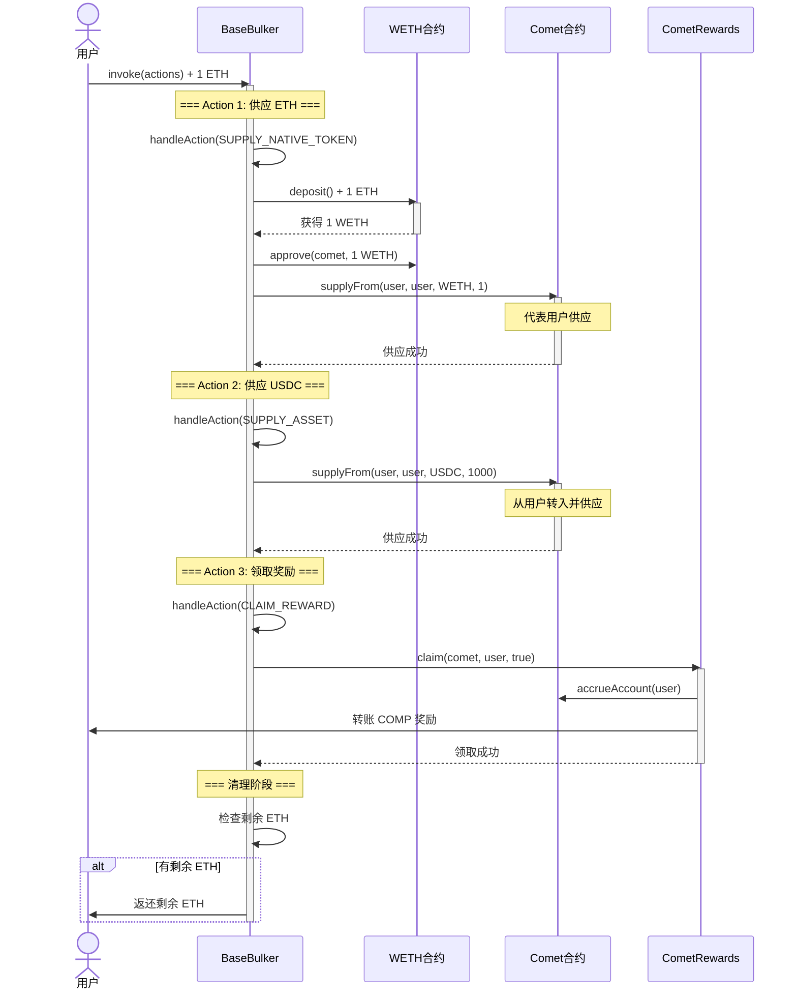

---

---

## 十二、核心流程总结

### 12.1 所有核心流程概览

| 流程 | 主要合约 | Gas 成本 | 频率 | 权限要求 |
|------|---------|---------|------|---------|
| **存款** | Comet | 中 | 高 | 用户 |
| **取款** | Comet | 中 | 高 | 用户 |
| **借贷** | Comet | 中 | 高 | 用户（通过取款） |
| **还款** | Comet | 中 | 高 | 用户（通过存款） |
| **计息** | Comet | 低 | 自动 | 无 |
| **清算** | Comet | 高 | 中 | 任何人 |
| **转账** | Comet | 中 | 中 | 用户/授权者 |
| **授权** | CometExt | 低 | 低 | 用户 |
| **签名授权** | CometExt | 中 | 低 | 中继者 |
| **奖励领取** | CometRewards | 中 | 低 | 用户/授权者 |
| **储备金提取** | Comet | 低 | 极低 | 治理 |
| **暂停** | Comet | 低 | 极低 | 治理/守护者 |
| **初始化** | Comet | 中 | 一次 | 部署者 |
| **批量操作** | Bulker | 高 | 中 | 用户 |

### 12.2 流程间关系

```
用户核心操作：
存款 ←→ 还款（自动）
取款 ←→ 借贷（自动）
转账 → 可能触发借贷/还款

辅助功能：
授权 → 启用代理操作
计息 → 自动触发（每次操作前）
奖励领取 → 独立于主流程

治理功能：
储备金提取 → 协议收益
暂停/恢复 → 紧急控制

优化功能：
批量操作 → 多个操作原子执行
签名授权 → 无 gas 授权
```

### 12.3 关键设计模式

#### 1. **自动触发模式**

- 计息在每次操作前自动触发
- 取款可能自动触发借贷
- 存款可能自动触发还款

#### 2. **权限分层模式**

- 用户：操作自己的账户
- 授权者：操作被授权账户
- 守护者：只能暂停
- 治理：完全控制

#### 3. **紧凑存储模式**

- 位标志存储暂停状态
- 资产信息打包存储
- 用户数据单槽存储

#### 4. **原子批量模式**

- Bulker 批量执行
- 清算批量处理
- 全部成功或全部失败

### 12.4 安全机制汇总

| 安全机制 | 应用场景 | 保护对象 |
|---------|---------|---------|
| **重入保护** | 所有状态修改操作 | 协议资金 |
| **权限检查** | 代理操作、治理操作 | 用户资产、协议控制 |
| **抵押率检查** | 借贷、取款、转账 | 协议偿付能力 |
| **暂停机制** | 紧急情况 | 整体安全 |
| **签名验证** | allowBySig | 用户授权 |
| **Nonce 机制** | 签名授权 | 防重放攻击 |
| **过期时间** | 签名授权 | 防过期签名 |
| **最小值检查** | 借贷金额 | 防灰尘攻击 |
| **供应上限** | 抵押品供应 | 单一资产风险 |

---

## 十三、关键点总结

### 13.1 核心流程关键点

#### 存款/取款

- ✅ 使用 **principal（本金）** 存储，通过指数计算当前价值
- ✅ 自动区分**供应/还款**和**取款/借贷**
- ✅ 支持 `uint256.max` 一键还清或取光
- ✅ 每次操作前自动累积利息

#### 贷款/还款

- ✅ **没有独立的借贷函数**，通过取款超额自动触发
- ✅ principal 正负表示供应/借贷状态
- ✅ 借贷需要检查抵押率和最小借贷量
- ✅ 还款优先偿还债务，剩余转为供应

#### 计息

- ✅ 使用**指数累积**而非线性累加
- ✅ **双斜率 Kink 模型**，鼓励适度利用率
- ✅ 供应和借贷使用不同指数
- ✅ 每次操作自动触发全局累积

#### 清算

- ✅ 使用**协议吸收**模式，而非清算人直接偿还
- ✅ **批量清算**支持，提高效率
- ✅ 清算后抵押品可折价购买
- ✅ 不足部分由协议储备吸收

### 13.2 Gas 优化技巧

1. **紧凑存储**：UserBasic 只占 1 个 slot
2. **位标志**：assetsIn 用 16 位表示持有的资产
3. **Immutable 配置**：所有参数编译时内嵌
4. **批量操作**：absorb 支持批量清算
5. **惰性累积**：只在需要时才累积利息

### 13.3 安全机制

1. **重入保护**：所有关键函数都有 `nonReentrant`
2. **暂停机制**：5 种操作可以独立暂停
3. **权限检查**：`hasPermission` 验证操作权限
4. **价格验证**：预言机价格必须 > 0
5. **溢出检查**：自定义 safe 函数防止溢出

### 13.4 数学精度

- `BASE_INDEX_SCALE = 1e15`：指数精度
- `FACTOR_SCALE = 1e18`：因子精度（100%）
- `PRICE_SCALE = 1e8`：价格精度
- `BASE_ACCRUAL_SCALE = 1e6`：奖励精度

---

---

## 十四、实际应用建议

### 14.1 用户操作建议

**存款**：

```solidity
// 存入基础资产赚取利息
comet.supply(USDC, 10000e6);

// 存入抵押品用于借贷
comet.supply(WETH, 5 ether);
```

**借贷**：

```solidity
// 通过取款触发借贷
comet.withdraw(USDC, 8000e6);  // 超过供应量即借贷
```

**还款**：

```solidity
// 存入基础资产自动还款
comet.supply(USDC, 3000e6);  // 优先还债

// 一键还清
comet.supply(USDC, type(uint256).max);
```

### 14.2 清算机器人建议

**监控逻辑**：

```javascript
// 定期检查所有借款人
for (const borrower of borrowers) {
    const isLiquidatable = await comet.isLiquidatable(borrower);
    if (isLiquidatable) {
        // 计算清算利润
        const profit = await estimateProfit(borrower);
        if (profit > gasСost) {
            await comet.absorb(liquidator, [borrower]);
        }
    }
}
```

**购买策略**：

```javascript
// 等待最佳折扣
const reserves = await comet.getCollateralReserves(ETH);
if (reserves > threshold) {
    const amount = await comet.quoteCollateral(ETH, maxUSDC);
    await comet.buyCollateral(ETH, minAmount, maxUSDC, recipient);
}
```

---

## 💡 如何使用本文档

### 代码链接导航

本文档中的所有代码片段都包含 **可点击的源码链接**（标记为 📄），点击后可以直接跳转到 GitHub 上的相应代码位置。

**示例**：[📄 Comet.sol:835-876](https://github.com/compound-finance/comet/blob/main/contracts/Comet.sol#L835-L876)

- 📄 图标：表示这是一个源码链接
- 链接格式：`文件名:起始行-结束行`
- 点击链接：跳转到 GitHub 查看完整源码和上下文

### 阅读建议

1. **跟随链接深入阅读**：遇到关键代码片段时，点击链接查看完整实现
2. **对比文档和源码**：文档提供解释，源码提供细节
3. **查看代码上下文**：GitHub 上可以查看函数的调用者和被调用者
4. **检查最新版本**：链接指向 `main` 分支，始终是最新代码

---

## 相关文档

- [📚 文档索引](./INDEX.md) - 所有文档的快速导航
- [🔧 可升级代理合约分析](./UPGRADEABLE_PROXY_ANALYSIS.md) - 代理模式和升级机制
- [🏗️ 系统架构图 (Mermaid)](./SYSTEM_ARCHITECTURE_MERMAID.md) - 完整的系统架构可视化
- [🔐 Market Admin 权限检查器分析](./MARKET_ADMIN_PERMISSION_CHECKER_ANALYSIS.md) - 权限管理和治理
- [🚀 部署流程分析](../src/deploy/Network.ts) - Comet 部署脚本
- [📖 核心类图详解](./core_class_diagram.md) - 详细的类结构和方法说明
- [📋 快速参考手册](./QUICK_REFERENCE.md) - 常用概念和命令速查

---

## 文档信息

| 项目 | 内容 |
|------|------|
| **文档名称** | COMET_CORE_FLOWS_ANALYSIS.md |
| **文档类型** | 技术分析文档 |
| **最后更新** | 2026年1月16日 |
| **协议版本** | Compound V3 (Comet) |
| **Solidity版本** | 0.8.15 |
| **GitHub仓库** | [compound-finance/comet](https://github.com/compound-finance/comet) |
| **代码链接数** | 37 个源码引用链接 |

### 特色功能

✅ **14个核心流程**完整解析  
✅ **37个源码链接**直达 GitHub  
✅ **13+时序图**可视化流程  
✅ **真实代码示例**和详细注释  
✅ **实际应用建议**和最佳实践
