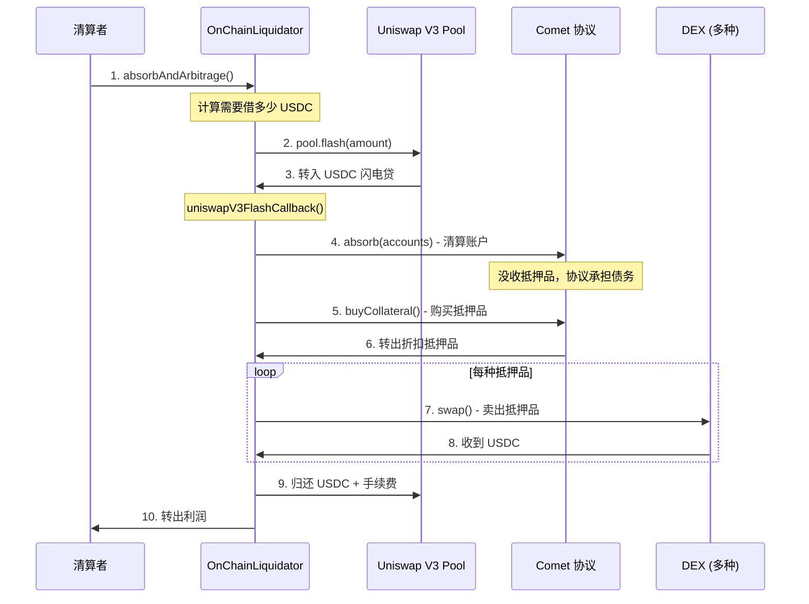

# OnChainLiquidator 链上清算机器人设计文档

## 📋 目录

- [概述](#概述)
- [设计背景](#设计背景)
- [核心功能](#核心功能)
- [技术架构](#技术架构)
- [工作流程](#工作流程)
- [代码实现分析](#代码实现分析)
- [使用示例](#使用示例)
- [经济模型](#经济模型)
- [安全机制](#安全机制)
- [优势与创新](#优势与创新)

---

## 概述

`OnChainLiquidator.sol` 是 Compound V3 生态中的**链上清算套利机器人合约**，它通过闪电贷技术实现零资本清算套利，是维护协议健康运行的关键基础设施。

### 基本信息

- **合约位置**: `contracts/liquidator/OnChainLiquidator.sol`
- **Solidity 版本**: 0.8.15
- **许可证**: MIT
- **主要依赖**: Uniswap V3, Comet 协议

### 核心价值

```
传统清算：需要大量资金 → 门槛高 → 参与者少 → 清算效率低
         ↓
OnChainLiquidator：闪电贷 → 零资本 → 任何人参与 → 高效清算
```

---

## 设计背景

### Compound V3 的二阶段清算机制

Compound V3 创新性地将清算过程分为两个独立阶段：

#### **阶段 1: absorb（没收抵押品）**

```solidity
// 任何人都可以调用，无需资金
Comet.absorb(liquidator, [underwaterAccount])
```

**特点**：

- ✅ **零资本要求** - 不需要任何代币
- ✅ **快速响应** - 立即清除风险账户
- ✅ **批量处理** - 一次清算多个账户
- ✅ **奖励机制** - 获得清算积分（可领取 COMP 奖励）

**结果**：

- 借款人的抵押品被协议没收
- 借款人的债务由协议承担
- 抵押品存入协议储备金

#### **阶段 2: buyCollateral（购买折扣抵押品）**

```solidity
// 任何人可以购买，需要支付基础资产（如 USDC）
Comet.buyCollateral(asset, minAmount, baseAmount, recipient)
```

**特点**：

- 💰 **折扣价格** - 通常 95%-97% 的市场价
- 💰 **补充储备** - 为协议注入流动性
- 💰 **套利机会** - 立即卖出赚取差价

**结果**：

- 购买者支付 USDC
- 购买者获得折扣抵押品
- 协议储备金得到补充

### OnChainLiquidator 的设计目标

**问题**：虽然二阶段清算降低了门槛，但仍需要：

1. 监控水下账户
2. 手动调用 `absorb`
3. 计算折扣价格
4. 准备 USDC 购买抵押品
5. 找到 DEX 卖出抵押品

**解决方案**：OnChainLiquidator 将所有步骤整合为一个原子交易，通过闪电贷实现零资本套利。

---

## 核心功能

### 1. absorbAndArbitrage - 一键清算套利

```solidity
function absorbAndArbitrage(
    address comet,                          // Comet 市场地址
    address[] calldata liquidatableAccounts, // 可清算的账户列表
    address[] calldata assets,               // 要购买的抵押品列表
    PoolConfig[] calldata poolConfigs,       // DEX 配置（如何卖出抵押品）
    uint[] calldata maxAmountsToPurchase,    // 每种资产的最大购买量
    address flashLoanPairToken,              // 闪电贷池的配对代币
    uint24 flashLoanPoolFee,                 // 闪电贷池的费率
    uint liquidationThreshold                // 最小清算阈值
) external
```

**功能说明**：

- 从 Uniswap V3 借入基础资产（如 USDC）
- 调用 Comet 的 `absorb` 清算账户
- 调用 Comet 的 `buyCollateral` 购买折扣抵押品
- 在 DEX 上卖出抵押品换回基础资产
- 归还闪电贷 + 手续费
- 将利润转给调用者

### 2. 多 DEX 支持

支持四大主流 DEX：

```solidity
enum Exchange {
    Uniswap,    // Uniswap V3 - 最佳流动性
    SushiSwap,  // SushiSwap V2 - 某些代币流动性好
    Balancer,   // Balancer - 适合稳定币和池化资产
    Curve       // Curve - 适合 stETH/wstETH 等
}
```

### 3. 灵活的交易路径

```solidity
struct PoolConfig {
    Exchange exchange;           // 使用哪个 DEX
    uint24 uniswapPoolFee;      // Uniswap 池费率（3000=0.3%, 500=0.05%）
    bool swapViaWeth;           // 是否先换成 WETH 再换基础资产
    bytes32 balancerPoolId;     // Balancer 池 ID
    address curvePool;          // Curve 池地址
}
```

**示例配置**：

- 高流动性资产（WETH, WBTC）：直接换成 USDC
- 低流动性资产（UNI, LINK）：先换 WETH，再换 USDC
- 特殊资产（wstETH）：使用 Curve 池

---

## 技术架构

### 架构图

```
┌─────────────────────────────────────────────────────────────┐
│                    OnChainLiquidator                        │
├─────────────────────────────────────────────────────────────┤
│                                                             │
│  ┌───────────────┐      ┌──────────────┐                  │
│  │ Flash Loan    │      │  Swap Logic  │                  │
│  │ - Uniswap V3  │      │  - Uniswap   │                  │
│  │ - Callback    │      │  - SushiSwap │                  │
│  └───────────────┘      │  - Balancer  │                  │
│                         │  - Curve     │                  │
│  ┌───────────────┐      └──────────────┘                  │
│  │ Comet Interface│                                        │
│  │ - absorb      │      ┌──────────────┐                  │
│  │ - buyCollateral│     │ Price Logic  │                  │
│  └───────────────┘      │ - quotePrice │                  │
│                         │ - slippage   │                  │
│                         └──────────────┘                  │
└─────────────────────────────────────────────────────────────┘
```

### 依赖关系

```
OnChainLiquidator
    │
    ├── IUniswapV3FlashCallback  (闪电贷回调接口)
    ├── PeripheryPayments        (支付辅助)
    ├── PeripheryImmutableState  (不可变状态)
    │
    ├── CometInterface           (Comet 协议接口)
    │   ├── absorb()
    │   ├── buyCollateral()
    │   ├── getCollateralReserves()
    │   └── quoteCollateral()
    │
    └── DEX Interfaces
        ├── ISwapRouter (Uniswap V3)
        ├── IUniswapV2Router (SushiSwap)
        ├── IVault (Balancer)
        └── IStableSwap (Curve)
```

### 关键不可变变量

```solidity
// DEX 路由器
address public immutable balancerVault;     // Balancer Vault
address public immutable sushiSwapRouter;   // SushiSwap Router
address public immutable uniswapRouter;     // Uniswap Router
address public immutable factory;           // Uniswap V3 Factory
address public immutable WETH9;             // WETH 地址

// 特殊代币
address public immutable stEth;             // Lido stETH
address public immutable wstEth;            // Wrapped stETH
```

---

## 工作流程

### 完整流程图



### 详细步骤

#### **步骤 1: 计算闪电贷金额**

```solidity
uint256 flashLoanAmount = 0;
uint256[] memory assetBaseAmounts = new uint256[](assets.length);

for (uint8 i = 0; i < assets.length; i++) {
    // 查询每种抵押品可以购买多少
    (, uint256 collateralBalanceInBase) = purchasableBalanceOfAsset(
        comet,
        assets[i],
        maxAmountsToPurchase[i]
    );
    
    // 如果超过阈值，累加到闪电贷金额
    if (collateralBalanceInBase > liquidationThreshold) {
        flashLoanAmount += collateralBalanceInBase;
        assetBaseAmounts[i] = collateralBalanceInBase;
    }
}
```

**关键点**：

- 计算需要多少 USDC 才能买下所有抵押品
- 过滤掉价值太小的抵押品（不值得清算）

#### **步骤 2: 发起闪电贷**

```solidity
// 找到 Uniswap V3 池（如 DAI/USDC 0.01% 池）
PoolAddress.PoolKey memory poolKey =
    PoolAddress.PoolKey({
        token0: poolToken0, 
        token1: poolToken1, 
        fee: flashLoanPoolFee
    });
    
IUniswapV3Pool pool = IUniswapV3Pool(
    PoolAddress.computeAddress(factory, poolKey)
);

// 发起闪电贷
pool.flash(
    address(this),
    reversedPair ? flashLoanAmount : 0,
    reversedPair ? 0 : flashLoanAmount,
    abi.encode(FlashCallbackData({...}))
);
```

**关键点**：

- 使用低费率池（0.01% 或 0.05%）降低成本
- 通过 `abi.encode` 传递所有必要参数

#### **步骤 3: 闪电贷回调**

```solidity
function uniswapV3FlashCallback(
    uint256 fee0,
    uint256 fee1,
    bytes calldata data
) external override {
    // 1. 验证回调来源（安全检查）
    FlashCallbackData memory flashCallbackData = abi.decode(data, (FlashCallbackData));
    CallbackValidation.verifyCallback(factory, flashCallbackData.poolKey);
    
    // 2. 授权 Comet 使用 USDC
    address baseToken = CometInterface(flashCallbackData.comet).baseToken();
    TransferHelper.safeApprove(baseToken, flashCallbackData.comet, flashLoanAmount);
    
    // 3. 购买并卖出每种抵押品
    uint256 totalAmountOut = 0;
    for (uint i = 0; i < assets.length; i++) {
        // 3a. 从 Comet 购买抵押品
        CometInterface(comet).buyCollateral(asset, 0, assetBaseAmount, address(this));
        
        // 3b. 在 DEX 上卖出抵押品
        uint256 amountOut = swapCollateral(comet, asset, assetBaseAmount, poolConfigs[i]);
        
        totalAmountOut += amountOut;
    }
    
    // 4. 归还闪电贷
    uint256 totalAmountOwed = flashLoanAmount + fee0 + fee1;
    pay(baseToken, address(this), msg.sender, totalAmountOwed);
    
    // 5. 转出利润
    uint256 profit = ERC20(baseToken).balanceOf(address(this));
    if (profit > 0) {
        pay(baseToken, address(this), recipient, profit);
    }
}
```

#### **步骤 4: 购买抵押品**

```solidity
CometInterface(comet).buyCollateral(
    asset,           // 抵押品地址（如 WETH）
    0,               // minAmount = 0（我们手动检查滑点）
    assetBaseAmount, // 支付的 USDC 数量
    address(this)    // 接收者
);
```

**关键逻辑**（在 Comet 内部）：

```solidity
// Comet.buyCollateral 内部
uint256 collateralAmount = quoteCollateral(asset, baseAmount);
// quoteCollateral 应用折扣：
// discountFactor = storeFrontPriceFactor × (1 - liquidationFactor)
// 例如：0.94 = 0.99 × (1 - 0.05)
// 即：6% 折扣
```

#### **步骤 5: 卖出抵押品**

根据 `PoolConfig` 选择不同的 DEX：

**Uniswap V3**：

```solidity
function swapViaUniswap(...) internal returns (uint256) {
    if (poolConfig.swapViaWeth) {
        // 两跳：Asset → WETH → USDC
        uint256 wethAmount = swapRouter.exactInputSingle(
            asset → WETH, poolFee, swapAmount
        );
        return swapRouter.exactInputSingle(
            WETH → USDC, 500, wethAmount  // WETH/USDC 固定用 0.05%
        );
    } else {
        // 一跳：Asset → USDC
        return swapRouter.exactInputSingle(
            asset → USDC, poolFee, swapAmount
        );
    }
}
```

**SushiSwap**：

```solidity
function swapViaSushiSwap(...) internal returns (uint256) {
    address[] memory path;
    if (poolConfig.swapViaWeth) {
        path = [asset, WETH, USDC];  // 两跳
    } else {
        path = [asset, USDC];        // 一跳
    }
    
    return sushiSwapRouter.swapExactTokensForTokens(
        swapAmount, 0, path, address(this), deadline
    );
}
```

**Curve（特殊处理 wstETH）**：

```solidity
function swapViaCurve(...) internal returns (uint256) {
    address tokenIn = asset;
    
    // wstETH 需要先解包成 stETH
    if (tokenIn == wstEth) {
        swapAmount = IWstETH(wstEth).unwrap(swapAmount);
        tokenIn = stEth;
    }
    
    // 使用 Curve 的 stETH/ETH 池
    return curvePool.exchange(idxIn, idxOut, swapAmount, 0);
}
```

---

## 代码实现分析

### 1. purchasableBalanceOfAsset - 计算可购买量

```solidity
function purchasableBalanceOfAsset(
    address comet, 
    address asset, 
    uint maxCollateralToPurchase
) internal returns (uint256, uint256) {
    // 1. 查询协议持有的抵押品数量
    uint256 collateralBalance = CometInterface(comet).getCollateralReserves(asset);
    
    // 2. 限制最大购买量（防止滑点过大）
    collateralBalance = min(collateralBalance, maxCollateralToPurchase);
    
    // 3. 计算需要多少 USDC
    uint256 baseScale = CometInterface(comet).baseScale();
    uint256 quotePrice = CometInterface(comet).quoteCollateral(
        asset, 
        QUOTE_PRICE_SCALE * baseScale  // 1 单位抵押品的价格
    );
    
    // 4. 总 USDC = 抵押品数量 × 每单位价格
    uint256 collateralBalanceInBase = 
        baseScale * QUOTE_PRICE_SCALE * collateralBalance / quotePrice;
    
    return (collateralBalance, collateralBalanceInBase);
}
```

**示例计算**：

```
假设：
- 协议持有 10 WETH
- WETH 市价 = $1,700
- liquidationFactor = 0.95 (5% 惩罚)
- storeFrontPriceFactor = 0.99 (1% 额外折扣)

折扣价 = $1,700 × (1 - (1 - 0.95) × 0.99) = $1,700 × 0.9405 = $1,598.85
需要 USDC = 10 × $1,598.85 = $15,988.5
```

### 2. swapCollateral - 路由到不同 DEX

```solidity
function swapCollateral(
    address comet,
    address asset,
    uint256 amountOutMin,
    PoolConfig memory poolConfig
) internal returns (uint256) {
    if (poolConfig.exchange == Exchange.Uniswap) {
        return swapViaUniswap(comet, asset, amountOutMin, poolConfig);
    } else if (poolConfig.exchange == Exchange.SushiSwap) {
        return swapViaSushiSwap(comet, asset, amountOutMin, poolConfig);
    } else if (poolConfig.exchange == Exchange.Balancer) {
        return swapViaBalancer(comet, asset, amountOutMin, poolConfig);
    } else if (poolConfig.exchange == Exchange.Curve) {
        return swapViaCurve(comet, asset, amountOutMin, poolConfig);
    } else {
        revert InvalidExchange();
    }
}
```

### 3. 安全检查

```solidity
// 验证 Uniswap 回调来源
CallbackValidation.verifyCallback(factory, flashCallbackData.poolKey);

// 检查最终余额
if (totalAmountOwed > balance) {
    revert InsufficientBalance(balance, totalAmountOwed);
}

// 检查滑点
if (amountOut < amountOutMin) {
    revert InsufficientAmountOut(tokenIn, tokenOut, amountIn, amountOut, amountOutMin, poolConfig);
}
```

---

## 使用示例

### 示例 1: 清算 WETH 抵押品

```typescript
// 配置
const comet = "0xc3d688B66703497DAA19211EEdff47f25384cdc3"; // USDC 市场
const liquidatableAccounts = ["0xBadBorrower..."];
const assets = ["0xC02aaA39b223FE8D0A0e5C4F27eAD9083C756Cc2"]; // WETH

// WETH 流动性好，直接用 Uniswap V3 0.05% 池
const poolConfigs = [{
    exchange: 0,              // Uniswap
    uniswapPoolFee: 500,      // 0.05%
    swapViaWeth: false,       // 直接 WETH → USDC
    balancerPoolId: "0x00",
    curvePool: "0x00"
}];

const maxAmountsToPurchase = [ethers.constants.MaxUint256]; // 不限制
const flashLoanPairToken = "0x6B175474E89094C44Da98b954EedeAC495271d0F"; // DAI
const flashLoanPoolFee = 100; // DAI/USDC 0.01% 池
const liquidationThreshold = 10e6; // 10 USDC

// 调用
await onChainLiquidator.absorbAndArbitrage(
    comet,
    liquidatableAccounts,
    assets,
    poolConfigs,
    maxAmountsToPurchase,
    flashLoanPairToken,
    flashLoanPoolFee,
    liquidationThreshold
);
```

### 示例 2: 清算 LINK（低流动性）

```typescript
const assets = ["0x514910771AF9Ca656af840dff83E8264EcF986CA"]; // LINK

// LINK 流动性较差，先换成 WETH 再换 USDC
const poolConfigs = [{
    exchange: 0,              // Uniswap
    uniswapPoolFee: 3000,     // LINK → WETH 用 0.3%
    swapViaWeth: true,        // ✅ 两跳交易
    balancerPoolId: "0x00",
    curvePool: "0x00"
}];
```

### 示例 3: 清算 wstETH（使用 Curve）

```typescript
const assets = ["0x7f39C581F595B53c5cb19bD0b3f8dA6c935E2Ca0"]; // wstETH

// wstETH 最适合用 Curve 的 stETH/ETH 池
const poolConfigs = [{
    exchange: 3,              // Curve
    uniswapPoolFee: 0,
    swapViaWeth: false,
    balancerPoolId: "0x00",
    curvePool: "0xDC24316b9AE028F1497c275EB9192a3Ea0f67022" // stETH/ETH
}];
```

---

## 经济模型

### 利润计算

```
收入：卖出抵押品的 USDC
  = 抵押品数量 × 市场价格

成本：
  1. 购买抵押品的 USDC = 抵押品数量 × 折扣价格
  2. 闪电贷手续费 = 借款金额 × 0.01% (Uniswap V3)
  3. Gas 费用

利润：
  = 收入 - 成本
  = 抵押品数量 × (市场价格 - 折扣价格) - 闪电贷手续费 - Gas 费
```

### 实际案例

**场景**：清算一个持有 10 WETH 抵押品的账户

```
市场状况：
- WETH 价格：$1,700
- USDC/DAI 池费率：0.01%
- WETH/USDC 池费率：0.05%
- Gas 价格：30 gwei
- 清算配置：liquidationFactor = 0.95, storeFrontPriceFactor = 0.99

步骤 1: 计算折扣价
折扣因子 = (1 - 0.95) × 0.99 = 0.0495
折扣价 = $1,700 × (1 - 0.0495) = $1,615.85

步骤 2: 计算闪电贷金额
需要借 = 10 × $1,615.85 = $16,158.50 USDC

步骤 3: 计算收入
卖出 10 WETH 收入 = 10 × $1,700 × (1 - 0.05%) = $16,991.50 USDC

步骤 4: 计算成本
- 购买成本：$16,158.50
- 闪电贷手续费：$16,158.50 × 0.01% = $1.62
- DEX 手续费：$16,991.50 × 0.05% = $8.50
- Gas 费：约 $30 (假设 400k gas)
- 总成本：$16,198.62

步骤 5: 净利润
利润 = $16,991.50 - $16,198.62 = $792.88
ROI = $792.88 / $16,158.50 = 4.9%
```

### 盈利阈值

清算是否盈利取决于：

```
盈利条件：
(市场价 - 折扣价) × 数量 > 闪电贷费用 + DEX 费用 + Gas 费

简化为：
折扣百分比 > (闪电贷费率 + DEX 费率 + Gas费/金额)

例如：
- 折扣：5.95%
- 费用：0.01% + 0.05% + 0.2% = 0.26%
- 利润率：5.95% - 0.26% = 5.69%  ✅ 盈利
```

---

## 安全机制

### 1. 闪电贷回调验证

```solidity
// 防止伪造回调攻击
CallbackValidation.verifyCallback(factory, flashCallbackData.poolKey);
```

**原理**：

- 计算预期的池地址：`CREATE2(factory, poolKey, initCodeHash)`
- 验证 `msg.sender == 计算的池地址`
- 防止攻击者伪造回调窃取资金

### 2. 余额检查

```solidity
uint256 balance = ERC20(baseToken).balanceOf(address(this));

if (totalAmountOwed > balance) {
    revert InsufficientBalance(balance, totalAmountOwed);
}
```

**保护**：

- 确保有足够资金归还闪电贷
- 防止交易失败导致的损失

### 3. 滑点保护

```solidity
if (amountOut < amountOutMin) {
    revert InsufficientAmountOut(
        tokenIn, tokenOut, amountIn, amountOut, amountOutMin, poolConfig
    );
}
```

**保护**：

- 防止价格波动导致亏损
- 提供详细错误信息便于调试

### 4. 参数验证

```solidity
if (poolConfigs.length != assets.length) revert InvalidArgument();
if (maxAmountsToPurchase.length != assets.length) revert InvalidArgument();
```

**保护**：

- 防止参数不匹配导致的错误
- 提前失败，节省 Gas

### 5. 只处理实际余额

```solidity
uint256 swapAmount = ERC20(asset).balanceOf(address(this));
if (swapAmount == 0) return 0;  // 安全退出
```

**保护**：

- 忽略合约中的残留余额
- 只处理本次清算获得的抵押品

---

## 优势与创新

### 传统清算 vs OnChainLiquidator

| 维度 | 传统清算（V2/Aave） | OnChainLiquidator |
|------|-------------------|------------------|
| **资金要求** | 需持有大量债务代币 | 零资本（闪电贷） |
| **操作复杂度** | 多步手动操作 | 一键完成 |
| **清算速度** | 需准备资金，较慢 | 即时，原子化 |
| **参与门槛** | 高（资金+技术） | 低（任何人可调用） |
| **Gas 效率** | 多次交易 | 单次交易 |
| **风险** | 价格波动风险 | 闪电贷保护 |
| **灵活性** | 固定流程 | 支持多 DEX |

### 核心创新点

#### 1. **零资本清算**

```
传统方式：
  清算者 → 准备 $100,000 USDC → 清算 → 卖出抵押品 → 收回资金 + 利润
  ❌ 需要大量资本
  ❌ 资金利用率低

OnChainLiquidator：
  闪电贷 $100,000 → 清算 → 卖出 → 归还 → 利润
  ✅ 零资本启动
  ✅ 资金效率 100%
```

#### 2. **原子化执行**

```solidity
// 所有操作在一个交易中完成
transaction {
    借款（闪电贷）
    清算（absorb）
    购买（buyCollateral）
    卖出（swap）
    归还（repay）
    收利润
} // 要么全部成功，要么全部回滚
```

**好处**：

- ✅ 无价格风险（原子化）
- ✅ 无资金占用
- ✅ 失败自动回滚

#### 3. **多 DEX 聚合**

```typescript
// 智能选择最优交易路径
WETH → Uniswap V3 0.05%  (流动性最好)
LINK → Uniswap V3 → WETH → USDC  (两跳)
wstETH → Curve stETH/ETH  (最低滑点)
```

#### 4. **配置化设计**

```solidity
// 灵活配置每种资产的交易路径
PoolConfig[] memory configs = [
    {Uniswap, 500, false, 0, 0},    // WETH
    {Uniswap, 3000, true, 0, 0},    // LINK
    {Curve, 0, false, 0, curvePool} // wstETH
];
```

#### 5. **MEV 保护**

```typescript
// 可以使用 Flashbots 私有交易
const flashbotsProvider = await FlashbotsBundleProvider.create(...);
await flashbotsProvider.sendPrivateTransaction(tx);
```

**好处**：

- 防止抢跑
- 防止三明治攻击
- 保护清算利润

---

## 实际应用

### 部署配置

```typescript
// 主网部署参数
const onChainLiquidator = await OnChainLiquidator.deploy(
    "0xBA12222222228d8Ba445958a75a0704d566BF2C8",  // Balancer Vault
    "0xd9e1cE17f2641f24aE83637ab66a2cca9C378B9F",  // SushiSwap Router
    "0xE592427A0AEce92De3Edee1F18E0157C05861564",  // Uniswap Router
    "0x1F98431c8aD98523631AE4a59f267346ea31F984",  // Uniswap V3 Factory
    "0xae7ab96520DE3A18E5e111B5EaAb095312D7fE84",  // stETH
    "0x7f39C581F595B53c5cb19bD0b3f8dA6c935E2Ca0",  // wstETH
    "0xC02aaA39b223FE8D0A0e5C4F27eAD9083C756Cc2"   // WETH9
);
```

### 监控和触发

```typescript
// 清算机器人主循环
while (true) {
    // 1. 查询可清算账户
    const accounts = await findLiquidatableAccounts(comet);
    
    if (accounts.length === 0) {
        await sleep(60000); // 1 分钟后重试
        continue;
    }
    
    // 2. 评估盈利性
    const profitable = await estimateProfit(accounts);
    
    if (!profitable) {
        console.log("清算不盈利，跳过");
        continue;
    }
    
    // 3. 执行清算
    await onChainLiquidator.absorbAndArbitrage(...);
    
    console.log(`成功清算 ${accounts.length} 个账户`);
}
```

### 关键指标

监控以下指标以优化清算：

```typescript
const metrics = {
    // 清算机会
    liquidatableAccounts: await countLiquidatable(comet),
    totalCollateralValue: await getTotalCollateralValue(comet),
    
    // 盈利性
    discountRate: 0.0595,              // 5.95%
    flashLoanFee: 0.0001,              // 0.01%
    dexFee: 0.0005,                    // 0.05%
    gasPrice: await provider.getGasPrice(),
    
    // 执行成本
    estimatedGas: 400000,
    estimatedCost: gasPrice * estimatedGas,
    
    // 利润率
    minProfitRate: 0.02,               // 2%
    expectedProfit: collateralValue * (discountRate - totalFees)
};
```

---

## 总结

`OnChainLiquidator` 是 Compound V3 生态中的关键基础设施，它通过以下创新实现了高效的清算机制：

### 核心价值

1. **降低清算门槛** - 从需要百万级资金降低到零资本
2. **提高清算效率** - 从手动多步操作到一键原子化执行
3. **增强系统安全** - 更多参与者 = 更快清算 = 更安全的协议
4. **创造套利机会** - 为市场参与者提供无风险收益机会

### 技术亮点

- ✅ Uniswap V3 闪电贷集成
- ✅ 多 DEX 聚合优化
- ✅ 原子化交易保护
- ✅ 灵活配置系统
- ✅ 完善的安全检查

### 对生态的影响

```
更多清算者 → 更快清算速度 → 更少坏账 → 更健康的协议 → 更低的风险 → 更多用户
```

这种良性循环使得 Compound V3 能够维持健康的清算市场，确保协议的长期稳定运行。

---

## 相关资源

- **合约代码**: `contracts/liquidator/OnChainLiquidator.sol`
- **清算机器人**: `scripts/liquidation_bot/`
- **测试用例**: `test/liquidation/`
- **Comet 文档**: [Compound V3 Docs](https://docs.compound.finance)

---

*最后更新: 2026-01-21*
