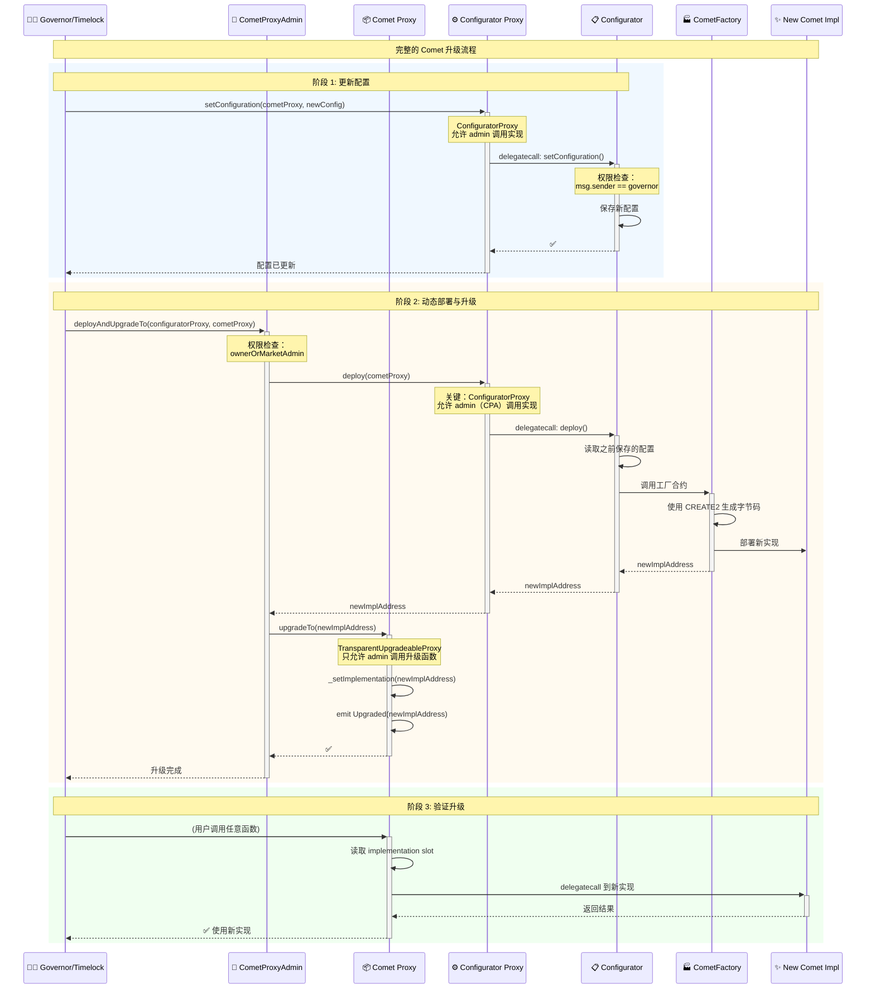
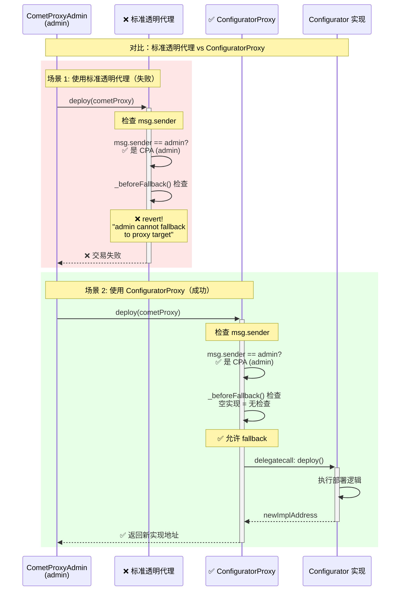

# CometProxyAdmin 和 ConfiguratorProxy 功能分析

> Compound V3 中两个关键代理管理合约的深度解析

## 目录

- [一、CometProxyAdmin 合约](#一cometproxyadmin-合约)
  - [1.1 核心功能](#11-核心功能)
  - [1.2 继承关系](#12-继承关系)
  - [1.3 多管理员权限机制](#13-多管理员权限机制)
  - [1.4 动态部署与升级](#14-动态部署与升级)
  - [1.5 源码详解](#15-源码详解)
- [二、ConfiguratorProxy 合约](#二configuratorproxy-合约)
  - [2.1 核心功能](#21-核心功能)
  - [2.2 与标准透明代理的区别](#22-与标准透明代理的区别)
  - [2.3 使用场景](#23-使用场景)
  - [2.4 源码详解](#24-源码详解)
- [三、两者的协作关系](#三两者的协作关系)
  - [3.1 在部署流程中的角色](#31-在部署流程中的角色)
  - [3.2 交互时序图](#32-交互时序图)
- [四、对比分析](#四对比分析)
- [五、最佳实践](#五最佳实践)

---

## 一、CometProxyAdmin 合约

### 1.1 核心功能

`CometProxyAdmin` 是 Compound V3 中用于管理 Comet 代理合约升级的核心合约，它扩展了 OpenZeppelin 的标准 `ProxyAdmin`。

**主要功能：**

1. ✅ **多管理员权限**：支持 owner 和 market admin 两种管理员角色
2. ✅ **动态部署升级**：通过 Configurator 动态生成并升级实现合约
3. ✅ **权限检查委托**：使用 `MarketAdminPermissionChecker` 验证权限
4. ✅ **升级管理**：管理透明代理的升级操作

### 1.2 继承关系

```
┌─────────────────┐
│     Ownable     │
└────────┬────────┘
         │
┌────────▼────────┐
│   ProxyAdmin    │  ← OpenZeppelin 标准代理管理员
└────────┬────────┘
         │
┌────────▼────────┐
│ CometProxyAdmin │  ← Compound V3 定制版本
└─────────────────┘
```

**文件位置：** `contracts/CometProxyAdmin.sol`

### 1.3 多管理员权限机制

#### 1.3.1 权限角色

| 角色 | 地址 | 权限 | 说明 |
|------|------|------|------|
| **Owner** | 继承自 Ownable | 完全控制权 | 通常是 Timelock（治理合约） |
| **Market Admin** | 通过 `MarketAdminPermissionChecker` 验证 | 升级权限 | 可以执行市场升级操作 |

#### 1.3.2 ownerOrMarketAdmin 修饰器

```solidity
modifier ownerOrMarketAdmin {
    if(_msgSender() != owner()) {
        // 如果不是 owner，检查是否是 market admin
        marketAdminPermissionChecker.checkUpdatePermission(_msgSender());
    }
    _;
}
```

**工作流程：**

```
调用者发起升级请求
    ↓
是否为 owner? ───→ 是 ───→ 允许执行
    │
    否
    ↓
调用 MarketAdminPermissionChecker
    ↓
检查调用者是否有权限
    ↓
是 ───→ 允许执行
否 ───→ revert
```

### 1.4 动态部署与升级

#### 1.4.1 deployAndUpgradeTo 函数

这是 CometProxyAdmin 最重要的功能，实现了"部署 + 升级"的一体化操作。

```solidity
function deployAndUpgradeTo(
    Deployable configuratorProxy, 
    TransparentUpgradeableProxy cometProxy
) public virtual ownerOrMarketAdmin {
    // 步骤1: 通过 Configurator 动态生成新的实现合约
    address newCometImpl = configuratorProxy.deploy(address(cometProxy));
    
    // 步骤2: 升级代理到新实现
    _upgrade(cometProxy, newCometImpl);
}
```

**执行流程：**

```
1. 管理员调用 deployAndUpgradeTo
        ↓
2. 权限检查 (ownerOrMarketAdmin)
        ↓
3. 调用 Configurator.deploy()
        ↓
4. Configurator 读取配置
        ↓
5. 通过 CometFactory 动态生成实现合约
        ↓
6. 返回新实现合约地址
        ↓
7. 调用 _upgrade() 升级代理
        ↓
8. Comet Proxy 指向新实现
        ↓
9. 完成升级 ✅
```

#### 1.4.2 deployUpgradeToAndCall 函数

带初始化调用的升级版本。

```solidity
function deployUpgradeToAndCall(
    Deployable configuratorProxy,
    TransparentUpgradeableProxy cometProxy,
    bytes memory data
) public virtual ownerOrMarketAdmin {
    // 步骤1: 部署新实现
    address newCometImpl = configuratorProxy.deploy(address(cometProxy));
    
    // 步骤2: 升级并调用初始化函数
    _upgradeAndCall(cometProxy, newCometImpl, data);
}
```

**使用场景：**
- 升级后需要初始化新的存储变量
- 需要执行迁移逻辑
- 激活新功能

### 1.5 源码详解

```solidity
// SPDX-License-Identifier: BUSL-1.1
pragma solidity 0.8.15;

import "./vendor/proxy/transparent/ProxyAdmin.sol";
import "./marketupdates/MarketAdminPermissionCheckerInterface.sol";

// Deployable 接口：要求 Configurator 实现 deploy 方法
interface Deployable {
  function deploy(address cometProxy) external returns (address);
}

/**
 * @title CometProxyAdmin
 * @notice Comet 代理升级管理合约
 * @dev 用于部署新实现并升级代理，带权限检查
 */
contract CometProxyAdmin is ProxyAdmin {

    /// @notice 权限检查合约
    MarketAdminPermissionCheckerInterface public marketAdminPermissionChecker;

    /// @notice 设置权限检查器事件
    event SetMarketAdminPermissionChecker(
        address indexed oldMarketAdminPermissionChecker, 
        address indexed newMarketAdminPermissionChecker
    );
    
    error Unauthorized();

    /**
     * @dev 确保调用者是 owner 或 market admin
     * @notice 委托给 MarketAdminPermissionChecker 进行权限检查
     */
    modifier ownerOrMarketAdmin {
        if(_msgSender() != owner()) {
            marketAdminPermissionChecker.checkUpdatePermission(_msgSender());
        }
        _;
    }

    /**
     * @dev 初始化合约，设置初始 owner
     * @param initialOwner 初始所有者地址
     */
    constructor(address initialOwner) ProxyAdmin(initialOwner) {}

    /**
     * @dev 部署新的 Comet 实现并升级代理
     * @notice 这是核心升级函数，集成了部署和升级两个步骤
     * @param configuratorProxy Configurator 代理合约
     * @param cometProxy Comet 代理合约
     * 
     * 要求：
     * - 本合约必须是 cometProxy 的 admin
     * - 调用者必须是 owner 或有权限的 market admin
     */
    function deployAndUpgradeTo(
        Deployable configuratorProxy, 
        TransparentUpgradeableProxy cometProxy
    ) public virtual ownerOrMarketAdmin {
        // 通过 Configurator 动态生成新实现
        address newCometImpl = configuratorProxy.deploy(address(cometProxy));
        
        // 升级代理到新实现
        _upgrade(cometProxy, newCometImpl);
    }

    /**
     * @dev 部署、升级并调用初始化函数
     * @param configuratorProxy Configurator 代理合约
     * @param cometProxy Comet 代理合约
     * @param data 升级后要调用的初始化数据
     */
    function deployUpgradeToAndCall(
        Deployable configuratorProxy,
        TransparentUpgradeableProxy cometProxy,
        bytes memory data
    ) public virtual ownerOrMarketAdmin {
        address newCometImpl = configuratorProxy.deploy(address(cometProxy));
        _upgradeAndCall(cometProxy, newCometImpl, data);
    }

    /**
     * @notice 设置市场管理员权限检查器
     * @dev 只有 owner 可以调用
     * @param newMarketAdminPermissionChecker 新的权限检查器地址
     */
    function setMarketAdminPermissionChecker(
        MarketAdminPermissionCheckerInterface newMarketAdminPermissionChecker
    ) external {
        if (_msgSender() != owner()) revert Unauthorized();
        
        address oldMarketAdminPermissionChecker = address(marketAdminPermissionChecker);
        marketAdminPermissionChecker = newMarketAdminPermissionChecker;
        
        emit SetMarketAdminPermissionChecker(
            oldMarketAdminPermissionChecker, 
            address(newMarketAdminPermissionChecker)
        );
    }

    /**
     * @dev 内部升级函数
     * @notice 允许 owner 和 market admin 调用
     */
    function _upgrade(
        TransparentUpgradeableProxy proxy, 
        address implementation
    ) private {
        proxy.upgradeTo(implementation);
    }

    /**
     * @dev 内部升级并调用函数
     * @notice 允许 owner 和 market admin 调用
     */
    function _upgradeAndCall(
        TransparentUpgradeableProxy proxy,
        address implementation,
        bytes memory data
    ) private {
        proxy.upgradeToAndCall(implementation, data);
    }
}
```

---

## 二、ConfiguratorProxy 合约

### 2.1 核心功能

`ConfiguratorProxy` 是一个**特殊的透明代理合约**，它打破了标准透明代理的限制，允许 admin 调用实现合约的函数。

**核心特点：**

1. ✅ **Admin 可以调用实现**：与标准透明代理不同
2. ✅ **简化的代理**：专门为 Configurator 设计
3. ✅ **保持可升级性**：仍然可以升级实现合约
4. ✅ **最小化改动**：仅覆盖 `_beforeFallback` 函数

**文件位置：** `contracts/ConfiguratorProxy.sol`

### 2.2 与标准透明代理的区别

#### 标准透明代理 (TransparentUpgradeableProxy)

```solidity
function _beforeFallback() internal virtual override {
    require(
        msg.sender != _getAdmin(), 
        "admin cannot fallback to proxy target"
    );
    super._beforeFallback();
}
```

**限制：** Admin **不能**调用实现合约的任何函数

#### ConfiguratorProxy

```solidity
function _beforeFallback() internal virtual override {
    // 空实现！允许 fallback 到实现合约
}
```

**特点：** Admin **可以**调用实现合约的函数

### 2.3 使用场景

#### 为什么 Configurator 需要这个特殊代理？

**问题：** Configurator 的函数需要被两类调用者访问：

1. **CometProxyAdmin**：调用 `deploy()` 来生成新的 Comet 实现
2. **Governor/Admin**：调用配置管理函数（`setConfiguration`, `setFactory` 等）

**标准透明代理的限制：**

```
CometProxyAdmin (作为 proxy admin)
    ↓ 尝试调用 deploy()
标准透明代理
    ↓ _beforeFallback() 检查
❌ revert("admin cannot fallback to proxy target")
```

**ConfiguratorProxy 的解决方案：**

```
CometProxyAdmin (作为 proxy admin)
    ↓ 调用 deploy()
ConfiguratorProxy
    ↓ _beforeFallback() 为空，允许通过
    ↓ fallback 到 Configurator 实现
✅ 成功调用 deploy() 函数
```

### 2.4 源码详解

```solidity
// SPDX-License-Identifier: BUSL-1.1
pragma solidity 0.8.15;

import "./vendor/proxy/transparent/TransparentUpgradeableProxy.sol";

/**
 * @title ConfiguratorProxy
 * @notice 允许 admin 调用实现合约的透明代理
 * @dev 这是一个特殊的透明代理，打破了标准的"admin 不能 fallback"限制
 * 
 * 使用场景：
 * - Configurator 需要被 CometProxyAdmin（作为 admin）调用
 * - 同时也需要被 Governor 通过代理调用
 * - 标准透明代理无法满足这个需求
 */
contract ConfiguratorProxy is TransparentUpgradeableProxy {
    /**
     * @dev 初始化可升级代理
     * @param _logic 实现合约地址（Configurator）
     * @param _admin 管理员地址（CometProxyAdmin）
     * @param _data 初始化数据（通常是 initialize 函数调用）
     */
    constructor(
        address _logic,
        address _admin,
        bytes memory _data
    ) payable TransparentUpgradeableProxy(_logic, _admin, _data) {}

    /**
     * @dev 覆盖标准透明代理的 _beforeFallback 函数
     * @notice 空实现！允许 admin 调用实现合约
     * 
     * 关键改动：
     * - 标准版本会检查 msg.sender != admin
     * - 这个版本移除了该检查
     * - 结果：admin 可以调用实现合约的函数
     */
    function _beforeFallback() internal virtual override {
        // 空实现 = 不做任何检查 = 允许所有人（包括 admin）fallback
    }
}
```

**安全性考虑：**

这个改动是安全的，因为：
1. ✅ ConfiguratorProxy 的 admin 是 CometProxyAdmin（受信任的合约）
2. ✅ Configurator 实现本身有权限检查（`governor` 和 `governorOrMarketAdmin`）
3. ✅ 不会导致权限提升或安全漏洞

---

## 三、两者的协作关系

### 3.1 在部署流程中的角色

```
┌─────────────────────────────────────────────────────────┐
│                    Comet 生态系统                        │
└─────────────────────────────────────────────────────────┘

┌──────────────────┐
│   Timelock       │  ← 最终治理权
│   (Governor)     │
└────────┬─────────┘
         │ owner
         ▼
┌──────────────────┐         ┌──────────────────┐
│ CometProxyAdmin  │◄────────│ Market Admin     │
│                  │  权限   │ Permission       │
│ - owner          │  检查   │ Checker          │
│ - market admins  │◄────────┘                  │
└────┬─────────┬───┘
     │ admin   │ admin
     │         │
     ▼         ▼
┌────────┐  ┌──────────────────┐
│ Comet  │  │ Configurator     │
│ Proxy  │  │ Proxy            │
└────┬───┘  └─────────┬────────┘
     │               │
     │ delegatecall  │ delegatecall
     ▼               ▼
┌────────────┐  ┌──────────────────┐
│   Comet    │  │  Configurator    │
│ Impl (v2)  │  │  Implementation  │
└────────────┘  └──────────────────┘
     ▲                  │
     │                  │ deploy()
     │                  ▼
     │          ┌──────────────────┐
     └──────────│  CometFactory    │
                └──────────────────┘
```

### 3.2 交互时序图

#### 3.2.1 完整升级流程



#### 3.2.2 为什么需要 ConfiguratorProxy？



---

## 四、对比分析

### 4.1 功能对比表

| 特性 | CometProxyAdmin | ConfiguratorProxy | 标准 ProxyAdmin | 标准透明代理 |
|------|----------------|-------------------|----------------|-------------|
| **继承基类** | ProxyAdmin | TransparentUpgradeableProxy | Ownable | ERC1967Proxy |
| **多管理员** | ✅ 支持 | ❌ 不适用 | ❌ 仅 owner | ❌ 仅 admin |
| **动态部署** | ✅ deployAndUpgradeTo | ❌ 不支持 | ❌ 不支持 | ❌ 不支持 |
| **权限检查** | ✅ 委托给 Checker | ❌ 由实现负责 | ✅ onlyOwner | ✅ ifAdmin |
| **Admin 可调用实现** | ❌ 不适用 | ✅ 可以 | ❌ 不适用 | ❌ 不可以 |
| **使用场景** | Comet 代理管理 | Configurator 代理 | 通用代理管理 | 通用代理 |

### 4.2 设计模式对比

#### CometProxyAdmin - 装饰器模式

```
基础 ProxyAdmin 功能
    +
多管理员权限扩展
    +
动态部署集成
    =
CometProxyAdmin
```

#### ConfiguratorProxy - 适配器模式

```
标准透明代理
    -
Admin fallback 限制
    =
ConfiguratorProxy
（适配特殊需求）
```

### 4.3 安全性对比

| 安全考虑 | CometProxyAdmin | ConfiguratorProxy |
|---------|----------------|-------------------|
| **权限控制** | ✅ 双重验证（owner + market admin） | ⚠️ 依赖实现合约的权限检查 |
| **升级安全** | ✅ 只有授权管理员可升级 | ✅ 只有 admin 可升级 |
| **函数选择器冲突** | ✅ 继承标准保护 | ⚠️ Admin 可调用实现，需小心设计 |
| **权限分离** | ✅ 清晰的角色分离 | ⚠️ 弱化的权限分离 |
| **审计复杂度** | 🟡 中等（扩展功能） | 🟢 简单（最小改动） |

---

## 五、最佳实践

### 5.1 CometProxyAdmin 使用建议

#### ✅ 推荐做法

1. **设置合适的 owner**
```solidity
// 使用 Timelock 作为 owner，确保去中心化治理
CometProxyAdmin admin = new CometProxyAdmin(timelockAddress);
```

2. **配置 Market Admin 权限检查器**
```solidity
// 设置权限检查器，启用多管理员功能
admin.setMarketAdminPermissionChecker(permissionCheckerAddress);
```

3. **升级前先更新配置**
```solidity
// 1. 先通过 Configurator 更新配置
configurator.setConfiguration(cometProxy, newConfig);

// 2. 再执行动态部署与升级
cometProxyAdmin.deployAndUpgradeTo(configuratorProxy, cometProxy);
```

#### ❌ 避免的做法

1. **不要直接设置 EOA 为 owner**
```solidity
// ❌ 不安全：单点故障
CometProxyAdmin admin = new CometProxyAdmin(eoaAddress);

// ✅ 安全：使用多签或 Timelock
CometProxyAdmin admin = new CometProxyAdmin(timelockAddress);
```

2. **不要跳过权限检查器设置**
```solidity
// ❌ 如果使用 market admin 功能，必须设置检查器
// 否则会在调用时 revert

// ✅ 确保设置了检查器
admin.setMarketAdminPermissionChecker(checker);
```

### 5.2 ConfiguratorProxy 使用建议

#### ✅ 推荐做法

1. **确保实现合约有完善的权限检查**
```solidity
// Configurator 实现必须有权限保护
contract Configurator {
    modifier governorOrMarketAdmin {
        if(msg.sender != governor) {
            marketAdminPermissionChecker.checkUpdatePermission(msg.sender);
        }
        _;
    }
    
    function deploy(address cometProxy) 
        external 
        governorOrMarketAdmin  // ← 关键：权限检查
        returns (address) 
    {
        // ...
    }
}
```

2. **谨慎使用 ConfiguratorProxy 模式**
```solidity
// ⚠️ 只在必要时使用这种特殊代理
// 标准透明代理更安全，优先考虑

// 使用场景：
// - 需要 admin 调用实现函数
// - 实现合约有自己的权限保护
// - 经过充分的安全审计
```

#### ❌ 避免的做法

1. **不要在实现合约中缺少权限检查**
```solidity
// ❌ 危险：没有权限检查
function deploy(address cometProxy) external returns (address) {
    // 任何人都可以调用！
}

// ✅ 安全：有权限检查
function deploy(address cometProxy) 
    external 
    governorOrMarketAdmin 
    returns (address) 
{
    // ...
}
```

2. **不要盲目复制这种模式**
```solidity
// ❌ 不要在不必要的场景使用 ConfiguratorProxy 模式
// 它打破了标准透明代理的安全假设

// ✅ 优先使用标准透明代理
// 只在确实需要时才使用 ConfiguratorProxy
```

### 5.3 升级流程最佳实践

#### 完整的升级检查清单

**升级前：**
- [ ] 在测试网上完整测试
- [ ] 更新 Configurator 配置
- [ ] 验证新配置的正确性
- [ ] 审计新的实现合约
- [ ] 准备回滚方案
- [ ] 通知社区和用户

**升级中：**
- [ ] 使用 `deployAndUpgradeTo` 执行原子升级
- [ ] 如需初始化，使用 `deployUpgradeToAndCall`
- [ ] 监控交易执行状态
- [ ] 验证事件日志

**升级后：**
- [ ] 验证新实现地址
- [ ] 测试关键功能
- [ ] 检查用户余额和状态
- [ ] 监控系统运行
- [ ] 更新文档和前端

### 5.4 权限管理最佳实践

```
┌────────────────────────────────────────────────┐
│           权限层级结构（推荐）                  │
└────────────────────────────────────────────────┘

最高权限：Timelock (Governor)
    │
    ├─→ owner of CometProxyAdmin
    │   └─→ 管理 Comet Proxy
    │
    ├─→ governor of Configurator
    │   └─→ 管理配置
    │
    └─→ setMarketAdminPermissionChecker
        └─→ 定义 market admin 权限

次级权限：Market Admin
    │
    └─→ 执行升级操作
        └─→ deployAndUpgradeTo
```

---

## 六、总结

### 6.1 CometProxyAdmin 核心要点

✅ **功能增强**
- 在标准 ProxyAdmin 基础上增加多管理员支持
- 集成动态部署与升级功能
- 使用权限检查器委托权限验证

✅ **关键创新**
- `deployAndUpgradeTo`: 一次调用完成部署+升级
- `ownerOrMarketAdmin`: 灵活的权限模型
- 与 Configurator 深度集成

⚠️ **使用注意**
- 需要正确配置 MarketAdminPermissionChecker
- Owner 应该是 Timelock 而非 EOA
- 升级前务必更新配置

### 6.2 ConfiguratorProxy 核心要点

✅ **设计目的**
- 允许 CometProxyAdmin（作为 admin）调用 Configurator 实现
- 解决标准透明代理的限制
- 最小化改动实现特殊需求

✅ **关键特性**
- 覆盖 `_beforeFallback` 为空实现
- Admin 可以调用实现合约
- 保持代理的可升级性

⚠️ **安全考虑**
- 依赖实现合约的权限检查
- 弱化了透明代理的权限分离
- 需要额外的安全审计

### 6.3 协作关系

两个合约在 Compound V3 中紧密协作：

```
CometProxyAdmin
    ├─→ 管理 Comet Proxy 的升级
    └─→ 调用 ConfiguratorProxy.deploy()
            ↓
ConfiguratorProxy
    ├─→ 允许 admin (CPA) 调用实现
    └─→ 转发到 Configurator 实现
            ↓
Configurator
    ├─→ 管理 Comet 配置
    └─→ 通过 Factory 生成新实现
            ↓
CometFactory
    └─→ 动态生成优化的 Comet 实现
```

### 6.4 设计智慧

这两个合约体现了 Compound V3 的设计智慧：

1. **模块化**：职责清晰分离
2. **可扩展**：支持多管理员模式
3. **灵活性**：动态生成实现合约
4. **实用性**：根据实际需求适配标准模式
5. **安全性**：多层权限保护

---

## 附录

### A. 接口定义

```solidity
// Deployable 接口
interface Deployable {
    function deploy(address cometProxy) external returns (address);
}

// MarketAdminPermissionCheckerInterface
interface MarketAdminPermissionCheckerInterface {
    function checkUpdatePermission(address caller) external view;
}
```

### B. 事件列表

```solidity
// CometProxyAdmin 事件
event SetMarketAdminPermissionChecker(
    address indexed oldMarketAdminPermissionChecker,
    address indexed newMarketAdminPermissionChecker
);

// ConfiguratorProxy 继承的事件
event Upgraded(address indexed implementation);
event AdminChanged(address previousAdmin, address newAdmin);
```

### C. 相关合约

| 合约 | 路径 | 作用 |
|------|------|------|
| ProxyAdmin | `vendor/proxy/transparent/ProxyAdmin.sol` | 基础代理管理员 |
| TransparentUpgradeableProxy | `vendor/proxy/transparent/TransparentUpgradeableProxy.sol` | 标准透明代理 |
| Configurator | `contracts/Configurator.sol` | 配置管理实现 |
| CometFactory | `contracts/CometFactory.sol` | Comet 实现工厂 |
| MarketAdminPermissionChecker | `contracts/marketupdates/MarketAdminPermissionChecker.sol` | 权限检查器 |

---

**文档版本：** v1.0  
**最后更新：** 2026-01-16  
**作者：** Compound V3 分析团队  
**许可：** MIT License
