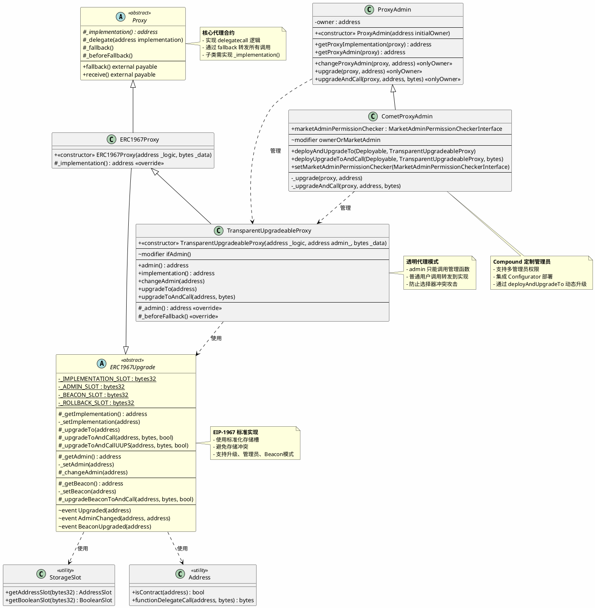
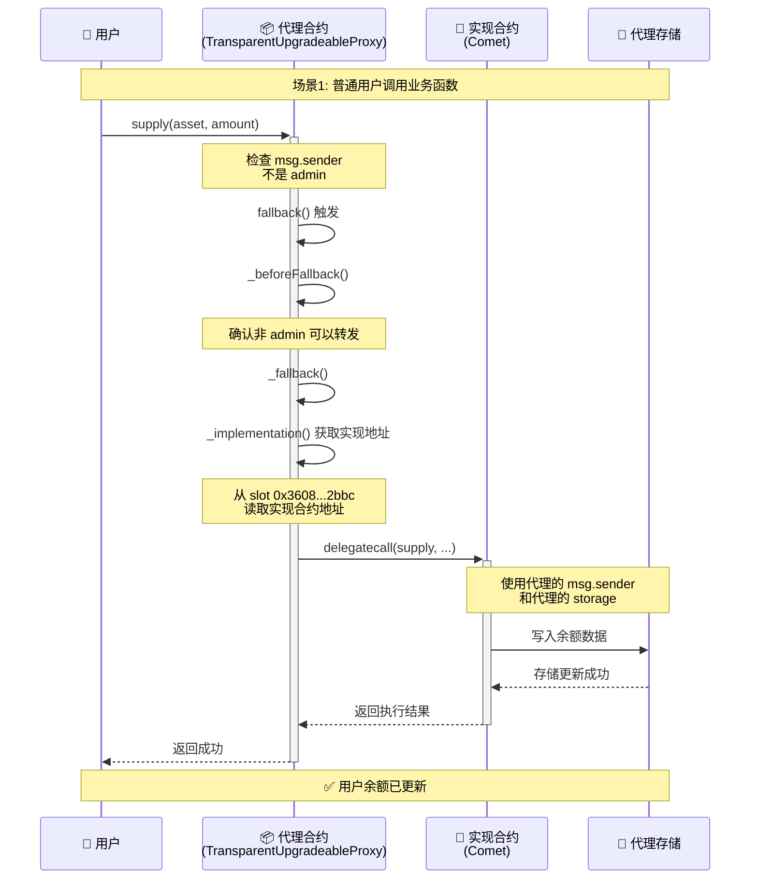
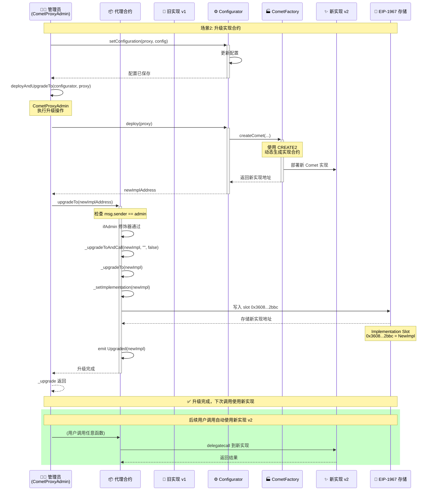
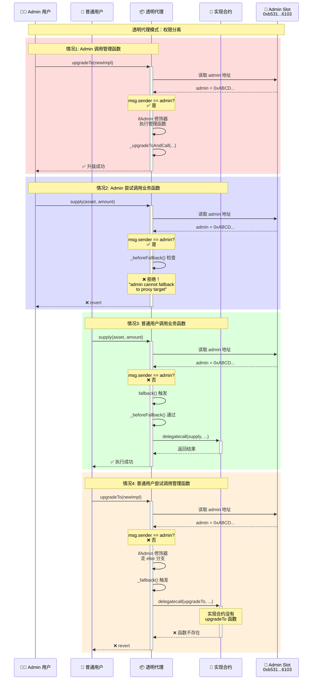
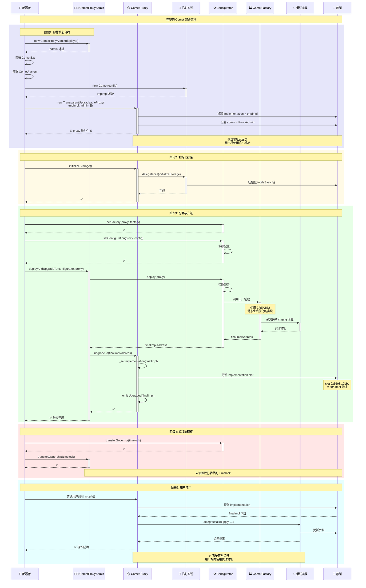

# 可升级代理合约深度分析

> 基于 Compound V3 的透明代理模式实现分析

## 目录

- [一、可升级合约原理](#一可升级合约原理)
  - [1.1 核心概念](#11-核心概念)
  - [1.2 delegatecall 原理](#12-delegatecall-原理)
  - [1.3 存储槽设计 (EIP-1967)](#13-存储槽设计-eip-1967)
  - [1.4 透明代理模式](#14-透明代理模式)
  - [1.5 存储布局示意图](#15-存储布局示意图)
- [二、源码分析](#二源码分析)
  - [2.1 类图 (PlantUML)](#21-类图-plantuml)
  - [2.2 核心流程时序图 (Mermaid)](#22-核心流程时序图-mermaid)
- [三、关键代码片段分析](#三关键代码片段分析)
  - [3.1 delegatecall 核心实现](#31-delegatecall-核心实现)
  - [3.2 透明代理的权限控制](#32-透明代理的权限控制)
  - [3.3 EIP-1967 存储槽](#33-eip-1967-存储槽)
- [四、安全特性总结](#四安全特性总结)
- [五、总结](#五总结)

---

## 一、可升级合约原理

### 1.1 核心概念

可升级合约基于 **代理模式（Proxy Pattern）** 和 **delegatecall** 机制实现，允许在保持合约地址不变的情况下升级合约逻辑。

**基本架构：**

```
┌─────────────┐
│   用户调用   │
└──────┬──────┘
       │
       ▼
┌─────────────────────────┐
│   代理合约 (Proxy)      │  ← 用户交互的固定地址
│  - 存储所有状态数据     │
│  - 转发所有调用         │
└──────────┬──────────────┘
           │ delegatecall
           ▼
┌─────────────────────────┐
│  实现合约 (Implementation)│ ← 可升级的逻辑合约
│  - 包含所有业务逻辑     │
│  - 可以被替换升级       │
└─────────────────────────┘
```

### 1.2 delegatecall 原理

`delegatecall` 是可升级合约的核心机制，它允许在一个合约的上下文中执行另一个合约的代码。

**delegatecall 的关键特性：**

```solidity
// 普通 call vs delegatecall

// call: 在目标合约的上下文中执行
target.call{value: msg.value}(data);
// - 使用目标合约的 storage
// - msg.sender 变为调用合约
// - 修改目标合约的状态

// delegatecall: 在当前合约的上下文中执行
target.delegatecall(data);
// - 使用当前合约的 storage
// - msg.sender 保持不变
// - 修改当前合约的状态
```

**执行流程：**

```
用户 (0xUser)
    │ call: supply(100)
    ▼
代理合约 (0xProxy)
    │ msg.sender = 0xUser
    │ delegatecall: supply(100)
    ▼
实现合约 (0xImpl)
    │ msg.sender 仍然是 0xUser
    │ 使用 0xProxy 的 storage
    ▼
代理合约的存储被修改
    │
    ▼
返回给用户
```

### 1.3 存储槽设计 (EIP-1967)

为了避免代理合约和实现合约之间的存储冲突，EIP-1967 定义了特殊的存储槽位置。

**标准存储槽：**

```solidity
// 实现合约地址存储槽
bytes32 internal constant _IMPLEMENTATION_SLOT = 
    0x360894a13ba1a3210667c828492db98dca3e2076cc3735a920a3ca505d382bbc;
// = keccak256("eip1967.proxy.implementation") - 1

// 管理员地址存储槽  
bytes32 internal constant _ADMIN_SLOT = 
    0xb53127684a568b3173ae13b9f8a6016e243e63b6e8ee1178d6a717850b5d6103;
// = keccak256("eip1967.proxy.admin") - 1

// Beacon 地址存储槽
bytes32 internal constant _BEACON_SLOT = 
    0xa3f0ad74e5423aebfd80d3ef4346578335a9a72aeaee59ff6cb3582b35133d50;
// = keccak256("eip1967.proxy.beacon") - 1
```

**为什么使用这些特殊槽位？**

1. **避免冲突**：这些槽位位于极高的位置，不会与正常的合约变量冲突
2. **标准化**：遵循 EIP-1967 标准，所有工具都能识别
3. **安全性**：减去 1 确保不会意外匹配到 `keccak256` 的输出

### 1.4 透明代理模式

**问题：函数选择器冲突攻击**

如果代理合约和实现合约有相同的函数签名，可能导致：
- 用户误调用代理的管理函数
- 管理员无法升级合约

**解决方案：透明代理模式**

```solidity
modifier ifAdmin() {
    if (msg.sender == _getAdmin()) {
        _; // 执行管理函数，不转发
    } else {
        _fallback(); // 转发到实现合约
    }
}

function _beforeFallback() internal virtual override {
    require(
        msg.sender != _getAdmin(), 
        "admin cannot fallback to proxy target"
    );
    super._beforeFallback();
}
```

**权限分离规则：**

| 调用者类型 | 调用管理函数 | 调用业务函数 |
|-----------|-------------|-------------|
| **Admin** | ✅ 允许 | ❌ 拒绝（revert） |
| **普通用户** | ❌ 转发到实现（通常失败） | ✅ 转发到实现 |

### 1.5 存储布局示意图

```
代理合约的存储空间:

┌────────────────────────────────────────────┐
│  Slot 0: 业务数据（由实现合约定义）         │
│  Slot 1: 业务数据                          │
│  Slot 2: 业务数据                          │
│  ...                                       │
│  Slot N: 业务数据                          │
│                                            │
│  ─────────── 普通存储空间 ─────────────    │
│                                            │
├────────────────────────────────────────────┤
│                                            │
│  特殊槽位（不会冲突）:                      │
│                                            │
│  0x3608...2bbc: 实现合约地址               │
│  (implementation slot)                     │
│                                            │
│  0xb531...6103: 管理员地址                 │
│  (admin slot)                              │
│                                            │
│  0xa3f0...3d50: Beacon 地址                │
│  (beacon slot)                             │
│                                            │
│  ─────────── EIP-1967 槽位 ─────────────   │
└────────────────────────────────────────────┘
```

---

## 二、源码分析

### 2.1 类图 (PlantUML)



### 2.2 核心流程时序图 (Mermaid)

#### 2.2.1 用户调用流程



#### 2.2.2 管理员升级流程



#### 2.2.3 透明代理权限分离



#### 2.2.4 Comet 完整部署与升级流程



---

## 三、关键代码片段分析

### 3.1 delegatecall 核心实现

**文件位置：** `contracts/vendor/proxy/Proxy.sol`

```solidity
function _delegate(address implementation) internal virtual {
    assembly {
        // 步骤1: 复制调用数据
        // 将 msg.data 复制到内存位置 0
        calldatacopy(0, 0, calldatasize())

        // 步骤2: 执行 delegatecall
        // - gas(): 转发所有可用 gas
        // - implementation: 实现合约地址
        // - 0: 输入数据在内存的起始位置
        // - calldatasize(): 输入数据的大小
        // - 0, 0: 输出数据位置和大小（暂时未知）
        let result := delegatecall(gas(), implementation, 0, calldatasize(), 0, 0)

        // 步骤3: 复制返回数据
        returndatacopy(0, 0, returndatasize())

        // 步骤4: 根据结果返回或回滚
        switch result
        // delegatecall 失败返回 0
        case 0 {
            revert(0, returndatasize())
        }
        // 成功则返回数据
        default {
            return(0, returndatasize())
        }
    }
}
```

**关键点：**

1. **内存操作**：使用内联汇编完全控制内存
2. **Gas 转发**：`gas()` 转发所有剩余 gas
3. **上下文保持**：`delegatecall` 保持原始的 `msg.sender` 和 `msg.value`
4. **直接返回**：不返回到 Solidity 代码，直接返回给调用者

**为什么使用 delegatecall？**

| 特性 | call | delegatecall |
|------|------|-------------|
| 执行上下文 | 目标合约 | 当前合约 |
| msg.sender | 变为代理合约 | 保持原始调用者 |
| 存储位置 | 目标合约存储 | 当前合约存储 |
| 适用场景 | 外部调用 | 代理模式、库 |

### 3.2 透明代理的权限控制

**文件位置：** `contracts/vendor/proxy/transparent/TransparentUpgradeableProxy.sol`

#### 3.2.1 ifAdmin 修饰器

```solidity
modifier ifAdmin() {
    if (msg.sender == _getAdmin()) {
        _; // 执行被修饰的函数
    } else {
        _fallback(); // 转发到实现合约
    }
}
```

**应用示例：**

```solidity
// Admin 调用 upgradeTo 时执行升级逻辑
// 普通用户调用 upgradeTo 时转发到实现（通常会失败）
function upgradeTo(address newImplementation) external ifAdmin {
    _upgradeToAndCall(newImplementation, bytes(""), false);
}
```

#### 3.2.2 _beforeFallback 检查

```solidity
function _beforeFallback() internal virtual override {
    require(
        msg.sender != _getAdmin(), 
        "TransparentUpgradeableProxy: admin cannot fallback to proxy target"
    );
    super._beforeFallback();
}
```

**双重保护机制：**

```
Admin 调用业务函数 (supply)
    ↓
fallback() 触发
    ↓
_beforeFallback() 检查
    ↓
msg.sender == admin? ✅
    ↓
❌ revert("admin cannot fallback to proxy target")
```

**为什么需要双重保护？**

1. `ifAdmin` 修饰器：确保 admin 只能调用管理函数
2. `_beforeFallback` 检查：防止 admin 通过 fallback 访问实现合约

### 3.3 EIP-1967 存储槽

**文件位置：** `contracts/vendor/proxy/ERC1967/ERC1967Upgrade.sol`

#### 3.3.1 读取实现地址

```solidity
function _getImplementation() internal view returns (address) {
    return StorageSlot.getAddressSlot(_IMPLEMENTATION_SLOT).value;
}
```

#### 3.3.2 设置实现地址

```solidity
function _setImplementation(address newImplementation) private {
    // 安全检查：确保新实现是合约
    require(
        Address.isContract(newImplementation), 
        "ERC1967: new implementation is not a contract"
    );
    
    // 写入 EIP-1967 标准槽位
    StorageSlot.getAddressSlot(_IMPLEMENTATION_SLOT).value = newImplementation;
}
```

#### 3.3.3 升级流程

```solidity
function _upgradeTo(address newImplementation) internal {
    _setImplementation(newImplementation);
    emit Upgraded(newImplementation);
}

function _upgradeToAndCall(
    address newImplementation,
    bytes memory data,
    bool forceCall
) internal {
    _upgradeTo(newImplementation);
    
    // 可选：升级后立即调用初始化函数
    if (data.length > 0 || forceCall) {
        Address.functionDelegateCall(newImplementation, data);
    }
}
```

**StorageSlot 工具类：**

```solidity
library StorageSlot {
    struct AddressSlot {
        address value;
    }
    
    function getAddressSlot(bytes32 slot) internal pure returns (AddressSlot storage r) {
        assembly {
            r.slot := slot
        }
    }
}
```

**为什么使用 StorageSlot？**

1. **类型安全**：封装底层的汇编操作
2. **可读性**：更清晰的代码结构
3. **标准化**：符合 EIP-1967 规范

---

## 四、安全特性总结

### 4.1 安全机制对照表

| 安全特性 | 实现方式 | 防御的攻击类型 | 代码位置 |
|---------|---------|---------------|---------|
| **透明代理模式** | `ifAdmin` 修饰器 + `_beforeFallback` | 函数选择器冲突攻击 | TransparentUpgradeableProxy.sol |
| **EIP-1967 存储槽** | 使用特殊哈希值槽位 | 存储布局冲突 | ERC1967Upgrade.sol |
| **delegatecall 上下文** | 保持 msg.sender 和 storage | 权限绕过攻击 | Proxy.sol |
| **实现合约验证** | `isContract` 检查 | 升级到 EOA 地址 | ERC1967Upgrade.sol |
| **权限分离** | ProxyAdmin 独立管理 | 误操作风险 | ProxyAdmin.sol |
| **事件记录** | Upgraded/AdminChanged 事件 | 升级追踪和审计 | ERC1967Upgrade.sol |

### 4.2 常见攻击向量及防御

#### 4.2.1 选择器冲突攻击

**攻击场景：**
```solidity
// 攻击者构造恶意实现合约
contract MaliciousImpl {
    // 与代理的 upgradeTo 有相同的选择器
    function upgradeTo(address) external {
        // 恶意代码
    }
}
```

**防御措施：**
- ✅ 透明代理模式：admin 的调用永不转发
- ✅ `_beforeFallback` 二次检查

#### 4.2.2 存储冲突攻击

**攻击场景：**
```solidity
// 实现合约覆盖代理的实现地址
contract MaliciousImpl {
    address public implementation; // Slot 0
    // 覆盖了代理的重要数据
}
```

**防御措施：**
- ✅ EIP-1967 标准槽位（位于极高位置）
- ✅ 槽位计算：`keccak256("eip1967.proxy.implementation") - 1`

#### 4.2.3 初始化攻击

**攻击场景：**
```solidity
// 攻击者直接调用实现合约的初始化函数
implementation.initialize(attackerAddress);
```

**防御措施：**
- ✅ 使用 `initializer` 修饰器（OpenZeppelin）
- ✅ 构造函数中初始化关键变量
- ✅ 代理部署时立即初始化

### 4.3 最佳实践清单

#### ✅ 部署前检查

- [ ] 实现合约不使用 `selfdestruct`
- [ ] 实现合约不使用 `delegatecall` 到不受信任的地址
- [ ] 存储变量顺序与之前版本兼容（升级时）
- [ ] 新变量添加在末尾
- [ ] 不删除或重新排列现有变量
- [ ] 使用 `initializer` 而非 `constructor`

#### ✅ 升级前检查

- [ ] 测试网上完整测试
- [ ] 审计新实现合约
- [ ] 准备回滚方案
- [ ] 通知用户升级计划
- [ ] 检查存储兼容性
- [ ] 验证新实现的业务逻辑

#### ✅ 权限管理

- [ ] ProxyAdmin 使用多签钱包
- [ ] 或使用 Timelock 合约
- [ ] 设置紧急暂停机制
- [ ] 定期审查权限配置

---

## 五、总结

### 5.1 核心优势

✅ **地址不变**
- 用户始终使用同一个代理地址
- 无需更新前端或集成

✅ **逻辑可升级**
- 修复漏洞而不丢失状态
- 添加新功能
- 优化 gas 消耗

✅ **数据保留**
- 所有状态保存在代理合约
- 升级不影响用户余额和数据

✅ **安全性**
- 透明代理模式防止选择器冲突
- EIP-1967 标准避免存储冲突
- 多重权限检查

✅ **标准化**
- 遵循 EIP-1967 标准
- 兼容主流工具和区块链浏览器
- OpenZeppelin 实现经过广泛审计

### 5.2 在 Compound V3 中的应用

**Comet 代理架构：**

```
用户/DApp
    ↓
┌─────────────────────────────────┐
│ Comet Proxy                     │ ← 固定地址（0xc3d6...）
│ (TransparentUpgradeableProxy)   │
└────────┬────────────────────────┘
         │ delegatecall
         ↓
┌─────────────────────────────────┐
│ Comet Implementation            │ ← 可升级
│ (动态生成 by CometFactory)      │
└─────────────────────────────────┘
         ↓
         管理
         ↓
┌─────────────────────────────────┐
│ CometProxyAdmin                 │
└─────────────────────────────────┘
         ↓
         配置
         ↓
┌─────────────────────────────────┐
│ Configurator                    │
└─────────────────────────────────┘
```

**关键特性：**

1. **动态实现生成**
   - 通过 CometFactory 按需生成实现
   - 支持配置驱动的合约生成
   - 优化的字节码部署

2. **多管理员支持**
   - CometProxyAdmin 扩展了 ProxyAdmin
   - 支持 MarketAdminPermissionChecker
   - 灵活的权限管理

3. **配置与升级分离**
   - Configurator 管理配置
   - ProxyAdmin 管理升级
   - 清晰的职责划分

4. **治理集成**
   - 最终控制权在 Timelock
   - 支持提案和投票机制
   - 去中心化治理

### 5.3 相关资源

**EIP 标准：**
- [EIP-1967: Standard Proxy Storage Slots](https://eips.ethereum.org/EIPS/eip-1967)
- [EIP-1822: Universal Upgradeable Proxy Standard](https://eips.ethereum.org/EIPS/eip-1822)

**OpenZeppelin 文档：**
- [Proxy Upgrade Pattern](https://docs.openzeppelin.com/upgrades-plugins/1.x/proxies)
- [Transparent vs UUPS Proxies](https://docs.openzeppelin.com/contracts/4.x/api/proxy)

**Compound V3 文档：**
- [Compound V3 GitHub](https://github.com/compound-finance/comet)
- [Comet Technical Documentation](https://github.com/compound-finance/comet/tree/main/docs)

**安全审计：**
- [OpenZeppelin Audit](https://blog.openzeppelin.com/security-audits)
- [Compound V3 Audit Reports](https://github.com/compound-finance/comet/tree/main/audits)

---

## 附录

### A. 合约文件清单

| 文件路径 | 说明 |
|---------|------|
| `contracts/vendor/proxy/Proxy.sol` | 基础代理合约，实现 delegatecall |
| `contracts/vendor/proxy/ERC1967/ERC1967Proxy.sol` | EIP-1967 代理实现 |
| `contracts/vendor/proxy/ERC1967/ERC1967Upgrade.sol` | EIP-1967 升级逻辑 |
| `contracts/vendor/proxy/transparent/TransparentUpgradeableProxy.sol` | 透明代理实现 |
| `contracts/vendor/proxy/transparent/ProxyAdmin.sol` | 代理管理员 |
| `contracts/CometProxyAdmin.sol` | Compound 定制的代理管理员 |
| `contracts/vendor/utils/StorageSlot.sol` | 存储槽工具库 |
| `contracts/vendor/utils/Address.sol` | 地址工具库 |

### B. 关键常量

```solidity
// EIP-1967 标准存储槽
bytes32 constant IMPLEMENTATION_SLOT = 
    0x360894a13ba1a3210667c828492db98dca3e2076cc3735a920a3ca505d382bbc;

bytes32 constant ADMIN_SLOT = 
    0xb53127684a568b3173ae13b9f8a6016e243e63b6e8ee1178d6a717850b5d6103;

bytes32 constant BEACON_SLOT = 
    0xa3f0ad74e5423aebfd80d3ef4346578335a9a72aeaee59ff6cb3582b35133d50;
```

### C. 事件列表

```solidity
// 升级事件
event Upgraded(address indexed implementation);

// 管理员变更事件
event AdminChanged(address previousAdmin, address newAdmin);

// Beacon 升级事件
event BeaconUpgraded(address indexed beacon);
```

---

**文档版本：** v1.0  
**最后更新：** 2026-01-16  
**作者：** Compound V3 分析团队  
**许可：** MIT License
