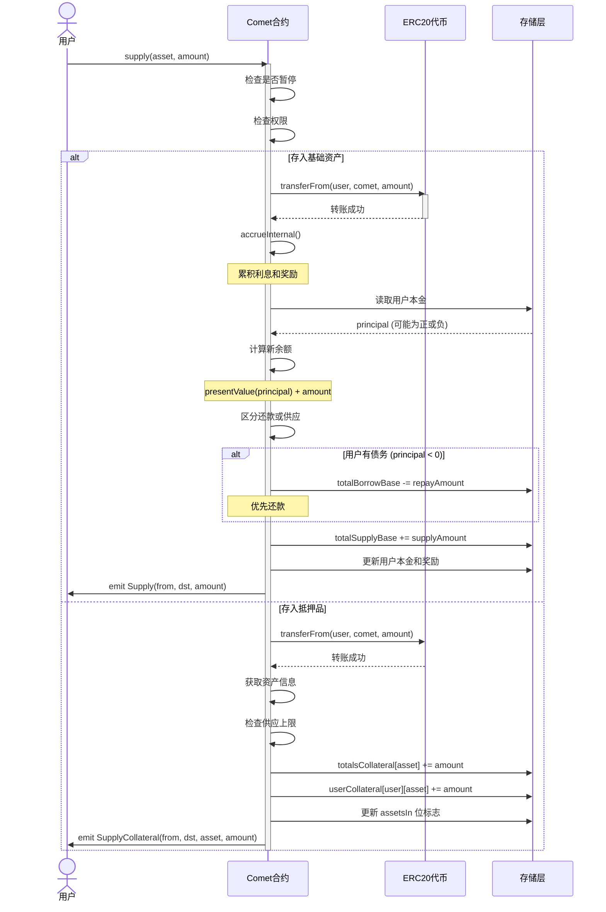
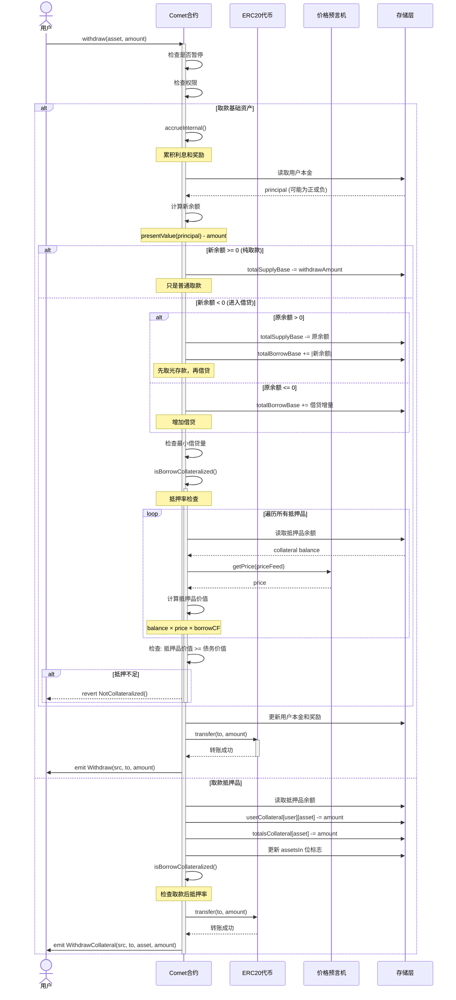
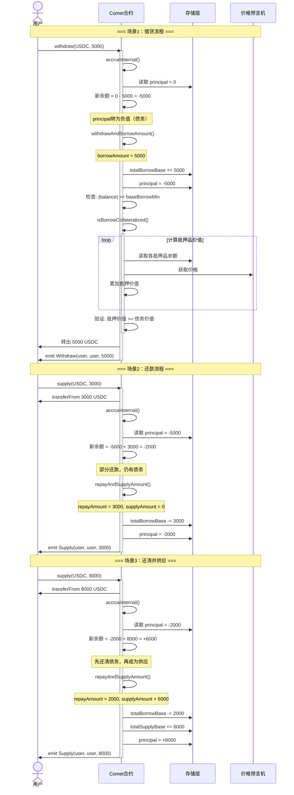
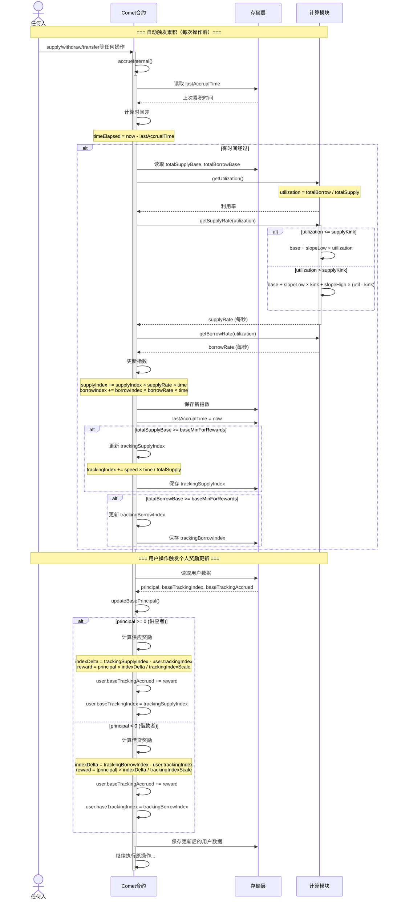

# Compound Comet 核心流程深度分析

## 目录
1. [用户存款与取款流程](#一用户存款与取款流程)
2. [用户贷款与还款流程](#二用户贷款与还款流程)
3. [计息计算机制](#三计息计算机制)
4. [清算流程](#四清算流程)

---

## 一、用户存款与取款流程

### 1.1 存款流程详解

#### 核心概念
Comet 协议中的"存款"分为两种类型：
- **基础资产存款**：存入基础借贷资产（如 USDC），获得利息收益
- **抵押品存款**：存入抵押品资产（如 ETH、WBTC），不获得利息，但可用于借贷

#### 存款核心代码

**入口函数** (`Comet.sol:835-876`):
```solidity
function supply(address asset, uint amount) override external {
    return supplyInternal(msg.sender, msg.sender, msg.sender, asset, amount);
}

function supplyInternal(address operator, address from, address dst, address asset, uint amount) 
    internal nonReentrant {
    if (isSupplyPaused()) revert Paused();
    if (!hasPermission(from, operator)) revert Unauthorized();

    if (asset == baseToken) {
        // 存入基础资产
        if (amount == type(uint256).max) {
            amount = borrowBalanceOf(dst);  // 还清全部债务
        }
        return supplyBase(from, dst, amount);
    } else {
        // 存入抵押品
        return supplyCollateral(from, dst, asset, safe128(amount));
    }
}
```

**基础资产存款** (`Comet.sol:881-903`):
```solidity
function supplyBase(address from, address dst, uint256 amount) internal {
    // 1. 转入代币（处理手续费代币）
    amount = doTransferIn(baseToken, from, amount);

    // 2. 累积利息和奖励
    accrueInternal();

    // 3. 读取用户数据
    UserBasic memory dstUser = userBasic[dst];
    int104 dstPrincipal = dstUser.principal;
    
    // 4. 计算新的余额和本金
    int256 dstBalance = presentValue(dstPrincipal) + signed256(amount);
    int104 dstPrincipalNew = principalValue(dstBalance);

    // 5. 区分还款和供应
    (uint104 repayAmount, uint104 supplyAmount) = repayAndSupplyAmount(dstPrincipal, dstPrincipalNew);

    // 6. 更新全局状态
    totalSupplyBase += supplyAmount;
    totalBorrowBase -= repayAmount;

    // 7. 更新用户状态和奖励
    updateBasePrincipal(dst, dstUser, dstPrincipalNew);

    // 8. 发出事件
    emit Supply(from, dst, amount);
}
```

**抵押品存款** (`Comet.sol:908-928`):
```solidity
function supplyCollateral(address from, address dst, address asset, uint128 amount) internal {
    // 1. 转入代币
    amount = safe128(doTransferIn(asset, from, amount));

    // 2. 获取资产信息
    AssetInfo memory assetInfo = getAssetInfoByAddress(asset);
    
    // 3. 读取用户抵押品余额
    TotalsCollateral memory totals = totalsCollateral[asset];
    uint128 totalSupplyAsset = totals.totalSupplyAsset;
    uint128 currBalance = userCollateral[dst][asset].balance;
    uint128 newBalance = currBalance + amount;

    // 4. 检查供应上限
    if (totalSupplyAsset + amount > assetInfo.supplyCap) revert SupplyCapExceeded();

    // 5. 更新状态
    totalsCollateral[asset].totalSupplyAsset = totalSupplyAsset + amount;
    userCollateral[dst][asset].balance = newBalance;

    // 6. 更新用户持有的资产标志位
    updateAssetsIn(dst, assetInfo, currBalance, newBalance);

    emit SupplyCollateral(from, dst, asset, amount);
}
```

#### 存款时序图



### 1.2 取款流程详解

#### 核心概念
- **取款**：提取存入的基础资产或抵押品
- **借贷**：当取款超过供应量时，自动进入借贷模式
- **抵押检查**：取款和借贷都需要检查抵押率

#### 取款核心代码

**入口函数** (`Comet.sol:1057-1098`):
```solidity
function withdraw(address asset, uint amount) override external {
    return withdrawInternal(msg.sender, msg.sender, msg.sender, asset, amount);
}

function withdrawInternal(address operator, address src, address to, address asset, uint amount) 
    internal nonReentrant {
    if (isWithdrawPaused()) revert Paused();
    if (!hasPermission(src, operator)) revert Unauthorized();

    if (asset == baseToken) {
        if (amount == type(uint256).max) {
            amount = balanceOf(src);  // 提取全部余额
        }
        return withdrawBase(src, to, amount);
    } else {
        return withdrawCollateral(src, to, asset, safe128(amount));
    }
}
```

**基础资产取款/借贷** (`Comet.sol:1103-1130`):
```solidity
function withdrawBase(address src, address to, uint256 amount) internal {
    accrueInternal();  // 先累积利息

    // 1. 读取用户数据
    UserBasic memory srcUser = userBasic[src];
    int104 srcPrincipal = srcUser.principal;
    
    // 2. 计算新余额（减去取款量）
    int256 srcBalance = presentValue(srcPrincipal) - signed256(amount);
    int104 srcPrincipalNew = principalValue(srcBalance);

    // 3. 区分取款和借贷
    (uint104 withdrawAmount, uint104 borrowAmount) = withdrawAndBorrowAmount(srcPrincipal, srcPrincipalNew);

    // 4. 更新全局状态
    totalSupplyBase -= withdrawAmount;
    totalBorrowBase += borrowAmount;

    // 5. 更新用户状态
    updateBasePrincipal(src, srcUser, srcPrincipalNew);

    // 6. 借贷检查
    if (srcBalance < 0) {
        // 检查最小借贷量
        if (uint256(-srcBalance) < baseBorrowMin) revert BorrowTooSmall();
        // 检查抵押率
        if (!isBorrowCollateralized(src)) revert NotCollateralized();
    }

    // 7. 转出代币
    doTransferOut(baseToken, to, amount);

    emit Withdraw(src, to, amount);
}
```

**抵押率检查** (`Comet.sol:524-559`):
```solidity
function isBorrowCollateralized(address account) override public view returns (bool) {
    int104 principal = userBasic[account].principal;
    
    // 如果没有借贷，总是通过
    if (principal >= 0) {
        return true;
    }

    uint16 assetsIn = userBasic[account].assetsIn;
    
    // 计算债务价值（负值）
    int liquidity = signedMulPrice(
        presentValue(principal),
        getPrice(baseTokenPriceFeed),
        uint64(baseScale)
    );

    // 遍历所有抵押品
    for (uint8 i = 0; i < numAssets; ) {
        if (isInAsset(assetsIn, i)) {
            if (liquidity >= 0) {
                return true;  // 已经足够抵押
            }

            AssetInfo memory asset = getAssetInfo(i);
            
            // 计算抵押品价值
            uint newAmount = mulPrice(
                userCollateral[account][asset.asset].balance,
                getPrice(asset.priceFeed),
                asset.scale
            );
            
            // 应用借贷抵押因子
            liquidity += signed256(mulFactor(
                newAmount,
                asset.borrowCollateralFactor
            ));
        }
        unchecked { i++; }
    }

    return liquidity >= 0;
}
```

**区分取款和借贷** (`Comet.sol:622-633`):
```solidity
function withdrawAndBorrowAmount(int104 oldPrincipal, int104 newPrincipal) 
    internal pure returns (uint104, uint104) {
    // 如果新本金更大，说明没有取款或借贷
    if (newPrincipal > oldPrincipal) return (0, 0);

    if (newPrincipal >= 0) {
        // 只是取款（从正到正）
        return (uint104(oldPrincipal - newPrincipal), 0);
    } else if (oldPrincipal <= 0) {
        // 只是借贷（从负到负）
        return (0, uint104(oldPrincipal - newPrincipal));
    } else {
        // 先取款再借贷（从正到负）
        return (uint104(oldPrincipal), uint104(-newPrincipal));
    }
}
```

#### 取款/借贷时序图



---

## 二、用户贷款与还款流程

### 2.1 贷款机制

#### 核心概念
Comet 的贷款**不是独立的操作**，而是通过**取款超过供应量**自动触发：
- 用户 principal > 0：有供应余额
- 用户 principal = 0：既无供应也无借贷
- 用户 principal < 0：有借贷（负的 principal 表示债务）

#### 贷款示例场景

```
场景1：用户首次借贷
- 初始状态：principal = 0，抵押品 = 10 ETH
- 操作：withdraw(USDC, 5000)
- 结果：principal = -5000（转为债务），取得 5000 USDC

场景2：用户已有存款后借贷
- 初始状态：principal = +3000 USDC，抵押品 = 10 ETH
- 操作：withdraw(USDC, 8000)
- 结果：
  - 先取出 3000 供应
  - 再借入 5000
  - 最终 principal = -5000

场景3：借贷限制
- 最小借贷量：baseBorrowMin (如 100 USDC)
- 不能借太小的金额，避免灰尘攻击
```

#### 借贷能力计算

**公式**：
```
借贷能力 = Σ (抵押品价值 × borrowCollateralFactor)

其中：
- 抵押品价值 = 抵押品余额 × 价格
- borrowCollateralFactor: 通常 0.70 ~ 0.85 (70% ~ 85%)
```

**代码实现** (见上文 `isBorrowCollateralized`)

### 2.2 还款机制

#### 核心概念
还款也**不是独立的操作**，而是通过**存入基础资产**自动还款：
- 如果用户有债务（principal < 0），存入会优先偿还债务
- 债务还清后，剩余部分成为供应

#### 还款示例场景

```
场景1：部分还款
- 初始状态：principal = -5000 USDC（债务）
- 操作：supply(USDC, 2000)
- 结果：principal = -3000 USDC（还剩 3000 债务）

场景2：完全还款
- 初始状态：principal = -5000 USDC
- 操作：supply(USDC, 5000)
- 结果：principal = 0（债务还清）

场景3：还款并转为供应
- 初始状态：principal = -3000 USDC
- 操作：supply(USDC, 8000)
- 结果：
  - 先还 3000 债务
  - 剩余 5000 成为供应
  - 最终 principal = +5000

场景4：一键还清
- 操作：supply(baseToken, type(uint256).max)
- 会自动计算债务并还清全部
```

#### 还款区分逻辑

**代码** (`Comet.sol:606-617`):
```solidity
function repayAndSupplyAmount(int104 oldPrincipal, int104 newPrincipal) 
    internal pure returns (uint104, uint104) {
    // 如果新本金更小，说明没有还款或供应
    if (newPrincipal < oldPrincipal) return (0, 0);

    if (newPrincipal <= 0) {
        // 只是还款（从负到负，或到0）
        return (uint104(newPrincipal - oldPrincipal), 0);
    } else if (oldPrincipal >= 0) {
        // 只是供应（从正到正）
        return (0, uint104(newPrincipal - oldPrincipal));
    } else {
        // 先还款再供应（从负到正）
        return (uint104(-oldPrincipal), uint104(newPrincipal));
    }
}
```

#### 贷款/还款时序图



---

## 三、计息计算机制

### 3.1 利率模型

Comet 使用**双斜率（Kink）利率模型**：

#### 利率公式

**供应利率**：
```
if utilization <= supplyKink:
    supplyRate = supplyRateBase + supplyRateSlopeLow × utilization
else:
    supplyRate = supplyRateBase 
                + supplyRateSlopeLow × supplyKink
                + supplyRateSlopeHigh × (utilization - supplyKink)
```

**借贷利率**：
```
if utilization <= borrowKink:
    borrowRate = borrowRateBase + borrowRateSlopeLow × utilization
else:
    borrowRate = borrowRateBase 
                + borrowRateSlopeLow × borrowKink
                + borrowRateSlopeHigh × (utilization - borrowKink)
```

**资金利用率**：
```
utilization = totalBorrow / totalSupply
```

#### 利率计算代码

**利用率** (`Comet.sol:478-486`):
```solidity
function getUtilization() override public view returns (uint) {
    uint totalSupply_ = presentValueSupply(baseSupplyIndex, totalSupplyBase);
    uint totalBorrow_ = presentValueBorrow(baseBorrowIndex, totalBorrowBase);
    if (totalSupply_ == 0) {
        return 0;
    } else {
        return totalBorrow_ * FACTOR_SCALE / totalSupply_;
    }
}
```

**供应利率** (`Comet.sol:449-457`):
```solidity
function getSupplyRate(uint utilization) override public view returns (uint64) {
    if (utilization <= supplyKink) {
        // 低于拐点
        return safe64(supplyPerSecondInterestRateBase + 
                     mulFactor(supplyPerSecondInterestRateSlopeLow, utilization));
    } else {
        // 高于拐点
        return safe64(supplyPerSecondInterestRateBase + 
                     mulFactor(supplyPerSecondInterestRateSlopeLow, supplyKink) + 
                     mulFactor(supplyPerSecondInterestRateSlopeHigh, (utilization - supplyKink)));
    }
}
```

**借贷利率** (`Comet.sol:464-472`):
```solidity
function getBorrowRate(uint utilization) override public view returns (uint64) {
    if (utilization <= borrowKink) {
        return safe64(borrowPerSecondInterestRateBase + 
                     mulFactor(borrowPerSecondInterestRateSlopeLow, utilization));
    } else {
        return safe64(borrowPerSecondInterestRateBase + 
                     mulFactor(borrowPerSecondInterestRateSlopeLow, borrowKink) + 
                     mulFactor(borrowPerSecondInterestRateSlopeHigh, (utilization - borrowKink)));
    }
}
```

### 3.2 利息累积机制

#### 指数累积原理

Comet 使用**指数累积**方式计算利息，而不是简单的线性累加：

**核心公式**：
```
新指数 = 旧指数 × (1 + 利率 × 时间间隔)

用户当前价值 = 用户本金 × 当前指数 / 基础指数
```

**优势**：
- 复利计算自动完成
- 不需要遍历所有用户
- Gas 成本固定，不随用户数增加

#### 利息累积代码

**指数计算** (`Comet.sol:403-414`):
```solidity
function accruedInterestIndices(uint timeElapsed) internal view returns (uint64, uint64) {
    uint64 baseSupplyIndex_ = baseSupplyIndex;
    uint64 baseBorrowIndex_ = baseBorrowIndex;
    
    if (timeElapsed > 0) {
        // 1. 获取当前利用率
        uint utilization = getUtilization();
        
        // 2. 计算供应和借贷利率
        uint supplyRate = getSupplyRate(utilization);
        uint borrowRate = getBorrowRate(utilization);
        
        // 3. 更新指数
        baseSupplyIndex_ += safe64(mulFactor(baseSupplyIndex_, supplyRate * timeElapsed));
        baseBorrowIndex_ += safe64(mulFactor(baseBorrowIndex_, borrowRate * timeElapsed));
    }
    
    return (baseSupplyIndex_, baseBorrowIndex_);
}
```

**全局累积** (`Comet.sol:419-432`):
```solidity
function accrueInternal() internal {
    uint40 now_ = getNowInternal();
    uint timeElapsed = uint256(now_ - lastAccrualTime);
    
    if (timeElapsed > 0) {
        // 1. 更新利息指数
        (baseSupplyIndex, baseBorrowIndex) = accruedInterestIndices(timeElapsed);
        
        // 2. 更新奖励追踪指数（如果达到最小要求）
        if (totalSupplyBase >= baseMinForRewards) {
            trackingSupplyIndex += safe64(divBaseWei(
                baseTrackingSupplySpeed * timeElapsed, 
                totalSupplyBase
            ));
        }
        if (totalBorrowBase >= baseMinForRewards) {
            trackingBorrowIndex += safe64(divBaseWei(
                baseTrackingBorrowSpeed * timeElapsed, 
                totalBorrowBase
            ));
        }
        
        // 3. 更新时间戳
        lastAccrualTime = now_;
    }
}
```

**用户奖励更新** (`Comet.sol:761-780`):
```solidity
function updateBasePrincipal(address account, UserBasic memory basic, int104 principalNew) internal {
    int104 principal = basic.principal;
    basic.principal = principalNew;

    // 计算奖励增量
    if (principal >= 0) {
        // 供应奖励
        uint indexDelta = uint256(trackingSupplyIndex - basic.baseTrackingIndex);
        basic.baseTrackingAccrued += safe64(
            uint104(principal) * indexDelta / trackingIndexScale / accrualDescaleFactor
        );
    } else {
        // 借贷奖励
        uint indexDelta = uint256(trackingBorrowIndex - basic.baseTrackingIndex);
        basic.baseTrackingAccrued += safe64(
            uint104(-principal) * indexDelta / trackingIndexScale / accrualDescaleFactor
        );
    }

    // 更新用户的追踪索引
    if (principalNew >= 0) {
        basic.baseTrackingIndex = trackingSupplyIndex;
    } else {
        basic.baseTrackingIndex = trackingBorrowIndex;
    }

    userBasic[account] = basic;
}
```

### 3.3 本金与当前价值转换

#### 转换原理

```
当前价值 = 本金 × 指数 / BASE_INDEX_SCALE

本金 = 当前价值 × BASE_INDEX_SCALE / 指数
```

**重要细节**：
- 供应：向下舍入（对协议有利）
- 借贷：向上舍入（对协议有利）

#### 转换代码

**本金 → 当前价值** (`CometCore.sol:79-99`):
```solidity
function presentValue(int104 principalValue_) internal view returns (int256) {
    if (principalValue_ >= 0) {
        // 供应余额
        return signed256(presentValueSupply(baseSupplyIndex, uint104(principalValue_)));
    } else {
        // 借贷余额
        return -signed256(presentValueBorrow(baseBorrowIndex, uint104(-principalValue_)));
    }
}

function presentValueSupply(uint64 baseSupplyIndex_, uint104 principalValue_) 
    internal pure returns (uint256) {
    return uint256(principalValue_) * baseSupplyIndex_ / BASE_INDEX_SCALE;
}

function presentValueBorrow(uint64 baseBorrowIndex_, uint104 principalValue_) 
    internal pure returns (uint256) {
    return uint256(principalValue_) * baseBorrowIndex_ / BASE_INDEX_SCALE;
}
```

**当前价值 → 本金** (`CometCore.sol:104-126`):
```solidity
function principalValue(int256 presentValue_) internal view returns (int104) {
    if (presentValue_ >= 0) {
        return signed104(principalValueSupply(baseSupplyIndex, uint256(presentValue_)));
    } else {
        return -signed104(principalValueBorrow(baseBorrowIndex, uint256(-presentValue_)));
    }
}

function principalValueSupply(uint64 baseSupplyIndex_, uint256 presentValue_) 
    internal pure returns (uint104) {
    // 向下舍入
    return safe104((presentValue_ * BASE_INDEX_SCALE) / baseSupplyIndex_);
}

function principalValueBorrow(uint64 baseBorrowIndex_, uint256 presentValue_) 
    internal pure returns (uint104) {
    // 向上舍入（+baseBorrowIndex_ - 1）
    return safe104((presentValue_ * BASE_INDEX_SCALE + baseBorrowIndex_ - 1) / baseBorrowIndex_);
}
```

### 3.4 计息示例计算

#### 示例参数
```
初始状态：
- baseSupplyIndex = 1e15 (BASE_INDEX_SCALE)
- baseBorrowIndex = 1e15
- supplyRate = 0.02 / year = 6.34e-10 / second (2% APY)
- borrowRate = 0.05 / year = 1.59e-9 / second (5% APY)
- 用户供应本金 = 1000 USDC
- 时间经过 = 30 天
```

#### 计算过程

**步骤1：计算新指数**
```
时间经过 = 30 × 24 × 3600 = 2,592,000 秒

新供应指数 = 旧指数 × (1 + 利率 × 时间)
          = 1e15 × (1 + 6.34e-10 × 2,592,000)
          = 1e15 × (1 + 0.001643)
          = 1e15 × 1.001643
          = 1.001643e15

实际计算（整数运算）：
增量 = 1e15 × 6.34e-10 × 2,592,000 / 1e18
    ≈ 1.643e12
新指数 = 1e15 + 1.643e12 = 1.001643e15
```

**步骤2：计算用户当前价值**
```
用户本金 = 1000e6 (1000 USDC, 6位小数)

当前价值 = principal × newIndex / BASE_INDEX_SCALE
        = 1000e6 × 1.001643e15 / 1e15
        = 1000e6 × 1.001643
        = 1001.643e6
        = 1001.643 USDC

赚取利息 = 1001.643 - 1000 = 1.643 USDC
```

#### 计息时序图



---

## 四、清算流程

### 4.1 清算触发条件

#### 清算判断

用户可被清算当且仅当：
```
抵押品价值 × liquidateCollateralFactor < 债务价值
```

其中：
- `borrowCollateralFactor < liquidateCollateralFactor`
- 通常：`borrowCF = 0.80`, `liquidateCF = 0.85`
- 这 5% 的差距是安全缓冲区

#### 清算检查代码

**清算判断** (`Comet.sol:566-601`):
```solidity
function isLiquidatable(address account) override public view returns (bool) {
    int104 principal = userBasic[account].principal;

    // 没有债务不能清算
    if (principal >= 0) {
        return false;
    }

    uint16 assetsIn = userBasic[account].assetsIn;
    
    // 计算债务价值（负数）
    int liquidity = signedMulPrice(
        presentValue(principal),
        getPrice(baseTokenPriceFeed),
        uint64(baseScale)
    );

    // 遍历所有抵押品
    for (uint8 i = 0; i < numAssets; ) {
        if (isInAsset(assetsIn, i)) {
            if (liquidity >= 0) {
                return false;  // 抵押充足
            }

            AssetInfo memory asset = getAssetInfo(i);
            uint newAmount = mulPrice(
                userCollateral[account][asset.asset].balance,
                getPrice(asset.priceFeed),
                asset.scale
            );
            
            // 使用 liquidateCollateralFactor（更高的阈值）
            liquidity += signed256(mulFactor(
                newAmount,
                asset.liquidateCollateralFactor
            ));
        }
        unchecked { i++; }
    }

    // liquidity < 0 表示抵押不足
    return liquidity < 0;
}
```

### 4.2 清算执行流程

#### Absorb 机制

Comet 使用**协议吸收**模式，而不是传统的清算人偿还模式：
1. 清算人调用 `absorb()`
2. 协议吸收账户的所有抵押品和债务
3. 抵押品进入协议储备
4. 清算人稍后可以折价购买这些抵押品

#### 清算核心代码

**清算入口** (`Comet.sol:1158-1178`):
```solidity
function absorb(address absorber, address[] calldata accounts) override external {
    if (isAbsorbPaused()) revert Paused();

    uint startGas = gasleft();
    
    // 先累积利息
    accrueInternal();
    
    // 批量清算多个账户
    for (uint i = 0; i < accounts.length; ) {
        absorbInternal(absorber, accounts[i]);
        unchecked { i++; }
    }
    
    uint gasUsed = startGas - gasleft();

    // 记录清算人积分（用于激励）
    LiquidatorPoints memory points = liquidatorPoints[absorber];
    points.numAbsorbs++;
    points.numAbsorbed += safe64(accounts.length);
    points.approxSpend += safe128(gasUsed * block.basefee);
    liquidatorPoints[absorber] = points;
}
```

**清算单个账户** (`Comet.sol:1183-1238`):
```solidity
function absorbInternal(address absorber, address account) internal {
    if (!isLiquidatable(account)) revert NotLiquidatable();

    UserBasic memory accountUser = userBasic[account];
    int104 oldPrincipal = accountUser.principal;
    int256 oldBalance = presentValue(oldPrincipal);
    uint16 assetsIn = accountUser.assetsIn;

    uint256 basePrice = getPrice(baseTokenPriceFeed);
    uint256 deltaValue = 0;

    // 1. 吸收所有抵押品
    for (uint8 i = 0; i < numAssets; ) {
        if (isInAsset(assetsIn, i)) {
            AssetInfo memory assetInfo = getAssetInfo(i);
            address asset = assetInfo.asset;
            
            // 清空用户抵押品
            uint128 seizeAmount = userCollateral[account][asset].balance;
            userCollateral[account][asset].balance = 0;
            totalsCollateral[asset].totalSupplyAsset -= seizeAmount;

            // 计算抵押品价值（应用清算因子）
            uint256 value = mulPrice(seizeAmount, getPrice(assetInfo.priceFeed), assetInfo.scale);
            deltaValue += mulFactor(value, assetInfo.liquidationFactor);

            emit AbsorbCollateral(absorber, account, asset, seizeAmount, value);
        }
        unchecked { i++; }
    }

    // 2. 将抵押品价值转换为基础资产数量
    uint256 deltaBalance = divPrice(deltaValue, basePrice, uint64(baseScale));
    int256 newBalance = oldBalance + signed256(deltaBalance);
    
    // 如果抵押品不足以覆盖债务，剩余由协议储备吸收
    if (newBalance < 0) {
        newBalance = 0;
    }

    // 3. 更新用户状态
    int104 newPrincipal = principalValue(newBalance);
    updateBasePrincipal(account, accountUser, newPrincipal);

    // 清空用户的资产标志
    userBasic[account].assetsIn = 0;

    // 4. 更新全局状态
    (uint104 repayAmount, uint104 supplyAmount) = repayAndSupplyAmount(oldPrincipal, newPrincipal);
    
    // 协议储备减少（因为用抵押品偿还了债务）
    totalSupplyBase += supplyAmount;
    totalBorrowBase -= repayAmount;

    emit AbsorbDebt(absorber, account, basePaidOut, deltaValue);
}
```

### 4.3 购买抵押品

#### 购买机制

清算后，抵押品进入协议储备，任何人可以折价购买：
- 购买价格 = 预言机价格 × `storeFrontPriceFactor`
- `storeFrontPriceFactor` 通常为 0.93 (7% 折扣)
- 只能用基础资产（USDC）购买
- 必须满足 `储备金 > targetReserves` 才能购买

#### 购买代码

**购买入口** (`Comet.sol:1260-1261`):
```solidity
function buyCollateral(address asset, uint minAmount, uint baseAmount, address recipient) 
    override external {
    if (isBuyPaused()) revert Paused();

    // 计算可购买的抵押品数量
    uint collateralAmount = quoteCollateral(asset, baseAmount);
    
    // 滑点保护
    if (collateralAmount < minAmount) {
        revert TooMuchSlippage();
    }
    
    // 检查抵押品储备
    if (collateralAmount > getCollateralReserves(asset)) {
        revert NotForSale();
    }

    // 转入基础资产
    doTransferIn(baseToken, msg.sender, baseAmount);

    // 转出抵押品
    doTransferOut(asset, recipient, collateralAmount);

    emit BuyCollateral(msg.sender, asset, baseAmount, collateralAmount);
}
```

**价格计算** (`Comet.sol:1240-1258`):
```solidity
function quoteCollateral(address asset, uint baseAmount) override public view returns (uint) {
    AssetInfo memory assetInfo = getAssetInfoByAddress(asset);
    
    // 获取价格
    uint256 assetPrice = getPrice(assetInfo.priceFeed);
    uint256 basePrice = getPrice(baseTokenPriceFeed);

    // 检查储备
    uint256 reserves = getReserves();
    if (reserves < 0 || uint(reserves) < targetReserves) {
        revert NotForSale();
    }

    // 计算抵押品数量（应用折扣）
    return divPrice(
        mulFactor(mulPrice(baseAmount, basePrice, uint64(baseScale)), storeFrontPriceFactor),
        assetPrice,
        assetInfo.scale
    );
}
```

### 4.4 清算示例场景

#### 场景参数
```
用户账户：
- 债务：10,000 USDC
- 抵押品：5 ETH @ $2,100 = $10,500

价格变动：
- ETH 价格跌至 $2,000
- 新抵押品价值 = 5 × $2,000 = $10,000

抵押率配置：
- borrowCollateralFactor = 0.80 (80%)
- liquidateCollateralFactor = 0.85 (85%)
- liquidationFactor = 0.95 (95%, 5%惩罚)
- storeFrontPriceFactor = 0.93 (7% 折扣)
```

#### 清算判断
```
借贷能力 = $10,000 × 0.80 = $8,000
清算阈值 = $10,000 × 0.85 = $8,500
当前债务 = $10,000

$8,500 < $10,000 → 可被清算 ✅
```

#### 清算执行
```
1. 吸收抵押品：
   - 没收 5 ETH
   - 抵押品价值 = $10,000
   - 应用清算因子：$10,000 × 0.95 = $9,500

2. 偿还债务：
   - 原债务：-10,000 USDC
   - 抵押品折算：+9,500 USDC
   - 剩余债务：-500 USDC
   - 由协议储备吸收

3. 协议影响：
   - 获得 5 ETH（价值 $10,000）
   - 吸收 $500 坏账
   - 净收益：$10,000 - $500 = $9,500
```

#### 购买抵押品
```
清算人购买：
- 支付：9,500 USDC（想买全部）
- 折扣价格：$2,000 × 0.93 = $1,860 / ETH
- 获得：9,500 / 1,860 ≈ 5.11 ETH（但只有 5 ETH）
- 实际：支付 5 × 1,860 = 9,300 USDC，获得 5 ETH

清算人利润：
- 市场价值：5 × $2,000 = $10,000
- 购买成本：$9,300
- 即时利润：$10,000 - $9,300 = $700
```

### 4.5 清算完整时序图

```mermaid
sequenceDiagram
    actor Liquidator as 清算人
    actor User as 被清算用户
    participant Contract as Comet合约
    participant PriceFeed as 价格预言机
    participant Storage as 存储层
    participant Token as 代币合约

    Note over Liquidator,Token: === 阶段1：监控和触发 ===
    
    Liquidator->>Contract: isLiquidatable(user)
    activate Contract
    
    Contract->>Storage: 读取 user.principal
    Storage-->>Contract: principal = -10,000 USDC (债务)
    
    Contract->>PriceFeed: getPrice(baseTokenPriceFeed)
    PriceFeed-->>Contract: USDC price = $1.00
    
    Contract->>Contract: 计算债务价值
    Note over Contract: debtValue = -10,000 × $1.00 = -$10,000
    
    Contract->>Storage: 读取 user.assetsIn
    Storage-->>Contract: assetsIn = 0b0001 (持有资产0)
    
    loop 遍历抵押品
        Contract->>Storage: 读取 userCollateral[user][ETH]
        Storage-->>Contract: balance = 5 ETH
        
        Contract->>PriceFeed: getPrice(ETH priceFeed)
        PriceFeed-->>Contract: ETH price = $2,000
        
        Contract->>Contract: 计算抵押品价值
        Note over Contract: collateralValue = 5 × $2,000 × 0.85<br/>= $8,500
    end
    
    Contract->>Contract: 判断: $8,500 < $10,000?
    Contract-->>Liquidator: true (可清算)
    deactivate Contract
    
    Note over Liquidator,Token: === 阶段2：执行清算 ===
    
    Liquidator->>Contract: absorb(liquidator, [user])
    activate Contract
    
    Contract->>Contract: 检查是否暂停
    Contract->>Contract: accrueInternal()
    Note over Contract: 更新利息指数
    
    Contract->>Contract: absorbInternal(liquidator, user)
    activate Contract
    
    Contract->>Contract: isLiquidatable(user)
    Note over Contract: 再次验证
    
    Contract->>Storage: 读取用户完整数据
    Storage-->>Contract: principal=-10,000, assetsIn, collaterals
    
    Contract->>PriceFeed: 获取所有资产价格
    PriceFeed-->>Contract: basePrice=$1, ETH=$2,000
    
    Note over Contract: === 吸收抵押品 ===
    
    loop 遍历用户的每个抵押品
        Contract->>Storage: seizeAmount = userCollateral[user][ETH]
        Storage-->>Contract: 5 ETH
        
        Contract->>Storage: userCollateral[user][ETH] = 0
        Note over Contract: 清空用户抵押品
        
        Contract->>Storage: totalsCollateral[ETH] -= 5
        Note over Contract: 转移到协议储备
        
        Contract->>Contract: 计算抵押品价值
        Note over Contract: value = 5 × $2,000 = $10,000<br/>deltaValue += $10,000 × 0.95 = $9,500
        
        Contract->>Liquidator: emit AbsorbCollateral(liquidator, user, ETH, 5, $10,000)
    end
    
    Note over Contract: === 偿还债务 ===
    
    Contract->>Contract: 转换为基础资产金额
    Note over Contract: deltaBalance = $9,500 / $1.00 = 9,500 USDC
    
    Contract->>Contract: 计算新余额
    Note over Contract: newBalance = -10,000 + 9,500 = -500<br/>负值由协议吸收，设为 0
    
    Contract->>Contract: 更新用户本金
    Note over Contract: newPrincipal = 0
    
    Contract->>Storage: userBasic[user].principal = 0
    Contract->>Storage: userBasic[user].assetsIn = 0
    Note over Contract: 清空所有状态
    
    Contract->>Storage: totalBorrowBase -= 10,000
    Contract->>Storage: totalSupplyBase += 0
    Note over Contract: 协议吸收了 $500 坏账
    
    Contract->>Liquidator: emit AbsorbDebt(liquidator, user, 10000, $9,500)
    deactivate Contract
    
    Contract->>Storage: 更新 liquidatorPoints[liquidator]
    Note over Contract: 记录清算积分
    
    deactivate Contract
    
    Note over Liquidator,Token: === 阶段3：购买抵押品 ===
    
    Liquidator->>Contract: quoteCollateral(ETH, 9,300 USDC)
    activate Contract
    
    Contract->>Contract: 检查储备金
    Note over Contract: reserves > targetReserves?
    
    Contract->>PriceFeed: 获取价格
    PriceFeed-->>Contract: ETH=$2,000, USDC=$1.00
    
    Contract->>Contract: 计算可买数量
    Note over Contract: amount = 9,300 × $1.00 × 0.93 / $2,000<br/>= 9,300 × 0.93 / 2,000<br/>≈ 4.32 ETH
    
    Contract-->>Liquidator: 4.32 ETH
    deactivate Contract
    
    Liquidator->>Contract: buyCollateral(ETH, 4.3, 9300, liquidator)
    activate Contract
    
    Contract->>Contract: 再次计算并验证
    Contract->>Contract: 检查滑点: 4.32 >= 4.3? ✅
    Contract->>Contract: 检查储备: 4.32 <= 5? ✅
    
    Contract->>Token: transferFrom(liquidator, comet, 9300 USDC)
    activate Token
    Token-->>Contract: 转账成功
    deactivate Token
    
    Contract->>Token: transfer(liquidator, 4.32 ETH)
    activate Token
    Token-->>Contract: 转账成功
    deactivate Token
    
    Contract->>Liquidator: emit BuyCollateral(liquidator, ETH, 9300, 4.32)
    deactivate Contract
    
    Note over Liquidator: 清算人利润分析：<br/>购买成本：$9,300<br/>市场价值：4.32 × $2,000 = $8,640<br/>实际利润：$8,640 - $9,300 = -$660<br/>（此例中由于折扣不够，清算人可能亏损）
```



---

## 五、总结与关键点

### 5.1 核心流程关键点

#### 存款/取款
- ✅ 使用 **principal（本金）** 存储，通过指数计算当前价值
- ✅ 自动区分**供应/还款**和**取款/借贷**
- ✅ 支持 `uint256.max` 一键还清或取光
- ✅ 每次操作前自动累积利息

#### 贷款/还款
- ✅ **没有独立的借贷函数**，通过取款超额自动触发
- ✅ principal 正负表示供应/借贷状态
- ✅ 借贷需要检查抵押率和最小借贷量
- ✅ 还款优先偿还债务，剩余转为供应

#### 计息
- ✅ 使用**指数累积**而非线性累加
- ✅ **双斜率 Kink 模型**，鼓励适度利用率
- ✅ 供应和借贷使用不同指数
- ✅ 每次操作自动触发全局累积

#### 清算
- ✅ 使用**协议吸收**模式，而非清算人直接偿还
- ✅ **批量清算**支持，提高效率
- ✅ 清算后抵押品可折价购买
- ✅ 不足部分由协议储备吸收

### 5.2 Gas 优化技巧

1. **紧凑存储**：UserBasic 只占 1 个 slot
2. **位标志**：assetsIn 用 16 位表示持有的资产
3. **Immutable 配置**：所有参数编译时内嵌
4. **批量操作**：absorb 支持批量清算
5. **惰性累积**：只在需要时才累积利息

### 5.3 安全机制

1. **重入保护**：所有关键函数都有 `nonReentrant`
2. **暂停机制**：5 种操作可以独立暂停
3. **权限检查**：`hasPermission` 验证操作权限
4. **价格验证**：预言机价格必须 > 0
5. **溢出检查**：自定义 safe 函数防止溢出

### 5.4 数学精度

- `BASE_INDEX_SCALE = 1e15`：指数精度
- `FACTOR_SCALE = 1e18`：因子精度（100%）
- `PRICE_SCALE = 1e8`：价格精度
- `BASE_ACCRUAL_SCALE = 1e6`：奖励精度

---

## 六、实际应用建议

### 6.1 用户操作建议

**存款**：
```solidity
// 存入基础资产赚取利息
comet.supply(USDC, 10000e6);

// 存入抵押品用于借贷
comet.supply(WETH, 5 ether);
```

**借贷**：
```solidity
// 通过取款触发借贷
comet.withdraw(USDC, 8000e6);  // 超过供应量即借贷
```

**还款**：
```solidity
// 存入基础资产自动还款
comet.supply(USDC, 3000e6);  // 优先还债

// 一键还清
comet.supply(USDC, type(uint256).max);
```

### 6.2 清算机器人建议

**监控逻辑**：
```javascript
// 定期检查所有借款人
for (const borrower of borrowers) {
    const isLiquidatable = await comet.isLiquidatable(borrower);
    if (isLiquidatable) {
        // 计算清算利润
        const profit = await estimateProfit(borrower);
        if (profit > gasСost) {
            await comet.absorb(liquidator, [borrower]);
        }
    }
}
```

**购买策略**：
```javascript
// 等待最佳折扣
const reserves = await comet.getCollateralReserves(ETH);
if (reserves > threshold) {
    const amount = await comet.quoteCollateral(ETH, maxUSDC);
    await comet.buyCollateral(ETH, minAmount, maxUSDC, recipient);
}
```

---

**文档版本**：v1.0  
**最后更新**：2026年1月8日  
**协议版本**：Comet V3 (Solidity 0.8.15)
