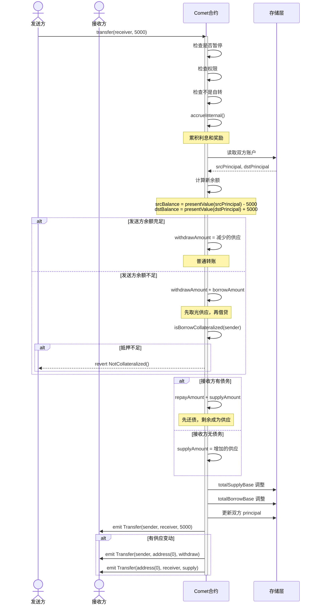
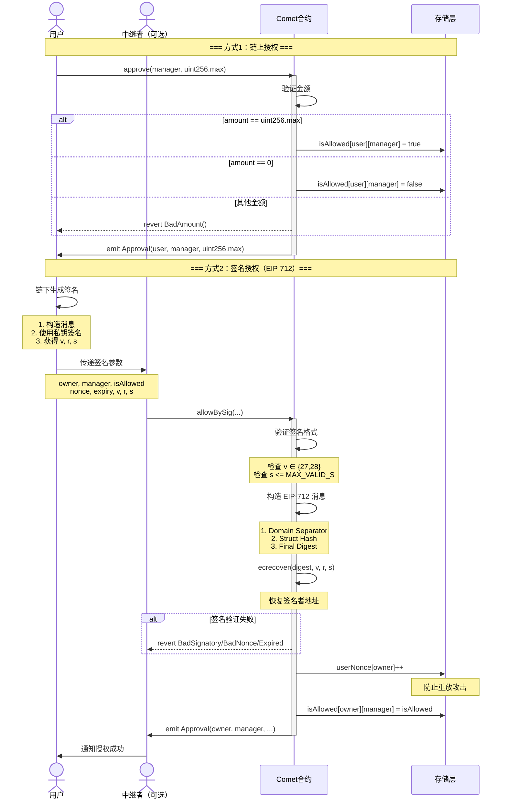
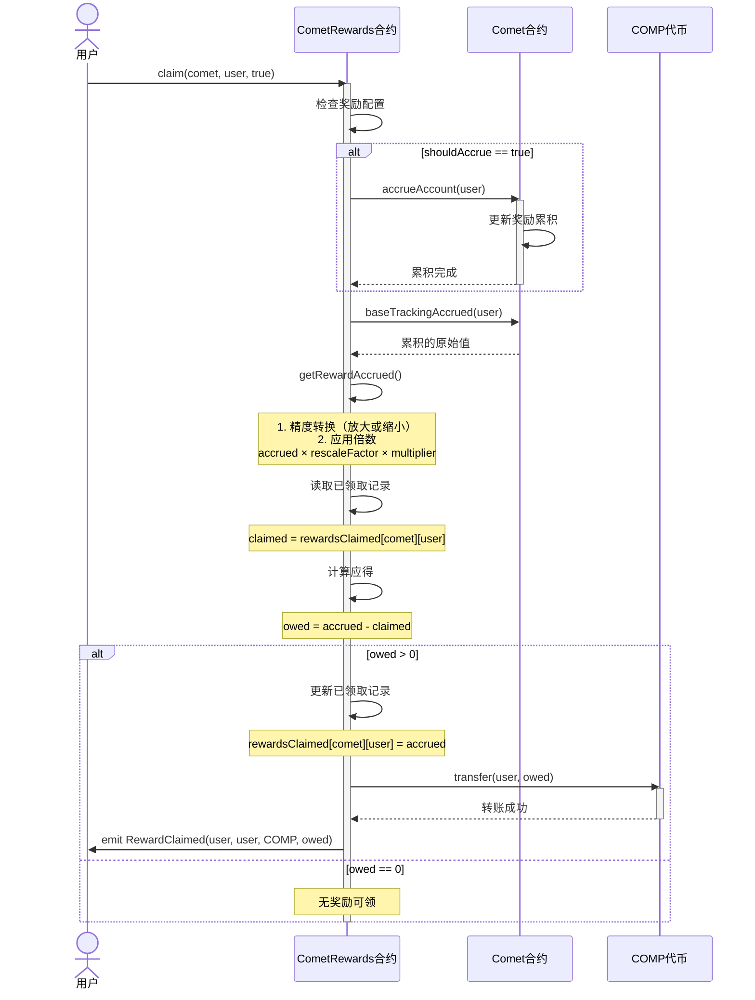
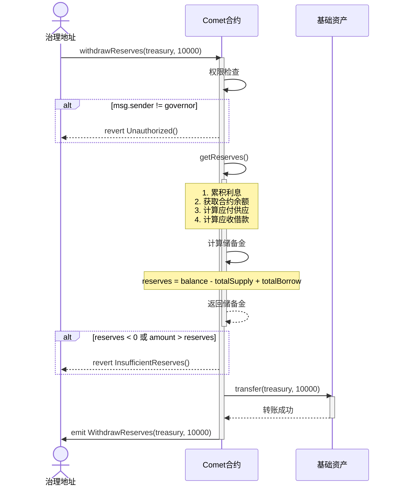
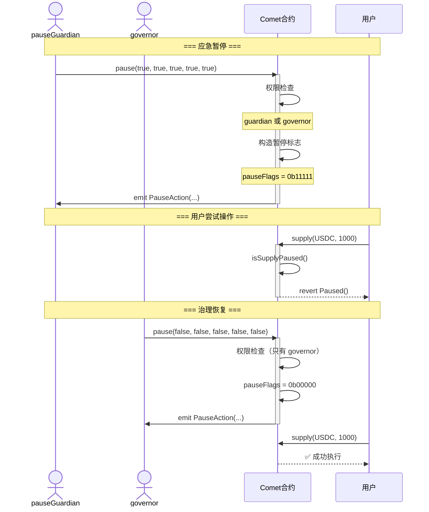
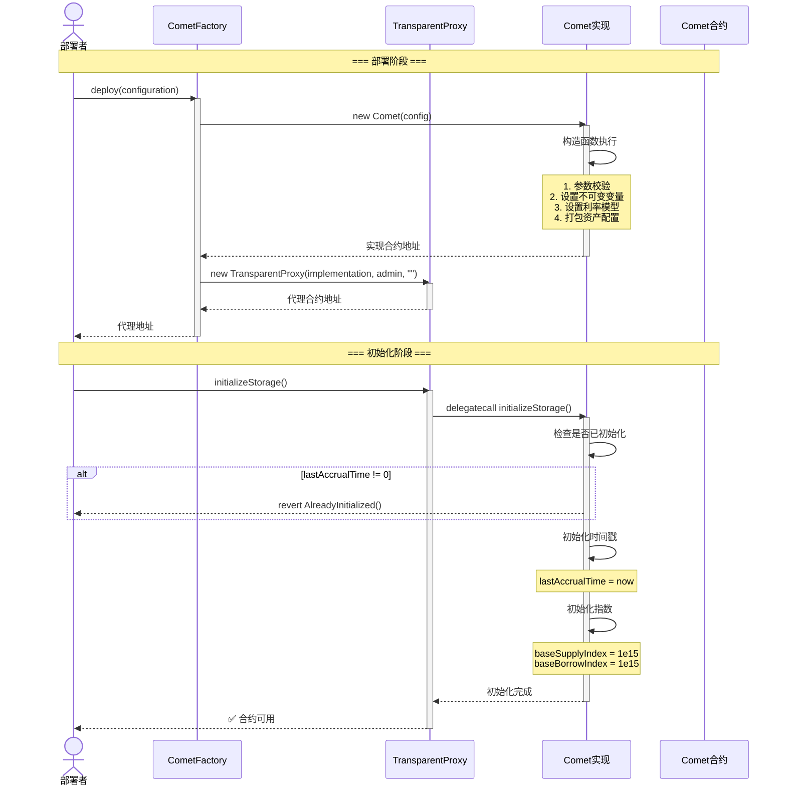
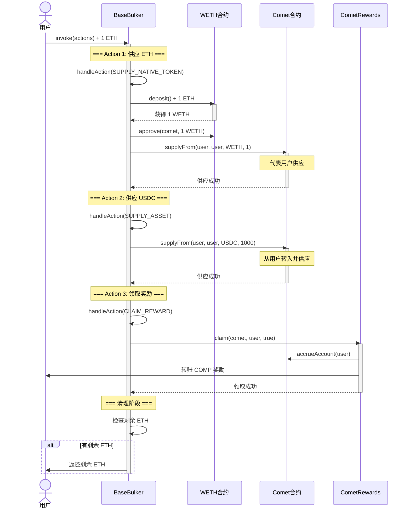

# Compound Comet 补充核心流程分析

## 目录
1. [转账流程](#一转账流程)
2. [授权机制](#二授权机制)
3. [奖励领取流程](#三奖励领取流程)
4. [储备金提取流程](#四储备金提取流程)
5. [暂停与恢复机制](#五暂停与恢复机制)
6. [初始化流程](#六初始化流程)
7. [批量操作（Bulker）](#七批量操作bulker)

---

## 一、转账流程

### 1.1 核心概念

Comet 实现了 **ERC20 兼容的转账功能**，但有独特的特性：
- 转账基础资产时，可能触发借贷
- 转账抵押品时，需要检查抵押率
- 支持 `uint256.max` 一键转移全部余额

**关键特性**：
- 发送方余额不足时，自动进入借贷模式
- 接收方有债务时，转账自动还款
- 不允许自己转给自己

### 1.2 转账核心代码

#### ERC20 标准转账

**入口函数** (`Comet.sol:933-948`):
```solidity
// ERC20 标准转账（只能转基础资产）
function transfer(address dst, uint amount) override external returns (bool) {
    transferInternal(msg.sender, msg.sender, dst, baseToken, amount);
    return true;
}

// ERC20 标准授权转账
function transferFrom(address src, address dst, uint amount) override external returns (bool) {
    transferInternal(msg.sender, src, dst, baseToken, amount);
    return true;
}
```

#### 通用转账接口

**转账任意资产** (`Comet.sol:956-988`):
```solidity
// 转账任意资产（基础资产或抵押品）
function transferAsset(address dst, address asset, uint amount) override external {
    return transferInternal(msg.sender, msg.sender, dst, asset, amount);
}

// 代理转账
function transferAssetFrom(address src, address dst, address asset, uint amount) override external {
    return transferInternal(msg.sender, src, dst, asset, amount);
}

// 内部转账逻辑
function transferInternal(address operator, address src, address dst, address asset, uint amount) 
    internal nonReentrant {
    // 1. 检查暂停状态
    if (isTransferPaused()) revert Paused();
    
    // 2. 检查权限
    if (!hasPermission(src, operator)) revert Unauthorized();
    
    // 3. 不允许自转
    if (src == dst) revert NoSelfTransfer();

    // 4. 根据资产类型分发
    if (asset == baseToken) {
        if (amount == type(uint256).max) {
            amount = balanceOf(src);  // 转移全部余额
        }
        return transferBase(src, dst, amount);
    } else {
        return transferCollateral(src, dst, asset, safe128(amount));
    }
}
```

#### 基础资产转账（可能触发借贷）

**核心逻辑** (`Comet.sol:993-1028`):
```solidity
function transferBase(address src, address dst, uint256 amount) internal {
    // 1. 累积利息
    accrueInternal();

    // 2. 读取双方账户数据
    UserBasic memory srcUser = userBasic[src];
    UserBasic memory dstUser = userBasic[dst];
    
    int104 srcPrincipal = srcUser.principal;
    int104 dstPrincipal = dstUser.principal;

    // 3. 计算转账后的新余额
    int256 srcBalance = presentValue(srcPrincipal) - signed256(amount);  // 发送方减少
    int256 dstBalance = presentValue(dstPrincipal) + signed256(amount);  // 接收方增加
    
    int104 srcPrincipalNew = principalValue(srcBalance);
    int104 dstPrincipalNew = principalValue(dstBalance);

    // 4. 分析发送方：取款还是借贷？
    (uint104 withdrawAmount, uint104 borrowAmount) = withdrawAndBorrowAmount(srcPrincipal, srcPrincipalNew);
    
    // 5. 分析接收方：还款还是供应？
    (uint104 repayAmount, uint104 supplyAmount) = repayAndSupplyAmount(dstPrincipal, dstPrincipalNew);

    // 6. 更新全局状态（避免下溢）
    totalSupplyBase = totalSupplyBase + supplyAmount - withdrawAmount;
    totalBorrowBase = totalBorrowBase + borrowAmount - repayAmount;

    // 7. 更新双方账户状态
    updateBasePrincipal(src, srcUser, srcPrincipalNew);
    updateBasePrincipal(dst, dstUser, dstPrincipalNew);

    // 8. 如果发送方进入借贷，检查抵押率
    if (srcBalance < 0) {
        if (uint256(-srcBalance) < baseBorrowMin) revert BorrowTooSmall();
        if (!isBorrowCollateralized(src)) revert NotCollateralized();
    }

    // 9. 发出 ERC20 标准事件
    if (withdrawAmount > 0) {
        emit Transfer(src, address(0), presentValueSupply(baseSupplyIndex, withdrawAmount));
    }
    if (supplyAmount > 0) {
        emit Transfer(address(0), dst, presentValueSupply(baseSupplyIndex, supplyAmount));
    }
}
```

#### 抵押品转账

**核心逻辑** (`Comet.sol:1033-1050`):
```solidity
function transferCollateral(address src, address dst, address asset, uint128 amount) internal {
    // 1. 读取双方抵押品余额
    uint128 srcCollateral = userCollateral[src][asset].balance;
    uint128 dstCollateral = userCollateral[dst][asset].balance;
    
    // 2. 计算新余额
    uint128 srcCollateralNew = srcCollateral - amount;
    uint128 dstCollateralNew = dstCollateral + amount;

    // 3. 更新抵押品余额
    userCollateral[src][asset].balance = srcCollateralNew;
    userCollateral[dst][asset].balance = dstCollateralNew;

    // 4. 获取资产信息并更新资产标志位
    AssetInfo memory assetInfo = getAssetInfoByAddress(asset);
    updateAssetsIn(src, assetInfo, srcCollateral, srcCollateralNew);
    updateAssetsIn(dst, assetInfo, dstCollateral, dstCollateralNew);

    // 5. 检查发送方抵押率（不累积利息，BorrowCF < LiquidationCF 提供缓冲）
    if (!isBorrowCollateralized(src)) revert NotCollateralized();

    emit TransferCollateral(src, dst, asset, amount);
}
```

### 1.3 转账场景示例

#### 场景1：普通转账（双方都有供应）
```
发送方：principal = +10,000 USDC
接收方：principal = +5,000 USDC
转账：3,000 USDC

结果：
发送方：principal = +7,000 USDC（减少供应）
接收方：principal = +8,000 USDC（增加供应）
```

#### 场景2：转账触发借贷
```
发送方：principal = +2,000 USDC，抵押品 = 5 ETH
接收方：principal = +5,000 USDC
转账：5,000 USDC

过程：
1. 发送方先取出 2,000 USDC 供应
2. 再借入 3,000 USDC
3. 转给接收方 5,000 USDC
4. 接收方增加 5,000 供应

结果：
发送方：principal = -3,000 USDC（进入借贷）
接收方：principal = +10,000 USDC
```

#### 场景3：转账自动还款
```
发送方：principal = +10,000 USDC
接收方：principal = -5,000 USDC（有债务）
转账：8,000 USDC

过程：
1. 发送方减少 8,000 供应
2. 接收方先还 5,000 债务
3. 剩余 3,000 成为供应

结果：
发送方：principal = +2,000 USDC
接收方：principal = +3,000 USDC
```

### 1.4 转账时序图



---

## 二、授权机制

### 2.1 授权类型

Comet 提供两种授权方式：

#### 1. **链上授权（approve/allow）**
- 需要发送交易
- 消耗 gas
- 立即生效

#### 2. **签名授权（allowBySig）**
- 链下签名，第三方提交
- 用户无需支付 gas
- 支持批量和自动化
- 使用 EIP-712 标准

### 2.2 授权核心代码

#### ERC20 兼容的 approve

**二元授权** (`CometExt.sol:186-198`):
```solidity
function approve(address spender, uint256 amount) override external returns (bool) {
    // 注意：Comet 使用二元授权，不同于传统 ERC20
    if (amount == type(uint256).max) {
        // 授权：spender 可以管理所有资产
        allowInternal(msg.sender, spender, true);
    } else if (amount == 0) {
        // 取消授权
        allowInternal(msg.sender, spender, false);
    } else {
        // 不接受其他金额
        revert BadAmount();
    }
    return true;
}

function allowance(address owner, address spender) override external view returns (uint256) {
    // 返回 uint256.max 或 0
    return hasPermission(owner, spender) ? type(uint256).max : 0;
}
```

#### Comet 特有的 allow

**简单授权** (`CometExt.sol:219-235`):
```solidity
function allow(address manager, bool isAllowed_) override external {
    allowInternal(msg.sender, manager, isAllowed_);
}

function allowInternal(address owner, address manager, bool isAllowed_) internal {
    // 更新授权状态
    isAllowed[owner][manager] = isAllowed_;
    
    // 发出 ERC20 兼容事件
    emit Approval(owner, manager, isAllowed_ ? type(uint256).max : 0);
}
```

#### EIP-712 签名授权

**无 gas 授权** (`CometExt.sol:257-311`):
```solidity
function allowBySig(
    address owner,
    address manager,
    bool isAllowed_,
    uint256 nonce,
    uint256 expiry,
    uint8 v,
    bytes32 r,
    bytes32 s
) override external {
    // 1. 验证签名的 s 值（防止签名延展性攻击）
    if (uint256(s) > MAX_VALID_ECDSA_S) revert InvalidValueS();
    
    // 2. 验证签名的 v 值
    if (v != 27 && v != 28) revert InvalidValueV();
    
    // 3. 构造 EIP-712 域分隔符
    bytes32 domainSeparator = keccak256(abi.encode(
        DOMAIN_TYPEHASH, 
        keccak256(bytes(name())),
        keccak256(bytes(version)),
        block.chainid,
        address(this)
    ));
    
    // 4. 构造结构化数据哈希
    bytes32 structHash = keccak256(abi.encode(
        AUTHORIZATION_TYPEHASH,
        owner,
        manager,
        isAllowed_,
        nonce,
        expiry
    ));
    
    // 5. 计算最终消息摘要
    bytes32 digest = keccak256(abi.encodePacked("\x19\x01", domainSeparator, structHash));
    
    // 6. 恢复签名者地址
    address signatory = ecrecover(digest, v, r, s);
    
    // 7. 验证签名
    if (signatory == address(0)) revert BadSignatory();
    if (owner != signatory) revert BadSignatory();
    if (nonce != userNonce[signatory]++) revert BadNonce();
    if (block.timestamp >= expiry) revert SignatureExpired();
    
    // 8. 执行授权
    allowInternal(signatory, manager, isAllowed_);
}
```

### 2.3 EIP-712 签名流程

#### 签名消息结构

```typescript
// EIP-712 Domain
const domain = {
    name: "Compound Comet",
    version: "0",
    chainId: 1,  // Mainnet
    verifyingContract: "0x..."  // Comet 地址
};

// Authorization 结构
const types = {
    Authorization: [
        { name: "owner", type: "address" },
        { name: "manager", type: "address" },
        { name: "isAllowed", type: "bool" },
        { name: "nonce", type: "uint256" },
        { name: "expiry", type: "uint256" }
    ]
};

// 待签名的值
const value = {
    owner: "0xUser...",
    manager: "0xManager...",
    isAllowed: true,
    nonce: 0,
    expiry: 1234567890
};

// 用户签名
const signature = await signer._signTypedData(domain, types, value);
const { v, r, s } = ethers.utils.splitSignature(signature);

// 第三方提交
await comet.allowBySig(owner, manager, isAllowed, nonce, expiry, v, r, s);
```

### 2.4 授权时序图



---

## 三、奖励领取流程

### 3.1 奖励机制概述

Comet 的奖励系统：
- **独立合约**：CometRewards.sol
- **奖励代币**：通常是 COMP
- **奖励来源**：供应和借贷都可获得奖励
- **累积方式**：自动累积，手动领取

### 3.2 奖励配置

**设置奖励** (`CometRewards.sol:67-89`):
```solidity
function setRewardConfigWithMultiplier(address comet, address token, uint256 multiplier) public {
    if (msg.sender != governor) revert NotPermitted(msg.sender);
    if (rewardConfig[comet].token != address(0)) revert AlreadyConfigured(comet);

    // 获取 Comet 的累积缩放因子
    uint64 accrualScale = CometInterface(comet).baseAccrualScale();
    // 获取奖励代币的小数位数
    uint8 tokenDecimals = ERC20(token).decimals();
    uint64 tokenScale = safe64(10 ** tokenDecimals);
    
    // 计算缩放因子
    if (accrualScale > tokenScale) {
        // 需要缩小
        rewardConfig[comet] = RewardConfig({
            token: token,
            rescaleFactor: accrualScale / tokenScale,
            shouldUpscale: false,
            multiplier: multiplier
        });
    } else {
        // 需要放大
        rewardConfig[comet] = RewardConfig({
            token: token,
            rescaleFactor: tokenScale / accrualScale,
            shouldUpscale: true,
            multiplier: multiplier
        });
    }
}
```

### 3.3 奖励计算

**奖励公式** (`CometRewards.sol:326-343`):
```solidity
function getRewardAccrued(address comet, address account, RewardConfig memory config) 
    internal view returns (uint) {
    // 1. 从 Comet 获取原始累积值
    uint accrued = CometInterface(comet).baseTrackingAccrued(account);

    // 2. 精度转换
    if (config.shouldUpscale) {
        // 累积精度 < 代币精度，需要放大
        accrued *= config.rescaleFactor;
    } else {
        // 累积精度 > 代币精度，需要缩小
        accrued /= config.rescaleFactor;
    }
    
    // 3. 应用奖励倍数
    // multiplier = 1e18 表示 100% (1.0)
    return accrued * config.multiplier / FACTOR_SCALE;
}
```

### 3.4 奖励领取

**领取函数** (`CometRewards.sol:277-301`):
```solidity
function claimInternal(address comet, address src, address to, bool shouldAccrue) internal {
    RewardConfig memory config = rewardConfig[comet];
    if (config.token == address(0)) revert NotSupported(comet);

    // 1. 可选地触发累积
    if (shouldAccrue) {
        CometInterface(comet).accrueAccount(src);
    }

    // 2. 计算应得奖励
    uint claimed = rewardsClaimed[comet][src];
    uint accrued = getRewardAccrued(comet, src, config);

    // 3. 如果有未领取的奖励
    if (accrued > claimed) {
        uint owed = accrued - claimed;
        
        // 更新已领取记录
        rewardsClaimed[comet][src] = accrued;
        
        // 转账奖励代币
        doTransferOut(config.token, to, owed);

        emit RewardClaimed(src, to, config.token, owed);
    }
}
```

### 3.5 奖励领取时序图



---

## 四、储备金提取流程

### 4.1 储备金机制

**储备金来源**：
- 借贷利息收入 > 供应利息支出的差额
- 清算惩罚
- 协议运营收益

**储备金公式** (`Comet.sol:511-517`):
```solidity
function getReserves() override public view returns (int) {
    (uint64 baseSupplyIndex_, uint64 baseBorrowIndex_) = accruedInterestIndices(getNowInternal() - lastAccrualTime);
    
    uint balance = IERC20NonStandard(baseToken).balanceOf(address(this));  // 合约持有的基础资产
    uint totalSupply_ = presentValueSupply(baseSupplyIndex_, totalSupplyBase);  // 应付给供应者
    uint totalBorrow_ = presentValueBorrow(baseBorrowIndex_, totalBorrowBase);  // 借款者应还
    
    // 储备金 = 实际余额 - 应付供应者 + 应收借款者
    return signed256(balance) - signed256(totalSupply_) + signed256(totalBorrow_);
}
```

### 4.2 提取储备金

**只有治理可调用** (`Comet.sol:1293-1302`):
```solidity
function withdrawReserves(address to, uint amount) override external {
    // 1. 权限检查
    if (msg.sender != governor) revert Unauthorized();

    // 2. 计算当前储备金
    int reserves = getReserves();
    
    // 3. 检查储备金充足
    if (reserves < 0 || amount > unsigned256(reserves)) {
        revert InsufficientReserves();
    }

    // 4. 转出储备金
    doTransferOut(baseToken, to, amount);

    emit WithdrawReserves(to, amount);
}
```

### 4.3 储备金示例

```
假设：
- 合约持有：1,000,000 USDC
- 总供应（应付）：900,000 USDC
- 总借贷（应收）：850,000 USDC

储备金 = 1,000,000 - 900,000 + 850,000 = 950,000 USDC

这不对！让我重新计算...

储备金 = 实际余额 - 应付 + 应收

如果借款人欠 850,000，供应者要取 900,000：
- 收回借款：+850,000
- 支付供应者：-900,000
- 需要从储备拿：50,000

所以储备金 = 1,000,000 - 900,000 + 850,000 = 950,000?

不对，应该是：
储备金 = balance - (totalSupply - totalBorrow)
       = 1,000,000 - (900,000 - 850,000)
       = 1,000,000 - 50,000
       = 950,000 USDC

治理可以提取最多 950,000 USDC
```

### 4.4 储备金提取时序图



---

## 五、暂停与恢复机制

### 5.1 暂停机制设计

Comet 使用**位标志**（bit flags）高效存储 5 种暂停状态：

```solidity
// 暂停标志位
uint8 internal constant PAUSE_SUPPLY_OFFSET = 0;      // 供应
uint8 internal constant PAUSE_TRANSFER_OFFSET = 1;    // 转账
uint8 internal constant PAUSE_WITHDRAW_OFFSET = 2;    // 取款
uint8 internal constant PAUSE_ABSORB_OFFSET = 3;      // 清算
uint8 internal constant PAUSE_BUY_OFFSET = 4;         // 购买抵押品

// 单个 uint8 存储所有暂停状态
// 示例：0b00010110 表示转账、取款、购买被暂停
```

### 5.2 暂停/恢复操作

**设置暂停** (`Comet.sol:643-661`):
```solidity
function pause(
    bool supplyPaused,
    bool transferPaused,
    bool withdrawPaused,
    bool absorbPaused,
    bool buyPaused
) override external {
    // 1. 权限检查：governor 或 pauseGuardian
    if (msg.sender != governor && msg.sender != pauseGuardian) {
        revert Unauthorized();
    }

    // 2. 构造暂停标志位
    pauseFlags =
        uint8(0) |
        (toUInt8(supplyPaused) << PAUSE_SUPPLY_OFFSET) |
        (toUInt8(transferPaused) << PAUSE_TRANSFER_OFFSET) |
        (toUInt8(withdrawPaused) << PAUSE_WITHDRAW_OFFSET) |
        (toUInt8(absorbPaused) << PAUSE_ABSORB_OFFSET) |
        (toUInt8(buyPaused) << PAUSE_BUY_OFFSET);

    emit PauseAction(supplyPaused, transferPaused, withdrawPaused, absorbPaused, buyPaused);
}
```

**检查暂停状态** (`Comet.sol:666-696`):
```solidity
function isSupplyPaused() override public view returns (bool) {
    return toBool(pauseFlags & (uint8(1) << PAUSE_SUPPLY_OFFSET));
}

function isTransferPaused() override public view returns (bool) {
    return toBool(pauseFlags & (uint8(1) << PAUSE_TRANSFER_OFFSET));
}

// ... 其他检查函数类似
```

### 5.3 暂停场景

#### 应急暂停场景
1. **发现安全漏洞**：暂停所有操作
2. **价格预言机异常**：暂停供应和借贷
3. **清算异常**：暂停清算功能
4. **市场极端波动**：暂停取款

#### 权限设计
- **pauseGuardian**：
  - 只能暂停，不能恢复
  - 快速响应紧急情况
  - 防止守护者滥用权力

- **governor**：
  - 可以暂停和恢复
  - 需要治理投票
  - 响应时间较慢但更安全

### 5.4 暂停时序图



---

## 六、初始化流程

### 6.1 初始化设计

Comet 支持两种部署方式：
1. **直接部署**：构造函数 + initializeStorage
2. **代理部署**：Proxy + 实现合约

### 6.2 构造函数

**设置不可变参数** (`Comet.sol:134-193`):
```solidity
constructor(Configuration memory config) {
    // 1. 参数校验
    uint8 decimals_ = IERC20NonStandard(config.baseToken).decimals();
    if (decimals_ > MAX_BASE_DECIMALS) revert BadDecimals();
    if (config.storeFrontPriceFactor > FACTOR_SCALE) revert BadDiscount();
    if (config.assetConfigs.length > MAX_ASSETS) revert TooManyAssets();
    if (config.baseMinForRewards == 0) revert BadMinimum();
    if (IPriceFeed(config.baseTokenPriceFeed).decimals() != PRICE_FEED_DECIMALS) revert BadDecimals();

    // 2. 复制基本配置（不可变变量）
    governor = config.governor;
    pauseGuardian = config.pauseGuardian;
    baseToken = config.baseToken;
    baseTokenPriceFeed = config.baseTokenPriceFeed;
    extensionDelegate = config.extensionDelegate;
    storeFrontPriceFactor = config.storeFrontPriceFactor;

    decimals = decimals_;
    baseScale = uint64(10 ** decimals_);
    trackingIndexScale = config.trackingIndexScale;
    accrualDescaleFactor = baseScale / BASE_ACCRUAL_SCALE;

    baseMinForRewards = config.baseMinForRewards;
    baseTrackingSupplySpeed = config.baseTrackingSupplySpeed;
    baseTrackingBorrowSpeed = config.baseTrackingBorrowSpeed;
    baseBorrowMin = config.baseBorrowMin;
    targetReserves = config.targetReserves;

    // 3. 设置利率模型参数
    supplyKink = config.supplyKink;
    supplyPerSecondInterestRateBase = config.supplyPerYearInterestRateBase / SECONDS_PER_YEAR;
    supplyPerSecondInterestRateSlopeLow = config.supplyPerYearInterestRateSlopeLow / SECONDS_PER_YEAR;
    supplyPerSecondInterestRateSlopeHigh = config.supplyPerYearInterestRateSlopeHigh / SECONDS_PER_YEAR;
    
    borrowKink = config.borrowKink;
    borrowPerSecondInterestRateBase = config.borrowPerYearInterestRateBase / SECONDS_PER_YEAR;
    borrowPerSecondInterestRateSlopeLow = config.borrowPerYearInterestRateSlopeLow / SECONDS_PER_YEAR;
    borrowPerSecondInterestRateSlopeHigh = config.borrowPerYearInterestRateSlopeHigh / SECONDS_PER_YEAR;

    // 4. 设置资产配置（紧凑存储）
    numAssets = safe8(config.assetConfigs.length);
    (asset00_a, asset00_b) = getPackedAssetInternal(config.assetConfigs, 0);
    (asset01_a, asset01_b) = getPackedAssetInternal(config.assetConfigs, 1);
    // ... 最多 15 个资产
}
```

### 6.3 存储初始化

**初始化可变状态** (`Comet.sol:237-248`):
```solidity
function initializeStorage() override external {
    // 1. 防止重复初始化
    if (lastAccrualTime != 0) revert AlreadyInitialized();

    // 2. 初始化累积时间
    lastAccrualTime = getNowInternal();
    
    // 3. 初始化指数为基准值
    baseSupplyIndex = BASE_INDEX_SCALE;  // 1e15
    baseBorrowIndex = BASE_INDEX_SCALE;  // 1e15

    // 4. 隐式初始化（不增加合约大小）
    // trackingSupplyIndex = 0;
    // trackingBorrowIndex = 0;
}
```

### 6.4 初始化时序图



---

## 七、批量操作（Bulker）

### 7.1 Bulker 概述

**BaseBulker** 合约允许用户在单笔交易中执行多个 Comet 操作：
- 供应多种资产
- 提取多种资产
- 领取奖励
- 原生代币（ETH）包装/解包装

**优势**：
- 节省 gas
- 原子性执行
- 改善用户体验

### 7.2 Bulker 核心代码

**批量执行** (`BaseBulker.sol`):
```solidity
function invoke(bytes[] calldata actions) external payable {
    for (uint i = 0; i < actions.length; ) {
        bytes calldata action = actions[i];
        bytes32 actionType = bytes32(action[:32]);
        
        handleAction(actionType, action[32:]);
        
        unchecked { i++; }
    }
    
    // 返还剩余 ETH
    uint256 remainingBalance = address(this).balance;
    if (remainingBalance > 0) {
        (bool success, ) = msg.sender.call{ value: remainingBalance }("");
        if (!success) revert FailedToSendNativeToken();
    }
}
```

**操作处理** (`BaseBulker.sol`):
```solidity
function handleAction(bytes32 action, bytes calldata data) internal virtual {
    if (action == ACTION_SUPPLY_ASSET) {
        // 供应资产
        (address comet, address to, address asset, uint amount) = abi.decode(data, (address, address, address, uint));
        supplyTo(comet, to, asset, amount);
        
    } else if (action == ACTION_SUPPLY_NATIVE_TOKEN) {
        // 供应原生代币（ETH）
        (address comet, address to, uint amount) = abi.decode(data, (address, address, uint));
        supplyNativeTokenTo(comet, to, amount);
        
    } else if (action == ACTION_WITHDRAW_ASSET) {
        // 提取资产
        (address comet, address to, address asset, uint amount) = abi.decode(data, (address, address, address, uint));
        withdrawTo(comet, to, asset, amount);
        
    } else if (action == ACTION_WITHDRAW_NATIVE_TOKEN) {
        // 提取原生代币
        (address comet, address to, uint amount) = abi.decode(data, (address, address, uint));
        withdrawNativeTokenTo(comet, to, amount);
        
    } else if (action == ACTION_CLAIM_REWARD) {
        // 领取奖励
        (address comet, address rewards, address src, bool shouldAccrue) = 
            abi.decode(data, (address, address, address, bool));
        claimReward(comet, rewards, src, shouldAccrue);
        
    } else {
        revert UnhandledAction();
    }
}
```

### 7.3 使用示例

```typescript
// 1. 准备批量操作
const actions = [
    // 供应 ETH
    encodeSupplyNativeToken(cometAddress, userAddress, ethers.utils.parseEther("1")),
    
    // 供应 USDC
    encodeSupplyAsset(cometAddress, userAddress, usdcAddress, 1000e6),
    
    // 领取奖励
    encodeClaimReward(cometAddress, rewardsAddress, userAddress, true)
];

// 2. 执行批量操作
await bulker.invoke(actions, { value: ethers.utils.parseEther("1") });
```

### 7.4 Bulker 时序图



---

## 八、核心流程总结

### 8.1 所有核心流程概览

| 流程 | 主要合约 | Gas 成本 | 频率 | 权限要求 |
|------|---------|---------|------|---------|
| **存款** | Comet | 中 | 高 | 用户 |
| **取款** | Comet | 中 | 高 | 用户 |
| **借贷** | Comet | 中 | 高 | 用户（通过取款） |
| **还款** | Comet | 中 | 高 | 用户（通过存款） |
| **计息** | Comet | 低 | 自动 | 无 |
| **清算** | Comet | 高 | 中 | 任何人 |
| **转账** | Comet | 中 | 中 | 用户/授权者 |
| **授权** | CometExt | 低 | 低 | 用户 |
| **签名授权** | CometExt | 中 | 低 | 中继者 |
| **奖励领取** | CometRewards | 中 | 低 | 用户/授权者 |
| **储备金提取** | Comet | 低 | 极低 | 治理 |
| **暂停** | Comet | 低 | 极低 | 治理/守护者 |
| **初始化** | Comet | 中 | 一次 | 部署者 |
| **批量操作** | Bulker | 高 | 中 | 用户 |

### 8.2 流程间关系

```
用户核心操作：
存款 ←→ 还款（自动）
取款 ←→ 借贷（自动）
转账 → 可能触发借贷/还款

辅助功能：
授权 → 启用代理操作
计息 → 自动触发（每次操作前）
奖励领取 → 独立于主流程

治理功能：
储备金提取 → 协议收益
暂停/恢复 → 紧急控制

优化功能：
批量操作 → 多个操作原子执行
签名授权 → 无 gas 授权
```

### 8.3 关键设计模式

#### 1. **自动触发模式**
- 计息在每次操作前自动触发
- 取款可能自动触发借贷
- 存款可能自动触发还款

#### 2. **权限分层模式**
- 用户：操作自己的账户
- 授权者：操作被授权账户
- 守护者：只能暂停
- 治理：完全控制

#### 3. **紧凑存储模式**
- 位标志存储暂停状态
- 资产信息打包存储
- 用户数据单槽存储

#### 4. **原子批量模式**
- Bulker 批量执行
- 清算批量处理
- 全部成功或全部失败

### 8.4 安全机制汇总

| 安全机制 | 应用场景 | 保护对象 |
|---------|---------|---------|
| **重入保护** | 所有状态修改操作 | 协议资金 |
| **权限检查** | 代理操作、治理操作 | 用户资产、协议控制 |
| **抵押率检查** | 借贷、取款、转账 | 协议偿付能力 |
| **暂停机制** | 紧急情况 | 整体安全 |
| **签名验证** | allowBySig | 用户授权 |
| **Nonce 机制** | 签名授权 | 防重放攻击 |
| **过期时间** | 签名授权 | 防过期签名 |
| **最小值检查** | 借贷金额 | 防灰尘攻击 |
| **供应上限** | 抵押品供应 | 单一资产风险 |

---

**文档版本**：v1.0  
**最后更新**：2026年1月8日  
**协议版本**：Comet V3 (Solidity 0.8.15)  
**相关文档**：[核心流程分析.md](核心流程分析.md)
